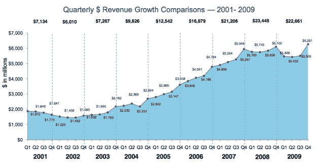
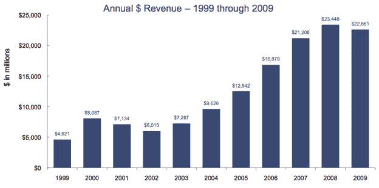
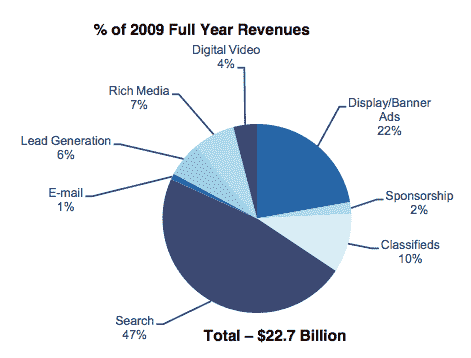

# 在搜索、显示和视频的推动下，在线广告收入走出低谷

> 原文：<https://web.archive.org/web/https://techcrunch.com/2010/04/07/online-advertising-revenues-2009-fourth-quarter/?utm_source=feedburner&utm_medium=feed&utm_campaign=Feed%3A%20Techcrunch%20%28TechCrunch%29>

# 在搜索、展示和视频的推动下，在线广告收入走出低谷

在线广告业在第四季度摆脱了去年的衰退。互动广告局(T2)和普华永道的新数据显示，美国第四季度的在线广告收入同比增长 2.6%，至 63 亿美元，比上一季度增长 13.8%。相比之下，这四家最大的网络公司上季度的互联网广告收入在全球范围内增长了 10.2)。全年的行业收入下降了 3.4%，至 227 亿美元。这是自 2001 年以来收入下降的第一年。

这 227 亿美元是如何按广告类别细分的:

搜索:107 亿美元(47%)
显示:80 亿美元(35%)
分类广告:23 亿美元(10%)
线索挖掘:15 亿美元(6%)
电子邮件营销:2.92 亿美元(1%)

搜索和显示收入今年都有所增长，分别增长了 1%和 4%。其他类别都下降了 14%至 29%。

展示广告的一些令人惊讶的相对优势来自视频广告，达到 10 亿美元，占总额的 4%。在第四季度，视频广告占了馅饼的 5%。