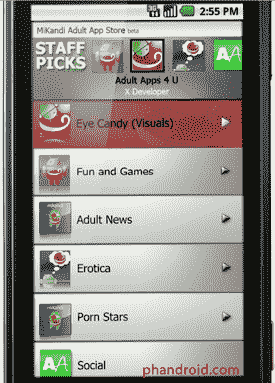

# 史蒂夫·乔布斯解释为什么 iPhone 不允许未签名的应用程序:他们不想要色情商店

> 原文：<https://web.archive.org/web/https://techcrunch.com/2010/04/08/steve-jobs-on-why-the-iphone-doesnt-allow-unsigned-apps-they-dont-want-a-porn-store/>

# 史蒂夫·乔布斯解释为什么 iPhone 不允许未签名的应用程序:他们不想要色情商店

今天，在苹果 iPhone 4.0 开发者预览版的问答环节中， [gdgt](https://web.archive.org/web/20230213060327/http://live.gdgt.com/2010/04/08/live-iphone-os-4-0-event-coverage/#11-29-39-am) 联合创始人瑞安·布洛克问了史蒂夫·乔布斯一个我们很多人已经想了多年的问题:“有没有计划允许未签名的应用程序在 iPhone 上运行？”他的回答是:

> 你知道，有一个安卓色情商店。除了黄片什么都不能下载。你可以下载色情，你的孩子也可以下载色情。那是一个我们不想去的地方——所以我们不会去那里。

答案是 iPhone 不允许未签名的应用程序——并不令人意外。但是乔布斯在背后的推理听起来确实很有趣。因为这是苹果虚伪的明显例子。

多年来，iTunes 一直在销售歌词露骨的歌曲和有裸露画面的电影。此外，正如我们[无数次指出](https://web.archive.org/web/20230213060327/https://techcrunch.com/2010/02/23/apple-iphone-pornography-ban/)的那样，iPhone *配有 Safari* 。网络上有相当多的色情内容。见鬼，许多色情网站甚至推出了针对 iPhone 优化的 HTML5 版本。是的，父母可以通过家长控制来禁止访问 Safari，但苹果可以很容易地添加类似的家长控制设置来限制运行未签名的应用程序。

苹果不允许未签名应用的真正原因是什么？他们希望保持对 iPhone 的完全控制，部分是为了确保它是一个漂亮、干净的环境。这样他们就可以阻止竞争对手的应用程序，就像他们对谷歌所做的那样。

对于那些想知道的人来说，乔布斯很可能指的是安卓色情商店[米坎迪](https://web.archive.org/web/20230213060327/http://www.mikandi.com/)，右图(显然是 NSFW)。

**更新:**我应该澄清一下，当我们提到“未签名应用”时，我们指的是什么。你从 App Store 下载的每一个应用程序都是由 Apple 审查、批准和签名的。这是将应用程序下载到你的 iPhone 的唯一地方，因为手机会检查这个认证标志(除非你越狱)。如果苹果开始允许 iPhone 运行未签名的应用程序，App Store 仍将被限制为通过苹果审批程序的应用程序——它仍将是下载应用程序的“安全”地方。

但是苹果也可以允许用户通过其他渠道安装应用，比如网络。Android 做到了这一点，但只是在显示用户可能下载恶意应用程序的警告之后。苹果不会销售这些未签名的应用程序。

当然，我们不希望这种情况发生。但要求苹果允许色情内容进入应用商店(这是我不支持的)和允许用户上网下载未经苹果批准的应用程序是有区别的。

*图片 via[Phandroid](https://web.archive.org/web/20230213060327/http://www.phandroid.com/)*