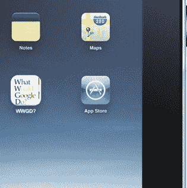

# 亲爱的作者们，你的下一本书应该是一个应用程序，而不是 iBook TechCrunch

> 原文：<https://web.archive.org/web/https://techcrunch.com/2010/04/11/dear-authors-your-next-book-should-be-an-app-not-an-ibook/?utm_source=feedburner&utm_medium=feed&utm_campaign=Feed%3A+Techcrunch+%28TechCrunch%29&utm_content=Google+Reader>

# 亲爱的作者，你的下一本书应该是一个应用程序，而不是 iBook

 *这个帖子是由 21 岁的[科迪·布朗](https://web.archive.org/web/20221005225323/http://codybrown.name/)写的，他是[科蒙斯](https://web.archive.org/web/20221005225323/http://www.kommons.com/)和 [NYU 本地](https://web.archive.org/web/20221005225323/http://www.nyulocal.com/)的创始人。*

在过去的几周里，关于 iPad 将如何改变图书行业已经说了很多，但在我遇到的几乎所有推文、帖子和文章中，一个简单的问题似乎完全被忽略了。为什么我们首先会有书？

TechCrunch 的 Paul Carr 今天早上发表了一篇[帖子](https://web.archive.org/web/20221005225323/https://beta.techcrunch.com/2010/04/11/who-needs-catch-22-when-you-have-flight-control/)无意中提出了这个问题。他的论点是这样的:

A.)iPad 比 Kindle 更值得购买，因为它让你可以做更多的事情，而不仅仅是读书。

B.)书籍无法与 iPad 上的其他应用程序竞争。部分原因是屏幕太亮，但主要是因为你会被飞行控制之类的游戏分散注意力。

C.)因此，正如我们所知，阅读是死的。

从某种意义上说，卡尔是对的。读书变了。没有提到的是为什么这是一件坏事。卡尔的论点植根于严肃读者和非严肃读者之间的区别。他举了一个例子，有人只看了《纽约时报》文章的几段，然后就把它发布在 Twitter 上。卡尔将这种解读定义为，“以在地铁上蹭女人就是性的方式解读。”

他的例子很生动，但也是彻头彻尾的反常。卡尔混淆了长度和质量，更深刻的是，他混淆了目的和手段。

作者的使命不是让你“阅读所有的文字”，而是用这个词最原始的意义进行交流。无论你是杰夫·贾维斯还是丹·布朗，你都有一个想法或一个故事，而书是向世界表达它的一种方式。

作为一名作家，如果你将 iPad 视为“出版”下一本书的地方，那你就完全没有抓住要点。如果乔治·奥威尔有 iPad，你认为会发生什么？你认为他会把自己的故事写出来，然后复制粘贴到 iBookstore 上吗？如果这不成功，你认为他会抱怨现在没有认真的读者了吗？不。他会看着媒介，然后让我们大吃一惊。

只要有更好的方式在 iPad 上交流，在 iPad 上从头到尾阅读一本书的体验不是很好，这不是问题。iPad 上有。在这一点上，对作者来说最大的挑战是 iPad 支持如此多不同类型的表达方式，简直让人不知所措。一旦你开始把你的书当成一个应用程序，你就会遇到各种各样奇怪的问题。比如，我需要在任何给定的时间都可以访问我所有的书吗？为什么不把它变成一个游戏，这样为了进入下一个“章节”,你需要通过一个测试？书的内容甚至需要完全由我来创作吗？我能把它的一些部分留给那些购买和阅读它的人来编辑吗？我需要收 9.99 美元，还是可以收 99.99 美元？开始思考 iPad 的每一个功能如何成为一个工具，让作者更清晰地表达他们想表达的任何东西，你会发现阅读并没有“死亡”，它只是变得更加复杂。

有文艺手法，会有 iPad 手法。

我今年 21 岁，我可以非常自信地说，定义我们这一代人的“书”将不可能被印刷出来。这太棒了。