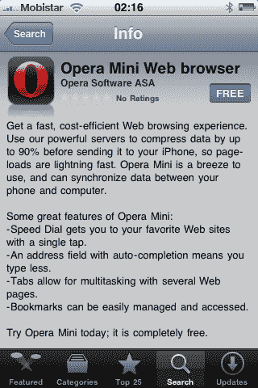

# 惊喜，惊喜:Opera Mini iPhone 应用获得苹果批准 TechCrunch

> 原文：<https://web.archive.org/web/https://techcrunch.com/2010/04/12/surprise-surprise-opera-mini-iphone-app-gets-apples-stamp-of-approval/>

# 惊喜吧，惊喜吧:Opera Mini iPhone 应用获得苹果的认可

对 [Opera](https://web.archive.org/web/20221209021545/http://opera.com/) (以及它在世界各地的大批粉丝)来说，这是一个好消息:该公司刚刚宣布，其手机浏览器 [Opera Mini](https://web.archive.org/web/20221209021545/http://www.opera.com/mobile/) 已经在苹果应用商店获得 iPhone 和 iPod touch 的许可。

该应用程序将在 24 小时内免费下载，具体取决于您所在的市场。

在最近的世界移动通信大会上，挪威软件公司向一小群记者展示了 iPhone 应用程序。

[Opera](https://web.archive.org/web/20221209021545/http://www.crunchbase.com/company/opera-software) 随后于 3 月 23 日正式向苹果[应用商店](https://web.archive.org/web/20221209021545/http://www.crunchbase.com/product/app-store)提交了用于 iPhone 的 [Opera Mini](https://web.archive.org/web/20221209021545/http://www.crunchbase.com/product/opera-mobile) ，当时我们大声问[它是否会被批准](https://web.archive.org/web/20221209021545/https://beta.techcrunch.com/2010/03/23/opera-submits-browser-app-for-iphone-but-will-it-be-approved/)。

这个问题的答案是肯定的，与许多人认为会发生的情况相反。我猜他们现在可以把那个柜台拿下来了。

Opera Software 声称，iPhone 版 Opera Mini 的速度比原生浏览器快 6 倍，这要归功于它的压缩和服务器端渲染技术，这是内部测试的结果，在巴塞罗那世界移动通信大会上亲自试用后，我不得不说这绝对是[缩放](https://web.archive.org/web/20221209021545/http://www.wired.co.uk/news/archive/2010-02/15/tested-opera-mini-browser-on-iphone.aspx)。

当这款应用第一次提交给苹果审批时，Opera 告诉我，他们已经非常详细地分析了应用商店的政策，他们完全确定 100%符合标准，看起来他们是对的。

今天早些时候，Opera 披露其现在拥有超过 1 亿用户，其中大约一半在使用其移动浏览器产品。该公司还为 Android 手机提供 [Opera Mini 5 测试版。](https://web.archive.org/web/20221209021545/http://www.mobilecrunch.com/2010/03/10/opera-mini-5-android/)

iPhone 应用程序已经在比利时出现了，你在哪里呢？

(来源:[新闻稿](https://web.archive.org/web/20221209021545/http://www.opera.com/press/releases/2010/04/13/))

【YouTube = http://www . YouTube . com/watch？v = optcs 3g-cBY & HL = en _ US & w = 620 & h = 480 & fs = 1 & color 1 = 0x 234900 & color 2 = 0x 4 e9 e 00]