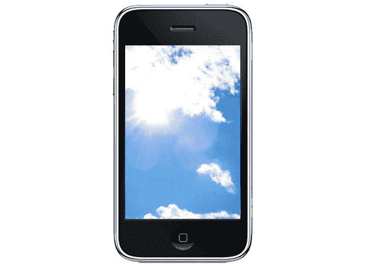
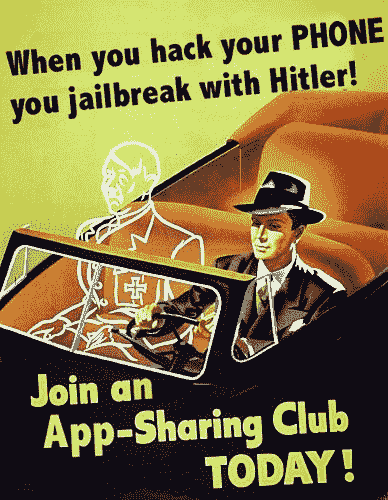
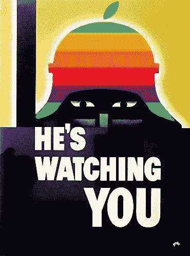

# 用户宣言:防御黑客攻击、篡改和越狱 TechCrunch

> 原文：<https://web.archive.org/web/https://techcrunch.com/2010/04/18/the-users-manifesto-in-defense-of-hacking-modding-and-jailbreaking/>

 
最近有一种趋势一直困扰着我。当改装或越狱的话题出现时——比方说，在 [iPad](https://web.archive.org/web/20221012131055/http://www.crunchgear.com/2010/04/01/and-now-we-wait-for-someone-to-jailbreak-the-ipad/) [发布](https://web.archive.org/web/20221012131055/http://www.crunchgear.com/2010/04/09/two-things-the-ipad-is-inching-closer-to-being-hacked-and-people-are-starting-to-see-why-hacking-it-is-a-good-idea/)或[索尼限制性 PS3 更新](https://web.archive.org/web/20221012131055/http://www.crunchgear.com/2010/04/07/hacker-says-hes-got-linux-on-the-ps3-again/)之后——会有一片哗然。我有什么资格告诉苹果什么最适合他们的设备？我怎样才能凭良心敦促他人取消保修或违反许可协议？当只有一小部分人攻击或破解他们的设备时，为什么有人会在意呢？

这些问题很自然，因为几年前它们甚至是不可能的。你有什么理由砸开第一代 iPod，或者黑掉一台原版 Playstation？System 9 和 Windows XP 上的“未授权软件”问题显然没有实际意义。但是，随着个人电脑、游戏机和电话功能的扩展，它们的权威性也在提高。随着他们权力的增长，他们的锁链也在增长。这些链子以前很轻，我们没有注意到它们，但现在它们不仅可见，而且开始真正妨碍我们的设备，我们必须考虑我们是否应该扔掉它们。答案，至少在我看来，似乎是显而易见的:**任何公司或个人都没有权利告诉你，你不可以用自己的财产做你喜欢做的事情。**
 事情真的就这么简单。但是让我重申一下，这样就没有人会认为我只是在故意夸张或挑衅。只要你所做的事情被限制在你家或个人的隐私范围内，任何公司、任何个人、任何设计师或工程师、任何经理、任何首席执行官都不能告诉你你可以或不可以用你合法购买的设备做什么。怎么可能不是呢？它是你的了。

换句话说，你可以使用你的 iPhone、PS3、Wii、iPad、TiVo、PC 和任何你能想到的设备，从家庭服务器到杀手机器人控制核心。有趣的是，出于某种原因，反对苹果的愿望比反对微软或索尼的愿望更有争议，即使反对的性质是相同的(例如，在设备上运行的定制软件)。出于这个原因，我将使用苹果作为我的主要例子。

现在，这不是一个许可证，在任何时候，你可以为所欲为，为所欲为。有几件事限制了你的自由，你有责任意识到这些:你可能签署了一份具有法律约束力的合同；你的使用的影响可能会超出你可以合理地期望被称为你自己的家或人；有法律管理某些种类的使用。本质上，要知道你的设备并不存在于连接真空中，你也不是生活在社会或法律真空中。

假设你买了一把锤子。锤子明明是用来敲钉子的，而且是在五金店卖的，就在钉子旁边。你真的仅限于用它敲钉子吗？是需要购买专门的许可证来拍摄，还是用它来嫩化肉类？当然不是。但是如果你整天站在外面用它敲钟，你的邻居可能会理所当然地抱怨。而且你不能拿着它到处打人，因为那是*殴打*。我真的不明白为什么一个更复杂的设备，更通用的，当然，但仍然是一个在商店买的硬件，应该受到更严格的限制。您对所购买的工具或设备的使用仅受法律和您的自由裁量权的限制。Acme Hammer 公司对你的所作所为没有发言权——因此，如果你*真的*决定动手打人，他们不承担责任。

 也就是说，你可能已经签署了(也许没有注意到)一份具有法律约束力的合同。如果你看过，请阅读。当然，EULAs 应该是*而不是*可读的，因为它们是呈现给最终用户的法律语言，它们的约束程度可能会成为多年争论的话题。安全起见:如果你看不懂，就在网上研究一下，看看要点是什么，或者打电话给支持部门询问一下。如果你发现你有一个合理的机会实际上违反了一项法律，并使该非法行为受到公司的追究，反思一下。

但也要反思这样一个事实，即没有人会在凌晨 3 点过马路时三思而行，因为当乱穿马路法律本应管理的条件不存在时，它们就没有权威。我们能说同样的许可协议吗？我们可以抛开伴随着法律、正义等等的复杂的哲学辩论——我们在这里谈论的是简单的案例。你是那种会在空无一人的街道上等待“禁止行走”标志的人吗？那你很可能住在西雅图(我看到你们这些人)。此外，你可能不是越狱的类型，你可能会被我到目前为止写的东西激怒。无论如何，改装最极端的后果通常是破坏保修和中断支持。哦不！

为了说明这一点，下面是 [iPad 许可协议](https://web.archive.org/web/20221012131055/http://www.scribd.com/doc/29198816/iPad-Software-License-Agreement)的相关部分:

> 您不得且您同意不得或允许他人复制(除非本许可证明确许可)、反编译、反向工程、反汇编、试图导出 iPad 软件或 iPad 软件提供的任何服务或其任何部分的源代码、解密、修改或创建衍生作品…
> 
> …本许可证在终止前一直有效。如果您未能遵守本许可证的任何条款，您在本许可证下的权利将自动终止或以其他方式停止生效，无需苹果公司通知。本许可证终止后，您应停止对 iPad 软件的所有使用

有些人会说，因为这些，你不“拥有”你买的设备。但很少有人会说他们的意思，即。事实上*没有办法*让你只购买苹果硬件——你实际上被禁止这样做，并且被告知如果你不同意软件的 EULA，请退回设备获得全额退款。幸运的是，这种轻率的限制性许可很容易被忽略，也很容易被创建。毫无疑问，这样的行为肯定是“对苹果权利的侵犯”这是他们永远不会知道的违规行为，因为他们*不可能*知道。他们对你的家和个人拥有和对月球黑暗面一样多的有效管辖权。据此行动。许多 EULA([索尼的](https://web.archive.org/web/20221012131055/http://www.scei.co.jp/ps3-eula/ps3_eula_en.html))建立了类似的无限制控制，只要许可证授予者或其他用户没有受到任何方式的实质性影响，人们也可能(并且经常会，不知情地)忽略这些控制而不受惩罚。违反许可证的惩罚实际上是自愿的，这很能说明问题。

尽管我只是建议对某些法律不要在意，但你必须记住，有些法律是你应该尊重的。想到了发短信和开车。这不是“用你的设备做你想做的事情”这将你周围的人和事置于危险之中。同样，似乎很明显，改装者应该避免超出他们的设备或家庭范围的行为。你有没有把你的 Xbox 360 拆成碎片，装上定制软件，目前把它当家庭媒体服务器用？太好了！你有没有修改你的 PS3，使它在网络游戏中拉额外的数据包，并导致每个人的 pings 上升？不太好！谨慎行事，如果你的行为影响的不仅仅是你自己，你会因此受到指责，不要感到惊讶。

 此外，不要嫉妒公司将你拒之门外的努力。当然，这是为了他们的利益，将他们的设备的使用限制在他们知道可以工作并且可以赚钱的事情上。苹果就是一个很好的例子。乔布斯创造了一个基于苹果的服务和设备的辉煌生态系统，这些服务和设备在相互协作时效果最佳。我说的“最好的工作”是指“对苹果公司最好的工作”如果它们*也*那样对你最合适，那太好了！你开心，苹果开心。但是不要告诉我我也需要这样。仅仅因为苹果顽固地反对人们将他们的硬件用于非苹果批准的目的，并不意味着这样做实际上是错误的或非法的。有趣的是，许多人似乎认为事实确实如此，例如，当一名顾客向他展示一部越狱的 iPhone 时，苹果商店经理[报了警](https://web.archive.org/web/20221012131055/http://www.mobilecrunch.com/2010/02/19/help-ipod-jailbreaker-call-the-police/)。如果这不是一个如此流行的错觉，那就更有趣了。

最后，如果你决定入侵或修改你的设备，你实际上是在切断与制造和支持它的公司的联系。如果这对你来说是个问题，那就不要做。如果你做了，不要抱怨。你的抱怨会被忽略，这是理所应当的。我黑了我的 PS2，当它坏了的时候(我求助于使用 SweeTart 来保持一个组件处于正确的角度),我没有试图把它还给索尼。我铺好了床，然后就躺在床上。你将不得不做同样的事情，即使你在试着刷新它的 BIOS 和安装第二个操作系统的时候，你用砖块垒了一个全新的 iPad。

上面的推理和解释基本上可以归结为几个基本规律。在我看来，只要你在这些范围内，你就应该免受起诉和批评。

* * *

## 无害

入侵你的设备不应该影响任何人的用户体验。如果你违反了任何法律，你应该是唯一的潜在受害者。

## 被告知

你承担的风险是你自己的，你应该彻底研究你想做的任何事情。不要假装破解你的 360 或破解你的 iPhone 是一件小事。

## 接受后果

你放弃了你的保修和所有随之而来的好处。你也可能在犯罪。

但是如果你不介意的话…

# 做你想做的事

没有人能在你的家里或在你身上告诉你如何处理你的财产。

我们处在前沿，在这里，这就是这场辩论发生的原因。有点奇怪的是，那些被亚马逊从 Kindles 上吸走内容的[吓到的人对苹果、索尼和其他公司规定你可以用你买的设备做什么没意见。一旦有可能，他们会试图将他们的权力扩展到你的客厅，这是很自然的，但你仍然可以当着他们的面把门关上。请注意，这个讨论不是关于内容或盗版，虽然有相似之处。这是关于你随意使用设备的权利。一些相同的论点也适用，正如信息想要免费一样，硬件也总是处于最佳状态。但是，虽然围绕数字媒体的权利存在合理的争议，但我看不出对你的硬件和设备可能进行的黑客攻击和修改有任何真正的异议。](https://web.archive.org/web/20221012131055/http://www.crunchgear.com/2009/07/17/amazon-puts-orwell-e-books-in-the-memory-hole/)

* * *

一个普遍的反对意见是，人们没有*有*去购买那些恰好被限制系统或故意限制的设备。用钱包投票吧？当然，甚至当你越狱或者修改的时候，你也是这么做的。您购买了最适合您需求的设备。iPad 是目前最好的平板电脑硬件，它拥有庞大的用户群，这将促使许多有趣的项目开发出来——并非所有项目都得到苹果的批准。虽然苹果对 iPhone 施加的限制不太明显，因为它跳过了高度受限的竞争，但 iPad 却因缺乏额外存储空间、单一专有接口等问题而受到限制。随着锁链开始压在他们身上，好奇和不满的人数将会膨胀。

这里也有更大的原则，但我认为黑客入侵我们的设备的简单效用和任何参与者完全没有后果是现阶段唯一必要的论点。我将把财产、隐私和其他权利的问题留给更聪明的人去讨论。

最后，我要谦恭地感谢苹果、索尼、微软和所有其他人，感谢他们创造了精彩的设备，我打算充分享受这些设备。但我谦卑地请求他们，以及其他所有人，一旦我的购买完成，不要告诉我能做什么，不能做什么。你也应该这样做。

* * *

[Digg](https://web.archive.org/web/20221012131055/http://digg.com/gadgets/User_s_Manifesto_Defense_of_hacking_modding_jailbreaking) / [Reddit](https://web.archive.org/web/20221012131055/http://www.reddit.com/r/technology/comments/bsrod/the_users_manifesto_in_defense_of_hacking_modding/) 这篇文章！