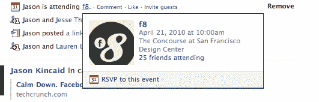

# 脸书借用了 Twitter 的另一个功能(或者是 FriendFeed？):hover card TechCrunch

> 原文：<https://web.archive.org/web/https://techcrunch.com/2010/04/19/facebook-borrows-another-feature-from-twitter-or-was-it-friendfeed-the-hovercard/>

# 脸书借用了 Twitter 的另一个功能(或者是 FriendFeed？):悬浮卡

今天有不少脸书新闻，有重新设计的[兴趣](https://web.archive.org/web/20230128210920/https://techcrunch.com/2010/04/19/facebook-asks-you-to-become-a-fan-of-all-your-interests/)页面，在脸书的隐私设置中增加了[的新部分](https://web.archive.org/web/20230128210920/https://techcrunch.com/2010/04/19/facebook-launches-new-privacy-section-that-may-make-your-head-hurt/)，以及随着脸书开始[拥有人们的兴趣](https://web.archive.org/web/20230128210920/https://techcrunch.com/2010/04/19/facebook-twitter-interests/)而推出[社区](https://web.archive.org/web/20230128210920/https://techcrunch.com/2010/04/19/facebook-introduces-community-pages-hopes-to-make-them-best-collections-of-shared-knowledge/)。我们刚刚遇到了一个更微妙的新变化:脸书正在获得悬浮卡。

在今天的新闻发布会上，脸书提到了在重新设计的兴趣部分使用新的弹出窗口，现在可以将你最喜欢的书籍、活动和电影与相应的脸书页面链接起来。现在将鼠标放在其中一个上面，你会看到一个小的弹出窗口，显示有多少用户也“喜欢”这个页面。脸书没有提到的是，这些弹出窗口也在整个网站上使用。

将鼠标指针悬停在新闻提要中的用户名上，您将看到您有多少共同好友，以及向他们发送消息的链接。将鼠标放在一个活动上，你可以一目了然地看到活动在何时何地举行，以及你有多少朋友要去。挺顺手的。

据我所知，这还没有推广到每个人——它可能会随着社区功能和更新的活动/兴趣页面一起推出。

Twitter 在 2 月份推出了类似的 hovercards，它们也包含在 Twitter 的 [@anywhere](https://web.archive.org/web/20230128210920/https://techcrunch.com/2010/04/01/we-just-tested-twitters-anywhere-platform-screenshots/) 平台中。但是 Twitter 并不是第一个实现这一功能的:FriendFeed(脸书过去经常复制，最终被收购)已经有一段时间了。

