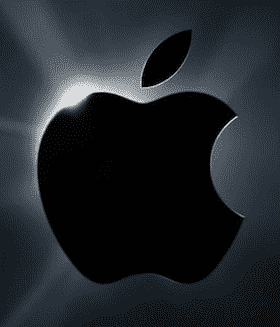

# 苹果又一次获得了“有史以来最好的非假日季度”。有史以来最好的 iPhone 销量。TechCrunch

> 原文：<https://web.archive.org/web/https://techcrunch.com/2010/04/20/once-again-apple-has-its-best-non-holiday-quarter-ever/>

苹果刚刚宣布了其 2010 年 Q2 的收益——正如我们对该公司的期望，这是[又一个令人惊奇的季度](https://web.archive.org/web/20221006172723/https://beta.techcrunch.com/2010/01/25/apple-q1-2010-results/)。收入为 135 亿美元，超过了他们自己和华尔街的预期。季度净利润为 30.7 亿美元，每股 3.33 美元。首席执行官史蒂夫·乔布斯在新闻稿中的关键简介:

> 苹果公司首席执行官史蒂夫·乔布斯说:“我们很高兴报告我们有史以来最好的非假日季度，收入增长了 49%，利润增长了 90%。“我们已经推出了革命性的新 iPad，用户们很喜欢它，今年我们还有几款特别的产品正在研发中。”

华尔街的预期是收入 120.4 亿美元，每股收益 2.45 美元。苹果自己的指导(总是很低)是每股 2.06-2.18 美元，收入 110-114 亿美元。所以没错，苹果杀了它。

其他关键数据包括，该公司在本季度销售了 294 万台 MAC 电脑(比去年增长 33%)，875 万台 iPhones 手机(比去年增长 131%)，以及 1089 万台 iPods(比去年下降 1%)。没有给出 iPad 的直接数字。

上个季度，即假日季度，苹果公司售出了 870 万部 iPhones，所以他们超过了这个数字(比一年前增长了 131%)的事实非常非常令人印象深刻。当然，现在我们都知道 [iPhone HD](https://web.archive.org/web/20221006172723/https://beta.techcrunch.com/2010/04/19/iphone-hd-4g/) (或者随便你怎么称呼它)即将上市，下一季度的销量可能会下降一点(当然，每个人都应该知道新硬件即将上市，就像每年夏天一样)。

苹果还大幅上调了下一季度的预期。首席财务官皮特·奥本海默指出，收入应该在 130 亿至 134 亿美元之间。再说一次，苹果公司给出的数字总是很低，所以你可能会预计实际数字会高得多。

***下面从收益调用中找到注释:***

参加电话会议的有首席财务官皮特·奥本海默、首席运营官·蒂姆·库克和苹果公司的财务主管。

**奥本海默**:三月份的季度业绩超出我们的预期。史上最佳非假日季度。**有史以来最高的季度 iPhone 销量**。3 月季度销量最好的 Mac 电脑。收入比上一季度增长 49%。iPhone 的销量比去年翻了一倍多。净利润比去年同期增长了 91%。

我们刚刚更新了 MacBook Pro 系列。3 周和 4 周的 Mac 渠道库存。iPod 的销量几乎持平(下降 1%)——**的 iPod touch 销量比去年同期增长了 61%，尽管是在**。iPod 收入增长(12%)是两年来最强劲的增长。份额仍在 70%以上。

迄今为止，已有 3500 个新的 iPad 应用程序。总共 185，000 个应用程序。

iPhone 销量创历史新高，打破了我们上个季度的记录。**我们在 88 个国家的 151 家运营商中销售 iPhone**。在亚洲、澳大利亚、日本和欧洲，销售强劲。

对过去几周 iPad 的销量非常满意。3G 版 iPad 将于 4 月 30 日在美国上市。

苹果商店的收入达到 16.8 亿美元，比去年大幅增长。4700 万游客，比去年同期增长了 20%。2010 年有 40 到 50 家新店。

毛利率为 41.7%。

**现金为 417 亿美元**，比上一季度增长 19 亿美元。首要任务是保护资本。

展望未来，iPad 的销售应该会很强劲——新产品的过渡应该会有助于销售(也许是新的 iPhone？)。

**——————问&一次——————**

问:iPad 开局很快，有什么见解吗？

库克:我们还没有足够的经验来判断事情。我们会看到它如何发展。到目前为止，我们对销售额感到兴奋。

问:3 月份 Mac 电脑的销售放缓是因为 iPad 吗？

库克:如果你看看去年 3 月我们宣布了新的 iMac 和新的 Mac mini，今年我们没有，所以你不能据此做出判断，真的。

问:WiFi 与 3G iPad 相比呢？

库克:现在说会有什么组合还为时过早。

问:为什么不提高下一季度的指导呢？

奥本海默:一部分原因是 iTunes 销量下降(人们在假期后使用礼品卡)。Mac 销量应该会上升。iPod 应该会逐年下滑，就像它一直在做的那样。iPhone，我们不确定。随着 3G 版本的到来，iPad 也在观望，它将于 5 月份在其他国家上市。

问:为什么 iPhone 这么好？令人震惊。

库克:我们有一些惊人的增长率。亚太地区为 474%。日本 183%的增长。欧洲 133%的增长。这很大程度上是在增加新的运营商合作伙伴。

问:中国呢？

库克:中国一直很有趣。同比增长 9 倍。本财年上半年，我们来自中国的收入接近 13 亿美元，同比增长超过 200%。(这包括香港。)

问:你能多快提高 iPad 产量？

库克:相对于我们的计划产能，我们做得很好。不存在生产问题——美国的需求太高了。这是一个好问题。

问:组件定价？

库克:DRAM 市场受到限制。

问:iAd 业务怎么样？这是利润中心吗？

奥本海默:我们把脚趾放在水里。今年不要对我们期望太高。我们将学习前进。

**问:AT & T 呢？**

库克:他们继续努力工作，并在不断改进。我认为这种情况会持续下去。调查证实了这一点。

问:运营商呢？

库克:**只有三个主要国家有独家代理权:美国、德国和西班牙**。我们在其他地区的业务已经扩展到一家运营商之外，我们已经看到了销售额的增长。但这并不意味着这种情况会一直发生。我们在个案的基础上看待它。

问:你对 iPad 定价持开放态度吗？

库克:我们对此无话可说，但我们现在的定价非常有竞争力。

问:iPad 会计——你会推迟一部分收入吗？iPad OS 更新收费？

奥本海默:iPad 上市后，我们将在 7 月的电话会议上讨论这个问题。

问:中国更新？

奥本海默:蒂姆谈到了收入，在零售店方面，我们将在上海开两家。到 2011 年底，我们应该有 25 个开放。

问:苹果在专利问题上一直咄咄逼人。应该如何看待诉讼费？

奥本海默:在我们的前瞻性数字中，我们肯定已经考虑了法律费用。

问:你能谈谈移动 iPhone 的不同方式吗？

库克:智能手机市场是一个很好的市场。iPhone 的增长速度是市场的 3 倍。美国以外的数字甚至更好(就增长而言)。我们学到了很多。

问:关于苹果电视——那里发生了什么？

库克:**销量同比增长 34%**。不过还是很小的— **还是公司的爱好**。如果你看看苹果所处的其他市场——电脑每年 3 亿台，电话每年 12 亿部，MP3 播放器每年 1 亿部。这些是巨大的市场。在我们看来，苹果电视的市场还没有那么大。**这就是为什么我们把它归类为爱好**。不想整人。但是我们中的许多人喜欢这个产品，并且使用它。我们仍然认为那里有一些有趣的东西。

问:更多关于 iAds 的信息？

奥本海默:正如我之前评论的那样，我们现在只是把脚趾放在水里。

问:iPad 对 Mac 的蚕食？

库克:到目前为止，还没有任何迹象表明这一点。但是我们还不知道，还为时过早。记住，我们刚刚也宣布了新的 MacBook Pros。**就上网本而言，iPad 对我来说是显而易见的。“这有点像 100 比 0。我想不出上网本做得好的一件事。**

问:但 iPad 市场还没有分类，对吗？

库克:我认为史蒂夫在一月份做得很好。iPad 在手机和笔记本之间。你可以在 iPad 上做很多事情。我们已经有了应用商店的生态系统。现在我们有了更大的画布。

问:iPhone 价格呢？是否应该有更低的服务计划？

库克:我们尽一切努力为消费者争取最好的交易。我觉得我们的运营商合作伙伴都同意。当我们把 iPhone 3G 降到 99 美元时，我们有点惊讶，这么多人仍然花 199 美元买 iPhone 3GS。人们想要非常创新的产品。

问:iPads 的利润——配件呢？

奥本海默:配件组合对我们有好处。许多 iPhone 和 iPod 配件也能与 iPad 兼容。让我们给它一点时间，伟大的事情会发生。

问:对 iPad 应用有什么见解吗？

奥本海默:我们没有专注于通过 iPad 或 iPhone 在 App Store 上赚很多钱。我们刚刚超过收支平衡。

问:有没有完全来自 iPad 的苹果新客户？

库克:我想是的，但现在下结论还为时过早。

**问:其他产品正在开发中吗？这些是增强功能吗？**

奥本海默:我们不会帮助我们的竞争对手，所以我不会回答这个问题。但我们对即将推出的产品感到非常兴奋。

*这是一个总结。*