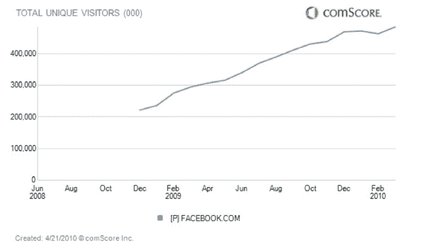
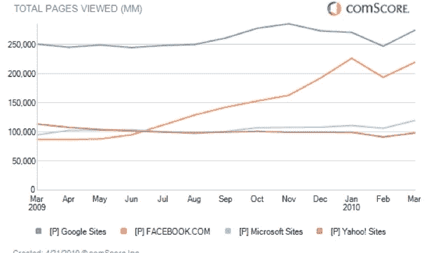

# 脸书每月接近 5 亿访客(ComScore)

> 原文：<https://web.archive.org/web/https://techcrunch.com/2010/04/21/facebook-500-million-visitors-comscore/>

# 脸书每月接近 5 亿游客(ComScore)

脸书的月独立访客人数即将突破 5 亿。根据 comScore 的最新估计，2010 年 3 月，这个社交网络在全球有 4.84 亿独立访客。这个数字比一年前增加了 64 %,比 2010 年 2 月增加了 2200 万。换句话说，它在一个月内增长了 Twitter.com 整个美国用户的规模。(ComScore 估计 Twitter 的全球用户数为 7900 万)。

这些估计不同于脸书官方的注册用户数，上次更新是在二月份，当时注册用户数达到了 4 亿(t 4)。在今天的 F8 开发者大会上，它可能会将这个数字更新到 4.5 亿或更多。(我们会看到，留在现场报道)。comScore 的数字往往比脸书的官方数字大，这是有道理的，因为不是每个访问脸书网站的人都是注册用户。

来自 comScore 的一些其他脸书统计数据:

*   全球网页浏览量每月增长超过 150%，达到 2200 亿次(比雅虎或微软多)。
*   平均而言，所有访问者每月登录 11 次，高于一年前的每月 8.5 次。
*   花在网站上的总时间为每月 1340 亿分钟，约占互联网总时间的 7.5%。

