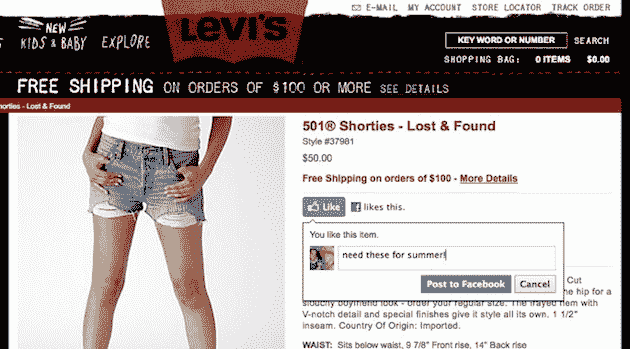

# 脸书:我们将在 24 小时内在网络上提供 10 亿个赞

> 原文：<https://web.archive.org/web/https://techcrunch.com/2010/04/21/facebook-like-button/>

# 脸书:我们将在 24 小时内在网上提供 10 亿个赞

今天，在脸书的 f8 大会上，首席执行官马克·扎克伯格做了一个大胆的预测。只是他觉得没那么大胆。根据扎克伯格的说法，在点击“喜欢”按钮的前 24 小时内，网络上将会有超过 10 亿个“喜欢”。今天发布。

扎克伯格可以这么说，因为脸书已经和大约 30 个大合作伙伴一起推出了这些新功能。我是说巨大。像 CNN，ESPN，IMDb，等等。这些网站都将有脸书按钮实施和工作的今天。

Like 按钮的工作原理和它在脸书(以及 FriendFeed 等其他网站)上的工作原理一模一样:用户只需点击一下，就可以显示他们对这些网站上任何内容的认可。你也可以附上一个小纸条，说明你为什么喜欢这件物品(见下面的截图)。几周前，我们报道了即将发射的消息。这些赞然后被运回脸书，整合到用户的个人资料中。值得注意的是，如果你喜欢 IMDb 上的一部电影，它将被推送到你在脸书个人资料中最喜欢的电影区域。

在演讲的早些时候，平台负责人 Bret Taylor 列举了另一个巨大的数据:目前脸书用户每月分享超过 250 亿件东西。随着新的喜欢按钮(和其他新的社交插件，更不用说开放图形本身)，以及脸书的新合作伙伴，预计这个数字将激增。我的意思是，如果脸书今天就要提供 10 亿个赞，那么这个月他们至少会有 300 亿次分享，这还不包括网站上其他的分享方式。

