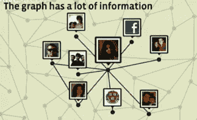
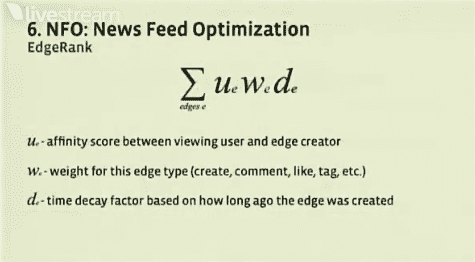

# EdgeRank:让脸书的新闻订阅成功的秘方

> 原文：<https://web.archive.org/web/https://techcrunch.com/2010/04/22/facebook-edgerank/>

昨天在 [f8 开发者大会](https://web.archive.org/web/20230304142515/https://techcrunch.com/2010/04/21/zuckerbergs-buildin-web-default-social/)上，脸书的工程师 Ruchi Sanghvi 和 Ari Steinberg 首次全面展示了脸书新闻订阅的基础，这是用户首次登录网站时看到的最重要的页面。在概述了自 2006 年推出以来已经发展了不少的新闻提要的历史之后，他们提供了一些关于允许新闻提要向你显示相关内容的算法的见解，这些算法统称为 EdgeRank。

你可能没有意识到，但是新闻订阅只显示了你的朋友产生的故事的一个子集——如果它显示了一切，你很可能会不知所措。开发人员总是试图确保他们的网站和应用程序发布符合要求的故事，这导致了“新闻订阅优化”的概念，他们的成功取决于 EdgeRank。

在高层次上，EdgeRank 公式相当简单。但是首先，一些定义:在你的新闻提要中出现的每个项目都被认为是一个对象。如果你在新闻提要中有一个对象(比如一个状态更新)，每当另一个用户与该对象交互时，他们就创建了脸书所说的优势，包括像标签和评论这样的动作。

每条边都有三个对脸书算法很重要的部分:

*   首先，查看用户和项目创建者之间有一个亲和力得分——如果你给你的朋友发了很多脸书信息，并经常查看他们的个人资料，那么你对那个用户的亲和力得分会比你，比如说，一个多年没联系的老熟人更高。
*   第二，每种类型的边都有一个权重。例如，评论可能比赞更重要。
*   最后还有一个最明显的因素——时间。一条边越老，它就变得越不重要。

将每个边的这些因子相乘，然后将边分数相加，你就得到一个物体的边等级。这个值越高，你的对象就越有可能出现在用户的 feed 中。值得指出的是，创建对象的行为也被认为是一种优势，这使得对象可以在任何人与它们交互之前显示在你朋友的订阅源中。

换句话说，如果你认识的人最近与某个对象有过互动，那么这个对象更有可能出现在你的新闻提要中。这并不特别令人惊讶。这对开发者来说也不是一个好消息:如果你想让你的帖子出现在新闻提要中，确保人们真的想和他们互动。

其他一些有趣的地方:斯坦伯格暗示，一个更简单的新闻订阅版本可能正在路上，因为当前的[双标签](https://web.archive.org/web/20230304142515/https://techcrunch.com/2009/10/23/facebook-merges-highlights-back-into-your-news-feed/)系统有点复杂。也就是说，许多人仍然使用这两个标签，超过 50%的用户经常点击“最近”标签。

有一些事情脸书的工程师们不会谈论——这个小组在一个关于故事最初是如何播种的问题上有点犹豫，解释说他们不会揭开 EdgeRank 的所有秘密。但他们确实表示，有一些信号在演讲中没有详细说明，他们正在试验更多的信号，比如分析用户点击的出站链接。

如果您想亲自观看视频，[请点击此处](https://web.archive.org/web/20230304142515/http://apps.facebook.com/feightlive/)，导航至技术课程，然后点击“聚焦 Feed”。关于脸书算法的讨论大约在 22 分钟后开始。