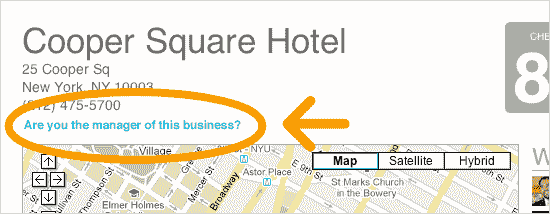
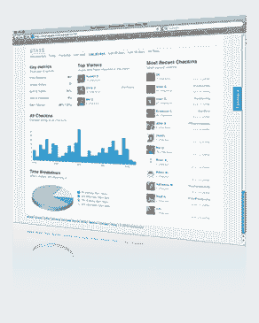

# Foursquare 变得更加商业友好 TechCrunch

> 原文：<https://web.archive.org/web/https://techcrunch.com/2010/04/22/foursquare-business-friendly/>

如果 Foursquare 对雅虎或任何人(T2)来说价值超过 1 亿美元，它不仅要增加大量用户，还要增加大量本地广告商。目前，Foursquare 上只有大约 2000 个来自全球各地酒吧、餐馆和商店的实时报价。这不是很多，但 Foursquare 正在采取措施增加这个数字。

现在每个无人认领的经营场所都有一个链接，问“你是这家企业的经理吗？”该链接将经理带到一个页面，要求他们证明自己确实是经理，以便 Foursquare 的销售团队可以打电话给他们，为他们提供申请场地和管理报价的工具。还有一个新的[商业页面](https://web.archive.org/web/20221005164258/http://foursquare.com/businesses/)，解释当地商家可用的不同工具。

声称在 Foursquare 上拥有场地的企业会得到一个仪表板，上面有实时统计数据，包括入住人数、一天中人们入住的时间、最近的访客和最频繁的访客。他们还可以管理人们入住时获得的优惠和徽章。其中包括市长特价、针对入住次数达到一定次数的人的特价，或者可以定制的通配符特价。特价可以是任何东西，从免费饮料到购物八折。

当人们进入商店或餐馆时，他们可以解锁的特价商品和徽章越多，他们就越有可能使用 Foursquare 登记入住。一旦有稳定的人流开始进入一个场所，Foursquare 提供的统计数据可能会开始成为当地企业的一个有意义的仪表板。

其他创业公司，[如 Snacksquare，](https://web.archive.org/web/20221005164258/https://beta.techcrunch.com/2010/04/15/snacksquare-foursquare-directory/)已经在使用 Foursquare 的 API 来帮助当地企业管理他们在 Foursquare 上的活动和优惠，并直接与消费者联系。但是现在 Foursquare 越来越重视帮助当地企业。

如果 Foursquare 要扩大规模，它需要自助服务，这对于整天忙于经营业务的当地商家来说是一个非常困难的命题。但如果这意味着更多的人流量，小企业至少会尝试一下。