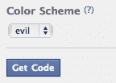

# 像纽扣一样邪恶吗？开放的网络对脸书不那么开放的图表作出反应

> 原文：<https://web.archive.org/web/https://techcrunch.com/2010/04/23/like-buttons-evil-facebook-not-open/>

# 像纽扣一样邪恶吗？开放的网络对脸书不那么开放的图表做出反应

技术社区仍然在消化脸书的计划的影响，该计划将“T1”的“喜欢”按钮推广到任何地方,“T2”和“T3”通过其所谓的“开放图”接管网络。Open Graph 是一个[雄心勃勃的项目](https://web.archive.org/web/20221005124808/https://beta.techcrunch.com/2010/04/21/zuckerbergs-buildin-web-default-social/),旨在为每个网站建立社交挂钩。它旨在根据人们的兴趣和“喜欢”在网络上的每一页上增加一层社交联系和即时个性化。它也是基于脸书身份证的网络身份系统的基础。

开放图只在名称上开放。它是一个脸书控制的协议和一组 API。脸书拿走了数据，但没有同样程度的回报。凯文·马克斯说，它是开着的，就像“打开你的内衣抽屉”你所有的喜欢都属于我们。开放网络的拥护者已经开始鼓动和团结起来反对这一提议的社会霸权。Hunch 创始人/种子投资人 Chris Dixon 和其他纽约市技术专家的乌合之众正在争论以 OpenLike 协议的形式抗衡，该协议增加了来自脸书以外的其他网站如 Digg、StumbleUpon 和 Hunch 的按钮。迪克森[推文](https://web.archive.org/web/20221005124808/http://twitter.com/cdixon/status/12671764115):

> 居然开了！在 opengraphprotocol 中不开放 zuck 将决定意义，但你可以做任何你想开放的事情！！

[克里斯·梅西纳](https://web.archive.org/web/20221005124808/http://www.crunchbase.com/person/chris-messina)(又名 OpenID 先生)在一篇[博客文章](https://web.archive.org/web/20221005124808/http://factoryjoe.com/blog/2010/04/22/understanding-the-open-graph-protocol/)中解释了他的反对意见:

> 但问题是:这些按钮只对脸书有效。我不能随便登录任何一家社交网络提供商…那肯定是脸书。最重要的是，每当我“喜欢”某样东西时，我会向脸书发回一个信号，这个信号会记录在我的个人资料和我的活动流中。
> 
> 好吧，没什么大不了的，但是横向想想:这个怎么样？如果拉里和谢尔盖今天想再造 PageRank 呢？
> 
> 你知道他们希望自己能做什么吗？强迫任何想在网上添加网页的人首先通过他们的认证。。。。经过认证的 PageRank，每个想被列入的人都必须首先获得一个谷歌帐户。听起来很聪明，对吧？
> 
> 除了——呸——这个模型有一个问题:它是邪恶的。

这在很大程度上可以归结为扎克伯格可能会赢得的书呆子之战。毕竟，他有近 5 亿用户，其他人都想接近他们。这些开放的选择从零开始。然而，脸书对这种反应并不感到意外。事实上，有一些证据表明它预见到了这一点(like 按钮的配色方案选项之一是[将其设置为“evil”](https://web.archive.org/web/20221005124808/https://beta.techcrunch.com/2010/04/21/facebook-like-button-evil/)，现在已经没有了)。然而，它需要小心行事，并做出一些善意的姿态，以使开放图实际上更加开放，因为它不仅仅存在于其数据库中。

我们都应该能够带着我们喜欢的人去 Twitter，或者 Google，或者任何一个网站。是的，我们都知道这种情况发生的几率。同时，一定要点击这篇文章顶部的“喜欢”按钮。