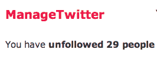

# 600 万不关注之后，Twitter 开始沉默管理

> 原文：<https://web.archive.org/web/https://techcrunch.com/2010/04/24/twitter-managetwitter/>

# 600 万不关注之后，Twitter 开始沉默管理 Twitter

 [正如我在二月份写的](https://web.archive.org/web/20230301155328/https://techcrunch.com/2010/02/24/manage-twitter/)， [ManageTwitter](https://web.archive.org/web/20230301155328/http://managetwitter.com/) 无疑是最有用的第三方 Twitter 服务之一。虽然有很多服务可以帮助你找到新的关注对象，但是仅仅帮助你删除那些你已经关注的人是不够的。对于我们这些已经使用这项服务很多年的人来说，这是一个问题。ManageTwitter 出色地解决了这个问题。现在 Twitter 要杀了他们。

当服务[昨天在其 Posterous 博客上发布](https://web.archive.org/web/20230301155328/http://blog.managetwitter.com/we-really-really-love-twitter-but)时，Twitter 已经向该服务发送了一封电子邮件，让他们知道他们违反了他们的一条规则。具体来说，Twitter 是这样写的:

> 我们写信告诉您，您的应用程序 ManageTwitter 违反了我们的自动化规则和最佳实践(http://help . Twitter . com/entries/76915)。具体来说，它有助于批量自动取消用户关注，这是不允许的。如果您的应用程序遵循这些规则，这对我们的用户和您的用户都是最好的，因此请进行必要的更改，例如删除“全选”选项(并要求用户单独决定每个用户)，以使您的应用程序符合这些规则。

问题是 ManageTwitter 的服务根本不是自动化的。它只是为你不应该关注的人提供了一些建议。正如 ManageTwitter 所写:

> 是的，我们的应用程序确实促进了批量取消跟踪，但是 **ManageTwitter 不促进任何*自动*批量取消跟踪**，用户必须根据标准进行过滤。用户仍然需要做大量的处理来取消对人群的关注。此外，该系统一次只允许取消最多 100 次跟踪。

他们接着指出，他们理解 Twitter 的规则，但再次强调，他们不认为自己违反了规则。Twitter 不喜欢的部分可能是用户名旁边的复选框被自动选择删除(我也不太喜欢这样，因为大多数用户——甚至是他们建议的许多用户——我*不想*取消关注——如果是这样，这是一个简单的解决办法。我在 Twitter 上发了一封电子邮件，询问他们这样做是否足够好，当我收到回复时会更新。

我当然可以看到 Twitter 因为商标的原因不同意这个名字——但是他们现在显然没有争论，只是大部分没有关注。

或者也许 Twitter 只是不喜欢 ManageTwitter 已经成功帮助 35000 名用户取消关注近*600 万人*的事实。我无法想象任何社交网络会喜欢第三方服务以这种方式改变社交图。但同样，这项服务对许多用户来说非常有用，我相信这会让 Twitter 变得更好——即使它的连接稍微少一些。

管理推特要求你转发[这条推特](https://web.archive.org/web/20230301155328/http://twitter.com/_manage/statuses/12673068690)来支持他们。

**更新** : Twitter 已经确认“*移除默认的全选将使他们在提到的问题*上合规。”

*【感谢* [*考特尼*](https://web.archive.org/web/20230301155328/http://twitter.com/courtenaybird/status/12747356055)*】*

 