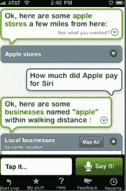

# 硅谷传言:苹果为 Siri 支付了超过 2 亿美元，以进入移动搜索领域 TechCrunch

> 原文：<https://web.archive.org/web/https://techcrunch.com/2010/04/28/apple-siri-200-million/>

苹果公司为收购 Siri 支付了多少钱，Siri 是一个移动虚拟个人助理应用程序的制造商？苹果不会说，该公司或其投资者也不会说。今天，我和 Siri 的两名董事会成员[谈过，他们都不愿谈论这个话题。“我可以确认交易已经发生，但对交易本身或苹果的计划一无所知，”摩根塔勒风险投资公司的加里·摩根塔勒说。“我只能说我们很高兴，”SRI 的 Norman Winarsky 说。我甚至问过我 iPhone 上 Siri 的应用。它指引我去了附近的苹果商店。](https://web.archive.org/web/20230124221205/http://siri.com/)

但如果硅谷的传言是正确的，Siri 的投资者有很多值得高兴的地方。我一直在调查。据我所知，这笔交易的间接金额在 1.5 亿至 2.5 亿美元之间，最大的传言是“超过 2 亿美元”。Siri 的投资者总共向这家初创公司投入了 2400 万美元，这样退出时至少能赚 8 英镑。

为什么苹果要花这么多钱收购一家 iPhone 应用公司？当你看到 Siri 作为一款 iPhone 应用程序，其免费应用程序的下载量只有约 25 万次时，价格似乎非常昂贵。但苹果真正买到的是一个进入移动搜索的入口。如果你从这个角度来看，2 亿美元可能是一笔划算的交易。还有一种可能是，苹果担心谷歌会再次趁虚而入，在 Siri 上出价高于他们，就像它在 AdMob 上的表现一样。Siri 本可以为 Android 增加一种独特的语音搜索体验。(虽然只发布了 iPhone 应用程序，但内部开发了一个 Android 应用程序)。

多年来，一直有传言称苹果想要建立自己的搜索引擎。最近，苹果分析师 G [ene Munster 提出了这个建议](https://web.archive.org/web/20230124221205/http://www.crunchgear.com/2010/03/31/munster-apple-will-build-a-search-engine-me-april-fools/)。但是这些总是被描述为传统的搜索引擎。苹果试图在谷歌的游戏中击败谷歌是愚蠢的。相反，它是在用谷歌尚未掌握的先进技术从侧面攻击谷歌。

Siri 不是传统的搜索引擎。它只擅长非常特定类型的面向行动的搜索，它与网络上的几十种服务联系在一起，实际上帮助你完成你想做的事情，从预订出租车到预订附近的餐馆，再到购买电影票。“与搜索引擎不同，它更像是一个搜索引擎，”Winarsky 解释道。“你把一个基于目标的查询插入到一堆服务中，它就会执行操作。”它是一个智能代理，它的许多技术都基于政府在大约 2 亿美元前资助的 SRI 项目。所以光是知识产权就价值连城。

但据推测，苹果还将获得 Siri 工程团队，该团队可以帮助领导其移动搜索工作。语音界面特别适合手机使用。当你问 Siri 问题时，它不仅会给出答案，还会代表你执行动作。不需要打字。Siri 将通过附属链接和用户采取建议行动的线索来赚钱，这是一种按行动付费的模式。

谷歌也在移动设备上推广语音搜索，但它的语音搜索只是创建一个常规的搜索查询。Siri 不执行一般的网络搜索。它试图使用自然语言处理和语义系统来理解用户的意图(你是在寻找航班、音乐会、出租车还是企业)，然后将搜索插入相关的网络服务。它现在支持 40 多种服务，但它被设计成支持数百或数千种服务。还计划向开发者开放一个 API，这样 Siri 可以更容易地接收这种类型的数据。

苹果是决定采取类似的方式，还是拿走核心技术，从零开始，还有待观察。但是不要搞错了。苹果将自己视为一家[移动计算公司，](https://web.archive.org/web/20230124221205/https://techcrunch.com/2010/02/23/tim-cook-apple-mobile-device-company/)，移动搜索现在是其业务的一部分。无论如何，你可以期待 Siri 的移动搜索功能进入未来的每一部 iPhone 和 iPad。