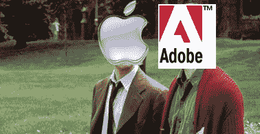

# 史蒂夫·乔布斯告诉全世界他对 Flash TechCrunch 的看法

> 原文：<https://web.archive.org/web/https://techcrunch.com/2010/04/29/steve-jobs-tells-the-world-just-what-he-thinks-of-flash/>

# 史蒂夫·乔布斯告诉全世界他对 Flash 的看法

从前有两个小男孩，[苹果](https://web.archive.org/web/20230213085419/http://crunchgear.com/tag/apple)和[土坯](https://web.archive.org/web/20230213085419/http://crunchgear.com/tag/adobe)。当他们还是孩子的时候，他们经常一起出去玩，踢踢罐子，并且通常和睦相处。但有一天，苹果生病了，Adobe 遇到了一些新的孩子，两人渐行渐远。现在他们都长大了，苹果不会放过奥多比，他们的兴趣虽然没有分歧，但也不再真正友好。你可以把它想象成一个独立的和平,但是拥有多国集团。

这就是史蒂夫·乔布斯如何看待他的公司与 Adobe 的关系，在一封给世界的奇怪的信中，他阐述了他对 Flash 的看法。他开始写道:

> 我想记下我们对 Adobe Flash 产品的一些想法，以便客户和批评者可以更好地理解为什么我们不允许 Flash 在 iPhones、iPods 和 iPads 上使用。Adobe 将我们的决定描述为主要由业务驱动——他们说我们想保护我们的应用商店——但实际上这是基于技术问题。Adobe 声称我们是一个封闭的系统，Flash 是开放的，但实际上恰恰相反。让我解释一下。

哇哦。他马上提出了“开放”论点。这应该会引起一些人的不满。苹果不是世界上最封闭的公司吗？如果你忽略了 OS X 是建立在 Mach 内核之上并植根于 FreeBSD 的事实，当然，苹果是封闭的。然而，如果你也明白，正如史蒂夫指出的那样，Adobe 控制着定价、可用性和产品增强，而苹果选择的移动武器 HTML5、CSS 和 Javascript 是完全开放的。

> 苹果没有使用 Flash，而是采用了 HTML5、CSS 和 JavaScript——这些都是开放标准。苹果的移动设备都采用这些开放标准的高性能、低功耗实现。HTML5 是一种新的网络标准，已经被苹果、谷歌和许多其他公司采用，它让网络开发人员无需依赖第三方浏览器插件(如 Flash)就能创建高级图形、排版、动画和过渡。HTML5 是完全开放的，由一个标准委员会控制，苹果是其中一员。

乔布斯还提到了安全性(“赛门铁克最近强调 Flash 是 2009 年安全性记录最差的产品之一。我们也直接知道闪存是 MAC 崩溃的首要原因。”)但是我们不要去那里。

> “Flash 是为使用鼠标的电脑设计的，而不是为使用手指的触摸屏设计的。例如，许多 Flash 网站依赖于“滚动”，当鼠标箭头悬停在特定点上时，它会弹出菜单或其他元素。苹果革命性的多点触控界面不使用鼠标，也没有翻转的概念。大多数 Flash 网站将需要重写以支持基于触摸的设备。如果开发人员需要重写他们的 Flash 网站，为什么不使用 HTML5、CSS 和 JavaScript 等现代技术呢？”

所以总的来说，史蒂夫说 Flash 很烂，我倾向于同意。数以百万计的 Flash 开发者不能用 Flash 为 iPad 制作他们的东西，这是对的吗？当然不是。但是我每次在我的电脑上访问 Flash 网站都要因为内存问题和糟糕的编程而遭受痛苦的折磨，这是对的吗？可能也不会。

乔布斯有他自己的议程。阿门。Adobe 有他们的。但不要把这描绘成一场开放与自由的争论或粉丝们的战斗:苹果选择了他们的立场，因为在他们看来，Flash 不适合他们的移动产品。如果你想要 Flash，给你弄点 Android，别烦史蒂夫。