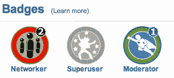
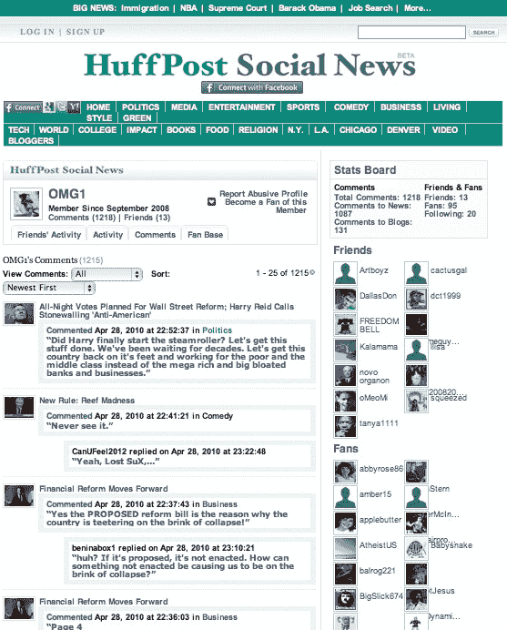

# 《赫芬顿邮报》开始向读者发放徽章

> 原文：<https://web.archive.org/web/https://techcrunch.com/2010/04/29/the-huffington-post-starts-giving-out-badges-to-readers/>

《赫芬顿邮报》正在呈现更多社交网络的特征。借鉴 Foursquare，今天它将开始向疯狂评论并通过脸书和推特分享《赫芬顿邮报》故事的忠实读者(超级用户)、收集大量粉丝和追随者(网络用户)或标记不当评论(版主)发放[徽章](https://web.archive.org/web/20230304114758/http://www.huffingtonpost.com/p/faq-badges.html)。该网站还重新设计了用户资料页面，以更好地突出每个用户的评论流，以及她的朋友、粉丝或追随者。

去年夏天，该网站推出了[赫芬顿邮报社交新闻网](https://web.archive.org/web/20230304114758/http://www.huffingtonpost.com/arianna-huffington/your-huffpost-experience_b_260666.html)，允许读者用他们的 id 和朋友范登录，并在网站上相互关注。后来，它增加了 Twitter、Google 和 Yahoo 作为登录选项。“我们希望整合社交媒体的精华，”阿里安娜·赫芬顿告诉我。“这对网站目前的发展很重要，对未来的发展更为重要。”

《赫芬顿邮报》已经相当庞大了。五年前，她把它作为一个政治博客推出，现在它在美国每月吸引 2300 万读者(comScore，2010 年 3 月)，超过了 NYTimes.com(1330 万)。该网站现在涵盖 20 个不同的新闻类别，包括媒体、娱乐、体育、商业和纽约、洛杉矶、芝加哥和丹佛的地方城市部分。下个月将推出艺术版块，之后是旅游版块。政治现在只占《赫芬顿邮报》不到四分之一的流量。

在这 2300 万访问者中，大多数是临时读者。但其中 80 万人有赫芬顿邮报社交新闻简介。就是他们登录，一个月留下 230 万条评论。赫芬顿说，为了“维持一个文明的环境”并防止“流氓接管”，除了网站自己的付费评论版主，还鼓励读者标记不适当的评论。现在，那些获得版主徽章和升级的人也可以删除评论了。

《赫芬顿邮报》的大部分增长来自读者在脸书、推特和其他社交网络上分享链接。Networker 徽章应该奖励这种行为。《赫芬顿邮报》也鼓励这种行为，在网站上大力推广脸书和推特按钮。通过社交分享传播的链接“是我们流量增长最快的部分，”首席执行官埃里克·希波说。"搜索的规模仍在扩大，但来自社交网络的推荐增长更快."

换句话说,《赫芬顿邮报》越像一个社交网络，它就越依赖脸书、推特和其他网站来推动其发展。

