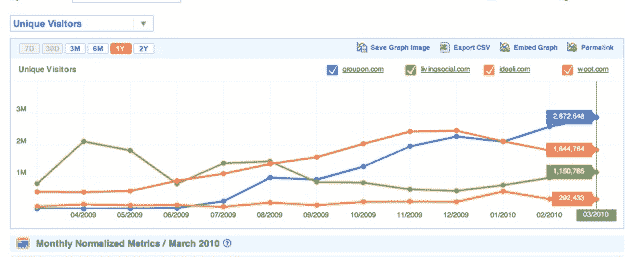
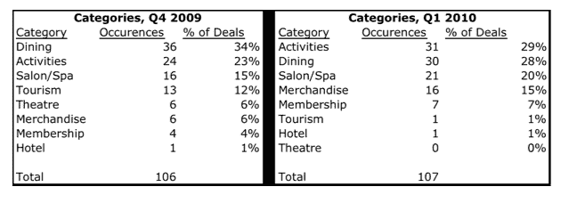
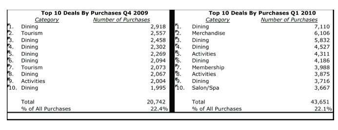
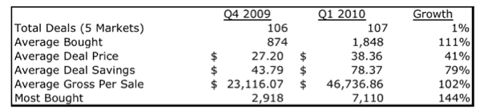
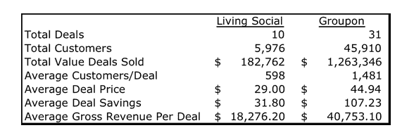

# TC 的解散:是什么让 Groupon 成功了

> 原文：<https://web.archive.org/web/http://techcrunch.com/2010/05/02/teardown-groupon/>

***编者按**:团购网站如雨后春笋般成长。在这篇拆解文章中，客座作者[史蒂文·卡彭特](https://web.archive.org/web/20230205064218/http://www.crunchbase.com/person/steven-carpenter)详细拆解了最大的社交商务网站 Groupon 及其竞争对手，看看到底发生了什么。卡彭特是 TechCrunch40 强企业 Cake Financial 的创始人兼首席执行官，该公司为主流投资者开发了一项管理投资的服务，今年早些时候被卖给了 E*Trade。在加入 Cake 之前，Steve 负责数字音乐管理战略和 Rhapsody 的日常运营。他还曾担任金融服务初创公司 myCFO 的业务开发总监，该公司由吉姆·克拉克创立，得到凯鹏华盈(Kleiner Perkins)和在线照片网站 Snapfish 的支持。*

关于芝加哥本地每日交易公司 Groupon 的快速发展和成功，已经有很多报道。这是有充分理由的。除了 YouTube (12 个月),没有其他创业公司从成立到估值超过 10 亿美元的速度更快，Groupon 在两周前通过最近的 1 . 35 亿美元注入在 16 个月内实现了这一目标。前所未有的是，“团体优惠券”的普及者在短短 3 个月内将其估值提高了 4 倍。这是怎么回事？Groupon 是风险投资估值泡沫的又一个例子，还是下一个经久不衰的消费互联网品牌之一？

**拆机**

为了找到答案，我用 Groupon 网站上最近一个季度的数据对其业务进行了分解，将我的发现与我对 2009 年最后三个月的计算进行了比较，然后将所有这些与主要竞争对手进行了比较。我进行了两项分析:1)去年 11 月的一天和今年 4 月的一天，我查看了 Groupon 网络上的每笔交易，以了解收入如何增长，以及该公司如何受益于对新城市的快速开放支持。然后，我分析了 2009 年第四季度和 2010 年 Q1 5 个城市(旧金山、波斯顿、圣路易斯、圣地亚哥和丹佛)的 Groupon 网站上列出的每一笔交易，以确定公司进入市场后的增长情况，并了解产品组合的变化。关键的发现是，Groupon 在所有方面都实现了可观的收入增长:更多的客户、更高的交易价格和快速扩张的市场。

【Groupon 如何赚钱

Groupon 把你妈妈以前买的旧的[娱乐优惠券书](https://web.archive.org/web/20230205064218/http://www.entertainment.com/discount/home.shtml)带到了社交网络上。Groupon 在它现在支持的 52 个城市中的每一个城市销售“每日交易”,为当地餐馆、服务提供商、活动和会员提供大量优惠，并收取佣金。诀窍在于，只有当足够多的人买进时，交易才会被“触发”。这就产生了与朋友和家人分享交易的动机，直到“交易开始”这对当地企业来说非常好，因为他们可以设置优惠参数，并且知道他们将提前售出的最低优惠数量。通过将社交网络和病毒式传播与难以复制的交易相结合，Groupon 创造了一种网络效应商业，这使其模式极具吸引力(因此，每周似乎都会有新的[模仿者](https://web.archive.org/web/20230205064218/https://techcrunch.com/2010/04/07/groupon-clones-pop-up-like-mushrooms-in-the-united-states-too/))。

**交通**

今年 3 月，Groupon 的独立访客数量接近 300 万，高于 9 月份的 90 万。就流量而言，它现在比 [Woot](https://web.archive.org/web/20230205064218/http://woot.com/) 更大，并迅速接近 Zappos(500 万)。据 [Compete](https://web.archive.org/web/20230205064218/http://siteanalytics.compete.com/groupon.com+buywithmee.com+livingsocial.com+ideeli.com+woot.com/) 报道，Groupon 从脸书获得的流量超过包括谷歌在内的任何其他网站，当人们搜索时，他们输入“Groupon”——这意味着它已经享受到了品牌资产的好处，因为该公司已经成为该类别的同义词。因此，Groupon 在搜索引擎营销上花的钱很少(相对于网飞或亚马逊)，这是一个显著的成本优势。相比之下，领先的直接竞争对手 [LivingSocial](https://web.archive.org/web/20230205064218/http://livingsocial.com/) 的用户数量持平于 90 万，但现在似乎又开始增加。

人们在买什么？

餐馆、按摩、健身俱乐部和博物馆的折扣会员、当地活动、旅游景点和商品的优惠券继续构成销售的主体。你可以通过在 Groupon 上购买的商品了解一个城市的很多情况。也就是说:

*   波士顿居民喜欢激光脱毛(655 次购买)，骑赛格威在镇上滑翔(4311 次)，学习如何驾驶直升机(2575 次)。希望不是在同一天。
*   圣路易斯居民喜爱他们的植物和园艺用品(6106 种)，当然还有 Llwelyn ' s Pub(5832 种)
*   圣迭戈人热衷于钢管舞和无限制的狂欢游乐设施(3875)
*   丹佛爱他们一些冷石头奶精(7110)和速度滚道(1938)
*   亚特兰大被打入纳斯卡(1063)
*   芝加哥人欣赏高大的船只【7，119】

如果你看看按购买数量排名的前 10 项交易，你会发现当地商家似乎对 Groupon 营销渠道越来越适应了。餐馆优惠券也将很受欢迎，但折扣服装、鲜花、房屋清洁和当地活动(如游艇展)等优惠也越来越多地出现在网站上。如下图所示，从 2009 年第四季度到 2010 年第一季度，“活动”取代“餐饮”成为排名第一的类别，“商品”大幅跃升。我的猜测是，随着 Groupon 销售队伍的壮大，以及这些更多的本地商家开始尝试独特的优惠，这种情况将变得更加普遍。消费者将从中受益，因为他们有机会以很高的折扣买到更多自己喜欢的东西。

**Groupon 的业务有多大，增长速度有多快？**

2010 年 4 月 16 日，Groupon 有 31 笔交易，45910 名付费用户，售出了价值近 130 万美元的优惠券。与 2009 年 11 月 6 日的 17 笔交易、10，018 名客户和 240，000 美元的总销售额相比，这是一个显著的增长。根据我观察的每一项指标——每天的交易数量、平均客户/交易、平均交易价格、平均总收入/交易——Groupon 看到了巨大的增长。尤其重要的是，它的平均交易价格正在上升(从 24.65 美元上升到 44.94 美元)，并且正在迅速打开新的市场。

所有这些都是导致 Groupon 收入快速增长的原因。假设 30%的收入份额，Groupon 去年 11 月净赚 72，000 美元，假设每个月有 20 个交易日，每月运营费用接近 150 万美元。4 月份，这使 5X 跃升至 38 万美元，这意味着每月的运行率为 760 万美元。正如你从下面的图表中看到的，不仅交易数量在增加，而且每笔交易的客户数量增加了一倍多，Groupon 能够提高每笔交易的价格。(更多的交易+更多的顾客)X(更高的价格)的公式似乎在起作用。

基于这些数字和公司的增长率，Groupon 年的收入应该会轻松超过 1.5 亿美元。随着收入的增加，其中大部分将是纯利润，因为该公司没有任何实物库存，其客户获取成本非常低。

Groupon 上市后表现如何？

(注意:由于某种原因，没有列出每天的交易，但这似乎是两个时间段的情况，因此我们正在进行比较。)

虽然这两个时间段的交易数量几乎相同(106 笔对 107 笔)，但 Groupon 的平均每笔销售总收入翻了一番多，从 2.3 万美元增至 4.7 万美元。该公司每笔交易的平均客户数量翻了一番，从 874 人增加到 1800 多人，交易价格从第四季度的 27.20 美元增加到 Q1 的 38.36 美元。我还觉得有趣的是，Q1 最受欢迎的交易是 7119 英镑(16 美元一张在芝加哥乘坐高大船只的门票)，是第四季度最受欢迎的交易的两倍多(丹佛 15 美元一顿素食晚餐的 2918 英镑)。

激烈的竞争对 Groupon 有何影响？

显然，我不是唯一一个运行这些数字的人。由于这种戏剧性的增长和新兴的每日交易类别的巨大利润潜力，许多公司正试图成为 T2 的快速追随者。你可以在下面看到 Groupon 与其两个资金最雄厚的追随者 LivingSocial 和 [BuyWithMe](https://web.archive.org/web/20230205064218/http://www.buywithme.com/) (最近带来了一位经验丰富的首席执行官谢丽尔·罗斯纳，前 TicketsNow 和 Hotels.com 首席执行官)。迄今为止，Groupon 已经筹集了 1.71 亿美元，雇佣了 200 多名员工，服务于 52 个市场。它的第二大竞争对手 LivingSocial 已经筹集了 4900 万美元，雇佣了大约 50 名员工，服务于 14 个市场。

在媒体喜欢提到的竞争对手中，事实是只有 LivingSocial 建立了足够的吸引力，提供了足够的数据来进行比较。LivingSocial 现在有 14 个市场，而 Groupon 有 52 个。我比较了 Groupon 和 LivingSocial 在 4 月 16 日同一天的每日交易。

正如你在下面看到的，LivingSocial 看起来很像 6 个月前的 Groupon。LivingSocial 有 10 笔交易，而 Groupon 有 31 笔。在每项指标上，客户总数(45，910 对 5，976)、每笔交易的平均客户数(1，481 对 598)、平均交易价格(44.94 美元对 29.00 美元)以及每笔交易的平均总收入(40，753 美元对 18，276 美元)，Groupon 都遥遥领先。数据显示，Groupon 尚未感受到所有新进入者的冲击。

**价值 10 亿美元的问题:这是一个赢家通吃的市场吗？**

我认为网上这类报价的潜力是一个 50 多亿美元的机会。没有理由认为这个概念不能扩展到几乎任何类别或服务提供商。

但我不认为这是一个赢家通吃的市场，就像易贝接手时的拍卖市场一样。

没有真正的技术优势，没有任何东西阻止本地供应商使用多种平台，买家不在乎他们在哪里购买，只要交易是好的。

也就是说，我认为这是一个赢家通吃的市场，看起来更像搜索，大部分收入将落入领先者手中。肯定有网络效应在起作用，而且它们似乎比我最初设想的更强。当 Groupon 进入一个新市场时，它是从零开始，但它可以利用其平台上的重大投资。这就是为什么它筹集了这么多资金，并在竞争前竞相进入新的城市。问题是，像 LivingSocial 和 BuyWithMe 这样的快速跟随者是否能够成长为迷你 Groupon，而 Groupon 已经在一个城市站稳了脚跟。

*布加迪拆解照片来源:Flickr/ [大卫·比利亚雷亚尔·费尔南德斯](https://web.archive.org/web/20230205064218/http://www.flickr.com/photos/davidvillarreal/4443367472/in/photostream/)*