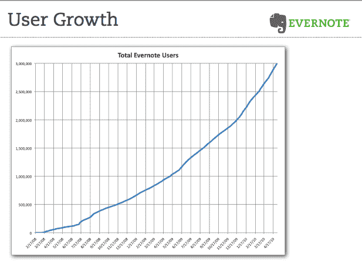
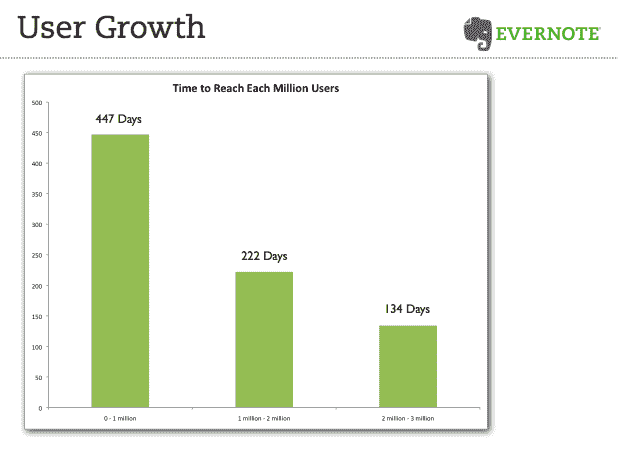

# Evernote 用户突破 300 万 TechCrunch

> 原文：<https://web.archive.org/web/https://techcrunch.com/2010/05/04/evernote-3-million-users/>

# Evernote 用户突破 300 万

如果有什么事每个人都需要帮助，那就是记东西。 [Evernote](https://web.archive.org/web/20221007010633/http://www.evernote.com/) 通过 iPhone、iPad、Android 手机、黑莓、Windows 电脑和网络很好地做到了这一点[。在达到 200 万用户的 60%时间内，它就突破了 300 万用户的大关。Evernote 花了 447 天获得第一个 100 万用户，222 天获得第二个 100 万用户，134 天获得第三个。](https://web.archive.org/web/20221007010633/https://beta.techcrunch.com/2008/02/21/extend-your-brain-with-evernote-private-beta-invites/)

Evernote 可以让你用手机摄像头或网页上的剪辑页给东西拍照，并把它们存储在一个可搜索的、按时间顺序排列的地理标签记录带中。它的日常移动使用中有整整 79%是在 iPhone OS 上，包括 iPhone 本身(63%)、iPod Touch(7%)和[iPad](https://web.archive.org/web/20221007010633/http://blog.evernote.com/2010/04/03/evernote-for-ipad-is-here/)(9%)。安卓系统占日常手机使用量的 12 %,而黑莓仅占 2%。在桌面上，Windows 占据了 49%的日常桌面使用量，其次是 Mac 客户端(38%)和 Web(13%)。

Evernote 业务的关键统计数据是有多少人可以转化为其高级服务，每年为更多存储和功能支付 45 美元。Evernote 的付费用户从 200 万人时的 3.5 万人增加到现在的 5.9 万人。这仍然是一个适中的数字，但它在稳步增长，转化率不断提高。但是为了证明投资者投入公司的 2550 万美元是合理的，它必须想办法让超过 2%的用户付费。

