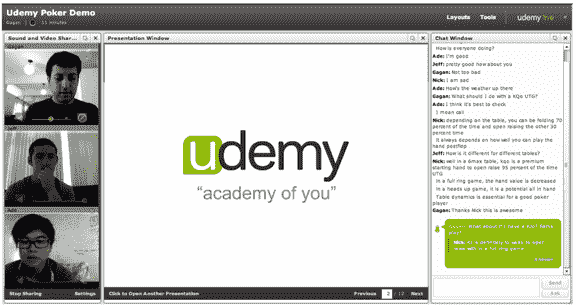

# Udemy 推出虚拟学习学院 TechCrunch

> 原文：<https://web.archive.org/web/https://techcrunch.com/2010/05/11/udemy-launches-virtual-learning-academy/>

# Udemy 推出虚拟学习学院

在线视频教育是一个发展迅速的领域，甚至吸引了微软创始人比尔·盖茨的注意，他认为基于网络的学习网站将会给教育带来一场革命。今天， [Udemy](https://web.archive.org/web/20221005190724/http://www.udemy.com/) 作为一个学习网站推出，旨在通过让任何人都能在线教学来实现在线教育的民主化。

Udemy 是在[创始人学院孵化的，](https://web.archive.org/web/20221005190724/http://www.founderinstitute.com/)提供了基本工具，因此任何人都可以在几分钟内创建自己喜欢的任何主题的在线课程。教育工作者可以上传演示文稿、视频，并为他们的在线课程写博客。

Udemy 还使教师能够与他们的用户互动，为参与者提供“订阅”课程的能力，使他们更加投入。他们还可以通过讨论板提问，并在推特和脸书上发布课程链接和评论。

Udemy 最引人注目的功能之一是实时虚拟教室，教师可以使用 Udemy 专有的实时视频技术与学生举行实时视频会议。Udemy Live 有一个白板、演示浏览器、聊天室和文件共享组件。超过 10 个视频可以在 Udemy Live 上播放，1000 多个用户可以观看一个会话。

Udemy 由 [Gagan Biyani、](https://web.archive.org/web/20221005190724/http://www.crunchbase.com/person/gagan-biyani) Eren Bali 和 Oktay 卡格拉尔创建，它希望成为任何教育内容的门户，从瑜伽课到微积分研讨会。虽然在线视频教育领域有许多有价值的竞争对手，包括 [EduFire](https://web.archive.org/web/20221005190724/http://www.crunchbase.com/company/edufire) 和 [Myngle，但](https://web.archive.org/web/20221005190724/http://www.crunchbase.com/company/myngle) Udemy 的直播视频技术令人印象深刻，而且非常简单易用。也许随着越来越多的大学和学院为学生提供在线资源，视频创业公司可以许可他们的技术。

