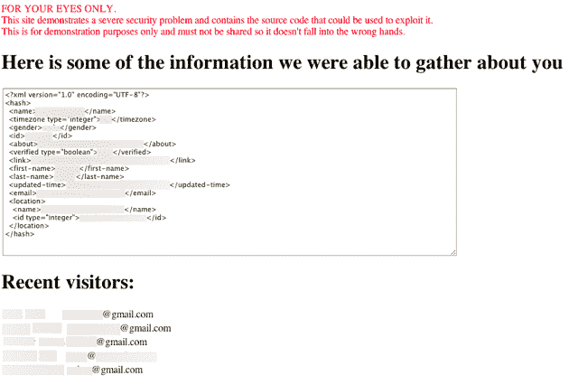

# Yelp 安全漏洞使脸书用户数据面临风险，凸显“即时个性化”的问题

> 原文：<https://web.archive.org/web/https://techcrunch.com/2010/05/11/yelp-security-hole-puts-facebook-user-data-at-risk-underscores-problems-with-instant-personalization/>

似乎脸书的即时个性化需要另一个[来反对](https://web.archive.org/web/20230214164733/https://techcrunch.com/2010/04/27/senators-call-out-facebook-on-instant-personalization-other-privacy-issues/)，今晚传来一个安全问题的消息，使得这个功能更加令人不安。网络安全顾问乔治·德格林发现了一个漏洞，该漏洞允许恶意网站立即获取脸书用户的姓名、电子邮件以及与脸书“所有人”共享的数据，而无需用户采取任何行动。这种特定的漏洞已被修补，没有用户数据受到损害，但其背后的安全问题仍然存在。

该漏洞利用跨站脚本将恶意代码注入 [Yelp](https://web.archive.org/web/20230214164733/http://www.yelp.com/) 。通常情况下，这种攻击不会对脸书用户产生特别广泛的影响，但 Yelp 当然是被认为适合脸书极具争议的即时个性化功能的三个网站之一。该功能允许 Yelp 在用户访问评论网站时立即访问用户的大部分核心脸书数据，而不必担心登录或连接按钮。但是这种便利也带来了风险——如果一个具有即时个性化功能的网站受到威胁，几乎所有脸书用户都会受到伤害。

以下是对该漏洞工作原理的高级描述:

> 我的示例中的脚本将捕获为 Yelp.com 设置的浏览器 cookies，提取向脸书 API 发出 Open Graph API 请求所需的密钥，并将该密钥发送到我的站点。然后，我的网站会请求您的姓名、电子邮件等。并将其存储在数据库中。

换句话说，如果你访问了恶意网站，它会立即获取 Yelp 可以访问的任何数据。Yelp 可以自动获取大量信息，包括你的电子邮件、姓名、个人资料照片、当前位置、好友列表和网络。你不必意外点击任何东西。恶意网站可以做到这一点*，即使你从来没有去过 Yelp* 。同样值得注意的是:Yelp 被自动授予访问你的电子邮件地址的权限，而所有其他的脸书连接网站都必须请求特殊许可才能访问它。

**更新**:今天早上，脸书声称任何被这个漏洞暴露的电子邮件地址都是*而不是*通过即时个性化共享的。这是错误的(更多信息见下文)。这是他们给我们的最初陈述:

> 这个问题是 Yelp 网站上的一个漏洞，并不是针对即时个性化试点计划的。如果漏洞确实暴露了，恶意用户可能已经访问了用户已经公开的数据，以及站点上的其他数据。需要注意的是，电子邮件地址并不是通过即时个性化共享的，只有当用户点击了一个共享的链接，而该链接的唯一目的就是钓鱼该用户时，他/她才会受到影响。

在漫长的来回之后，脸书确实确认了用户的电子邮件地址受到了攻击。事实上，情况似乎比我们想象的更糟——恶意网站不仅可以访问用户的电子邮件地址，还可以访问用户所有朋友的电子邮件地址。脸书声称 Yelp 从来就不应该访问这些电子邮件地址，这就是为什么他们最初说我们的帖子是错误的。他们说过度分享是由一个错误引起的。

以下是他们对此事的声明:

> “感谢您提醒我们。它确实揭示了我们这边的一个缺陷，这个缺陷已经被修复了。”

幸运的是，德格林是一个好人。在被告知存在安全漏洞后，Yelp 和脸书关闭了即时个性化服务一两个小时，直到修复程序到位。

但这仍然令人不安。即时个性化仅仅在三个网站上出现了几个星期，其中一个已经出现了问题。鉴于 XSS 漏洞是如此普遍，如果脸书扩展该计划，我们可能会看到类似的利用。还值得指出的是，一些拥有许多脸书连接用户的大型网站——如 Farmville.com 或 CNN——也可能容易受到类似的安全问题的影响。简而言之，这个系统不太安全。

以下是每家公司关于这个问题的声明:

Yelp:

> 我们被告知我们的脸书实现有一个错误。我们立即关闭了该功能，并推出了一个修复程序，该功能再次上线。没有用户信息受到损害。

脸书:

> 今天早些时候，我们被告知 Yelp 的脸书实现存在一个错误，在问题暴露之前，所有相关功能都被暂时关闭。Yelp 立即调查了这个问题，现在实现已经恢复并运行。

脸书也有许多其他安全问题，包括一个主要的跨域漏洞和一个暴露用户脸书私人聊天的问题。

