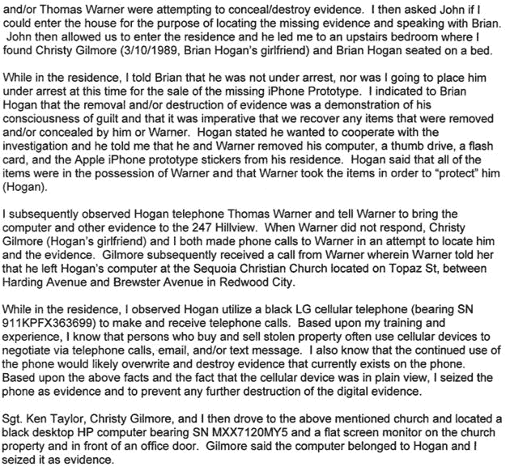
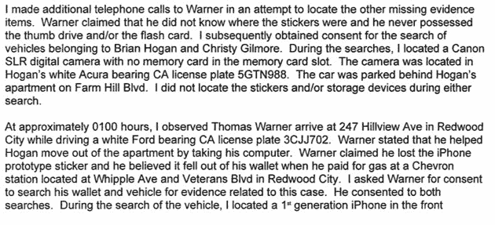
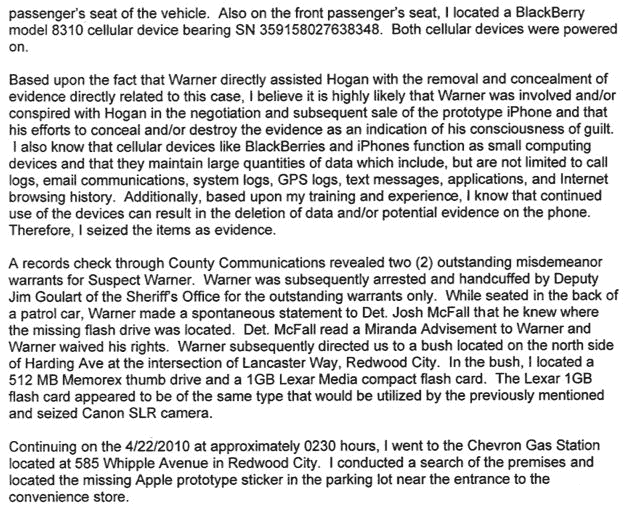

# 未密封的 iPhone 4G 宣誓书:手机销售商涉嫌试图隐藏证据

> 原文：<https://web.archive.org/web/https://techcrunch.com/2010/05/14/unsealed-iphone-4g-affidavit-phones-sellers-allegedly-tried-to-hide-evidence/>

今天早些时候，在包括《连线》和 Cnet 在内的媒体组织联盟的坚持下，一名法官公开了一份关于 iPhone 4G 泄露案件的宣誓书，披露了该案件的更多细节。这些文件包含圣马特奥县警长办公室侦探马修·布罗德的证词，确认是苹果引发了警方的调查，并提供了导致警方突袭 Gizmodo 编辑陈以桐家的事件时间表。我们已经通过 Cnet 在下面嵌入了完整的文档。

在文件中，史蒂夫·乔布斯亲自联系 Gizmodo 要回手机(Gizmodo 回应说，它希望苹果官方声明这款手机是他们的)。它还揭示了苹果声称 Gizmodo 在拆卸 iPhone 原型的过程中损坏了它:

> 休厄尔说，回到苹果公司后，员工们试图给手机通电，却发现手机不再工作了。在检查手机时，他们发现由于手机被拆卸，手机出现了以下损坏。断带电缆
> 2。一个螺钉被插入错误的位置，导致电气短路
> 3。背板搭扣断裂。
> 4。剥螺丝。”

在文件的某一点上，详细描述了格雷·鲍威尔可能丢失手机的故事(注意，这支持了 Gizmodo 的说法，即手机实际上不是从格雷·鲍威尔的手中被盗走的):

> “鲍威尔说他和他叔叔坐在酒吧里。他说，他对原型手机的最后记忆是把它放在他的包里，然后放在他脚边的地板上。鲍威尔说，他的包在某个时间点被打翻了，原型 iPhone 可能从包里掉到了地板上。
> 
> 我问鲍威尔，有没有可能有人从他的包里偷走了原型 iPhone。他说，他确实在晚上去洗手间的时候把包交给了他的叔叔，虽然不太可能，但有人从他的包里拿走了 iPhone 原型。

但最有趣的是，至少在我们第一次通读这些文件时，随着对布莱恩·霍根和托马斯·华纳的调查接近，发生了一系列奇怪的事件——霍根在一家酒吧发现这部手机后，这两个年轻人涉嫌合作出售这部手机。据称，这两人的室友凯瑟琳·马丁森(Katherine Martinson)向警方透露了这两人的参与情况，她担心自己会被认为是这两个年轻人的帮凶，因为霍根曾用她的电脑试图同步 iPhone 4G 样机。

> 奥尔洛夫说，证人马丁森联系他是因为嫌疑人霍根将被盗的 iPhone 连接到了她的电脑上，她相信苹果最终会通过 IP 地址追踪到她的 iPhone。因此，她联系了苹果公司，以免除自己的刑事责任……”

这些文件声称，当马丁森试图说服霍根不要出售 iPhone，因为这会“毁了罗伯特·格雷·鲍威尔的事业”，霍根回答说“对他来说糟透了”。他丢了手机。不该丢手机的。”

这些文件接着详细描述了 4 月 21 日的晚上，当时霍根和华纳据称试图隐藏将他们与电话联系在一起的证据。这是一个离奇的故事。华纳有两个未决的轻罪逮捕令，据称他试图在教堂藏一台笔记本电脑，在说他不知道失踪的拇指驱动器和闪存卡在哪里后，他说它们藏在红木城的一个灌木丛中。下面是描述那晚事件的段落:

[scribd id = 31376177 key = key-20 bibw 8 FP 2 q 1 svsr 7 shb mode = list]