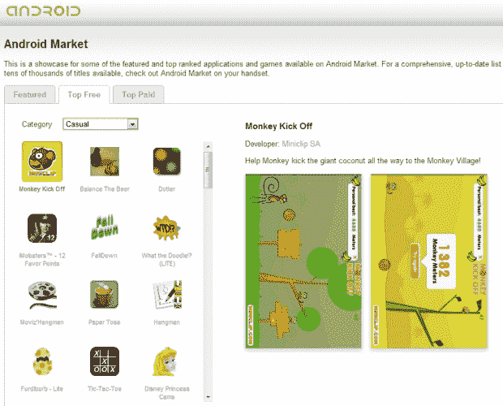

# 谷歌刷新 Android Market 网站-它莫名其妙地仍然缺乏搜索 TechCrunch

> 原文：<https://web.archive.org/web/https://techcrunch.com/2010/05/17/android-market-website/>

# 谷歌刷新 Android Market 网站——莫名其妙地仍然缺少搜索

我们不能 100%确定它是何时首次出现的，但是[谷歌](https://web.archive.org/web/20221204233737/http://google.com/)似乎已经更新了[安卓市场网站](https://web.archive.org/web/20221204233737/http://www.android.com/market)。先别急着尿裤子——他们显然只是把一些东西和其他布局变化混在了一起。仍然没有搜索，仍然没有办法下载应用 OTA，仍然没有任何形式的统计数据。

从好的方面来看，界面比以前更加直观。你可以在这篇文章的[中看到“旧”用户界面的截图，其中 Jason Kincaid 正确地呼吁使用 Android Market 桌面客户端——正如你可以看到的那样，新网站使浏览免费和付费应用程序的不同类别变得更加容易。](https://web.archive.org/web/20221204233737/https://beta.techcrunch.com/2009/11/15/android-market-app-store/)

谷歌就是谷歌，我真的很惊讶新网站仍然缺乏搜索功能。

我的意思是，你可以从你的 Android 手机上查找应用程序，但如果你碰巧没有带在身上呢？没有办法通过浏览市场网站来检查是否有 Skype 或脸书 Android 客户端，除非你碰巧在精选、顶级免费或顶级付费应用列表中发现它们。

诚然，他们很清楚 Android Market 网站只在新网站的顶部作为应用程序的展示，但这并不能解释*为什么*他们选择不使它更有用。

好在有像 [Cyrket](https://web.archive.org/web/20221204233737/http://www.cyrket.com/) 和 [AndroLib](https://web.archive.org/web/20221204233737/http://www.androlib.com/) (更新:和 [AppBrain](https://web.archive.org/web/20221204233737/http://www.appbrain.com/) )这样的网站来做谷歌显然不能或不愿做的事情:为想浏览 Android marketplace 的人制作一个[像样的网站](https://web.archive.org/web/20221204233737/https://beta.techcrunch.com/2009/07/07/finally-a-decent-website-to-browse-android-apps-androlib/)。

(感谢 [Charly Omer](https://web.archive.org/web/20221204233737/http://www.worldcuptimetable.com/) 的提醒)