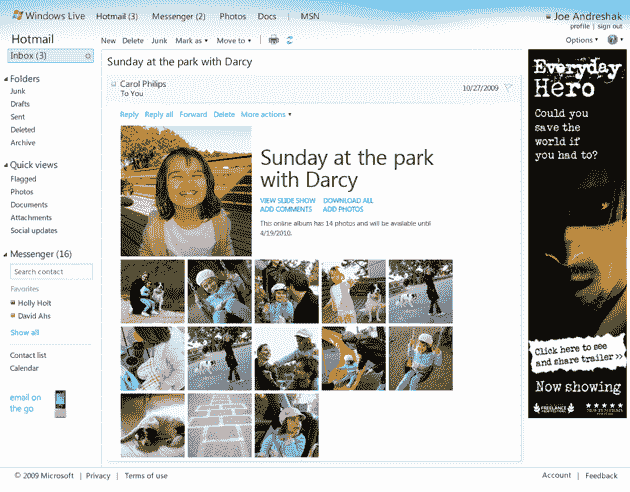
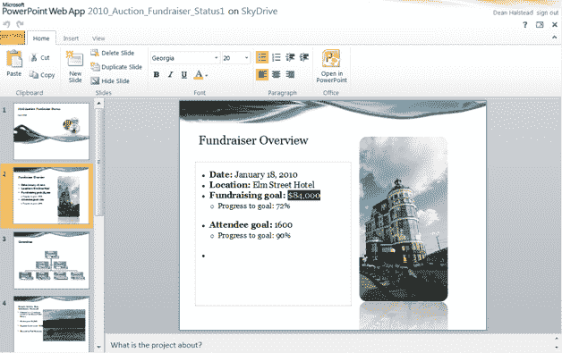

# 迎接新的 Hotmail:更快更时尚，拥有对付收件箱超载的强大武器 TechCrunch

> 原文：<https://web.archive.org/web/https://techcrunch.com/2010/05/17/meet-the-new-hotmail-sleeker-faster-and-a-powerful-weapon-against-inbox-overload/>

回到 Gmail 出现之前的日子，互联网上的网络邮件非常非常糟糕。收件箱被限制在 10 或 20 兆字节，界面又慢又难看，而且体验根本无法与大多数桌面客户端所提供的相媲美。这就是我记忆中的 Hotmail。我讨厌它。事实上，自从 2004 年注册 Gmail 以来，我唯一一次查看微软的网络邮件客户端是在大规模发布之后，那时我会重新激活我的账户，快速浏览一遍，然后迅速决定它仍然不是很好。因此，当我说 Hotmail 今年夏天推出的新版本让我兴奋不已时，那就说明了一些问题。

今天早上，微软在旧金山的办公室向一屋子的媒体展示了新版 Hotmail。它快速、灵活，并带有一系列管理大量电子邮件的新功能，这使它成为 Gmail 更好的竞争对手。看起来像革命吗？不完全是。但是它确实包含了一些非常好的特性——这些特性在你看到它们的时候看起来很明显，但是在其他地方却没有。更重要的是，它们是普通人会真正使用的功能。

首先，Hotmail 实际上只是在追赶。您将注意到的第一件事是，现在提供了线程对话，看起来它们是默认的(尽管您可以关闭它们)。搜索框现在具有自动完成功能。您可以标记邮件(我不敢相信以前没有这个功能)。有更好的垃圾邮件防护。Gmail 用户应该停止打哈欠，因为还有很多其他的好东西。

也许最重要的一套功能，至少对经常经历收件箱超负荷的人来说，是新 Hotmail 附带的所有新的过滤和邮件管理工具。我最喜欢的叫‘扫’。如果您订阅了时事通讯，但决定不再填满您的收件箱，您可以点击激活此选项，将您收到的来自该发件人的每封邮件移动到主收件箱以外的文件夹中。其他网络邮件客户端也可以做到这一点，但这一流程看起来比在 Gmail 中制作过滤器更容易。

另一个名为 Hotmail 突出显示的功能可以根据邮件的来源对邮件进行分类。其中一个部分可以让你一目了然地看到你是否收到了地址簿中的人发来的信息。另一个显示你从脸书等社交网络获得的任何信息。在屏幕的左侧，您会在“快速查看”标签下看到几个选项。其中一个是用于照片的——点击它，你会看到收件箱里所有带有图片附件或链接到 Flickr 等网站相册的信息。文档也有类似的选项，还可以让你立即找到发货更新。

其他主要功能包括阅读和撰写信息。当您收到包含照片附件或指向在线相册的链接的邮件时，Hotmail 将使用这些照片来制作精美的幻灯片(使用 Silverlight)。发送照片的服务甚至更好。大多数电子邮件服务都不太适合发送照片，因为它们的每封邮件的限制是 10-20 兆字节(你还必须担心收件人的服务是否允许这么大的邮件)。Hotmail 通过自动将你的图片上传到微软的云存储服务 SkyDrive 来解决这个问题，sky drive 有 25 GB 的免费空间。生成的邮件看起来很棒——Hotmail 构建了一个相册，它应该在任何支持丰富格式的邮件客户端中都可见，并且不会占用任何人的收件箱存储空间。

最后是 Hotmail 与微软在线版 Office 的整合。当您在 Hotmail 中收到一个文档时，您可以选择使用 Office 的联机版本查看和编辑它，然后保存并将任何更改发送回原始发件人。这些在线应用程序与 Office 2010 的桌面版本有很强的集成性，但你不需要桌面应用程序就可以免费使用在线版本。这当然是微软对 Google Docs 的回答，Google Docs 本身集成到 Gmail 中，看起来做得很好(我预计文档保真对微软来说会更好，这可能是一大症结)。

我应该指出的是，雅虎邮箱已经提供了其中的一些功能(比如能够显示你的联系人发送的信息)。虽然 Gmail 默认设置中没有提供其中一些功能，但你可以使用过滤器重现其中一些功能。Hotmail 不一定需要在每个方面都超越竞争对手——它仍然是全球最大的电子邮件提供商，拥有 3.6 亿活跃账户。但 Gmail 的增长速度最快，微软正试图抑制这种增长。这一新的发布可能不会引发任何形式的从谷歌服务的大规模迁移，它可能会吸引更多的前 AOL 用户，他们现在正在寻找一个新的网络邮件提供商。

微软预计在仲夏推出新的 Hotmail。