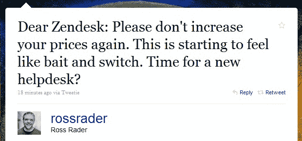

# Zendesk 提高价格，惹恼客户

> 原文：<https://web.archive.org/web/https://techcrunch.com/2010/05/18/zendesk-pricing/>

我们都支持创业公司努力赚钱，但当我们看到一个好的老“诱饵和开关”策略时，我们也认识到这一点。例证:按需服务台软件制造商 [Zendesk](https://web.archive.org/web/20230315095541/http://www.zendesk.com/) ，它刚刚给客户发了电子邮件，告诉他们他们正在提高价格——导致一些客户的月费[增加了 300%以上](https://web.archive.org/web/20230315095541/http://twitter.com/mattRo55/statuses/14230232767)。

该公告也是在公司论坛上发布的[，以介绍新产品功能的形式发布，并在下方提到了新的定价方案(这绝不是一个好兆头)。](https://web.archive.org/web/20230315095541/https://support.zendesk.com/entries/174769)

这家初创公司声称，新的定价计划是为了响应“客户对不同包装和功能的要求”。但是从论坛条目的评论和 [Twitter](https://web.archive.org/web/20230315095541/http://twitter.com/ahow/statuses/14231467128) 上的[来看，我们并不确定事实是否如此。](https://web.archive.org/web/20230315095541/http://twitter.com/juanmartitegui/statuses/14229480567)

巧合的是，我们刚刚报道了 Zendesk [突破 5000 家企业客户大关](https://web.archive.org/web/20230315095541/http://www.techcrunchit.com/2010/05/18/zendesks-saas-help-desk-system-now-being-used-by-over-5000-businesses/)。

以下是他们的变化:

**之前:**

单人套餐:每个代理 9 美元/月，仅 1 个代理
普通套餐:每个代理 19 美元/月，最少 3 个代理
Plus+套餐:每个代理 39 美元/月，最少 5 个代理

**现在:**

初级计划:每个代理每月 9 美元，1 到 3 个代理
常规计划:每月 29 美元，3 到 20 个代理
Plus+计划:每月 59 美元，5 到 100 个代理

不管怎样，Zendesk 正试图用[【不溯既往条款】](https://web.archive.org/web/20230315095541/https://support.zendesk.com/entries/173169-new-grandfathering-terms)来安抚愤怒的客户，但这迫使许多人转向按年计费，而不是按月或按季度计费，而他们中的许多人似乎不愿意这样做。况且这也不是长久之计。

论坛帖子上的一些反应充分说明了 Zendesk 客户对这些变化的感受:

> 因此，有了 19 个代理，我们每月的账单从 645 美元到 1121 美元？增长了 74%？真的吗？？！！！

> 我们为 5 个用户支付 99 美元，现在是每月 5x 59 = 295 美元..这不可能是真的，我们从早期就开始支持 zendesk，这怎么能说得过去…如果我对我的客户耍这样的花招，我肯定我们会输..特别是当选择留在你目前的价格范围内需要支付一年的费用..拜托，伙计们，给我们一个公平的机会，这太过分了！！！！

> 我同意 David 的观点，我们的帐户从每月 153 美元(9 个代理)增加到每月 261 美元，增长了 58%。用大幅涨价来迫使人们接受年度计费计划，会让很多人觉得不太好受。

> 我们目前有 41 名代理，到 6 月中旬将增加到 50 名。不再是了。我们每月的账单将从 1503 美元增加到 2419 美元。这意味着每年增加约 11，000 美元。大约增长了 62%。

> 这似乎是敲诈，我们面临着 100%+的增长，你在禅台玩什么？

我还设法找到了一些人，他们对 Zendesk 在给客户的电子邮件中展示的透明度感到满意，所以也许我们只是听到了愤怒者的声音。

再说一遍，创业公司赚钱没问题，即使这意味着他们需要改变定价计划，在某个时候提高费用。但在这种情况下，也许 Zendesk 应该更好地检查这些变化会对他们早期客户的账单产生多大的影响。

你如何解释一项服务的价格上涨超过 300%，而你远不是唯一一家提供这项服务的公司？Zendesk 甚至没有真正做到这一点，他们只是传达了新的费用，并继续将抱怨的客户指向不溯既往的条款，这也没有解释涨价背后的理由。

我们已经联系了 Zendesk 首席执行官 [Mikkel Svane](https://web.archive.org/web/20230315095541/http://www.crunchbase.com/person/mikkel-svane) 了解更多信息，希望能尽快得到回复。

**更新:** Svane 回应我们说:

> 是的，我们提高了两个计划的价格。我们现在有三种不同价位的方案(起价 9 美元)。这是我们第一次提高价格。但在过去两年半的时间里，我们每周都为这项服务增加了新的功能。
> 
> 今天，我们将推出更多知识库和社区支持功能。Zendesk 已经从传统的票证管理系统发展成为一个完整的客户参与平台，支持一对一、一对多和多对多的客户对话和支持交互。Zendesk 正在大力投资新功能，我们的客户将继续体验 Zendesk 带来的美妙体验。
> 
> 我们会兑现我们的承诺。我们是镇上最便宜的演出吗？没有。但我们确实认为，我们提供的产品几乎适合每种预算，起价为每个代理席位 9 美元。我们确实会向现有客户提供额外一年的保护期，以他们当前的价位为准，他们当前的所有功能都无限期地不受保护。
> 
> 在常规计划和 Plus+计划中，每个代理的价格分别上涨了 10 美元和 20 美元。增长了 50%。一些客户可能会由于早期的介绍性折扣而经历不成比例的价格上涨，我们将根据具体情况调查这些客户。
> 
> 让我最后指出，我们对价格变化完全公开透明。我们不想偷偷把它带进去。