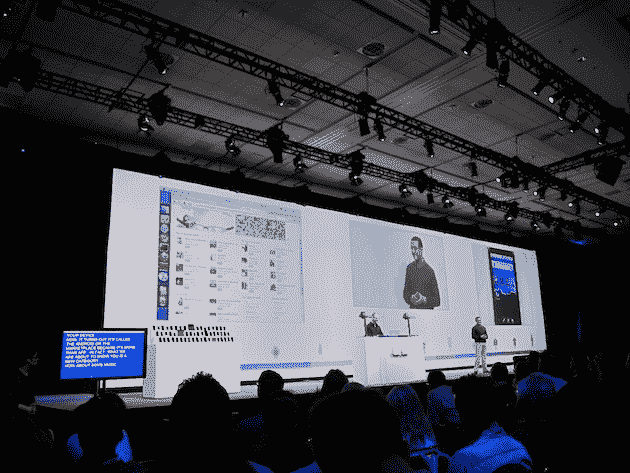
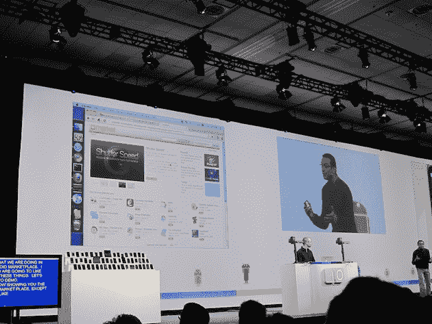

# 嗯，谷歌刚刚悄悄地推出了一个基于网络的 iTunes 的竞争对手吗？没错。TechCrunch

> 原文：<https://web.archive.org/web/https://techcrunch.com/2010/05/20/um-did-google-just-quietly-launch-a-web-based-itunes-competitor-yep/>

# 嗯，谷歌刚刚悄悄地推出了一个基于网络的 iTunes 的竞争对手吗？没错。

今天在谷歌 I/O 大会上，维克·冈多特拉介绍了 Froyo，也就是 Android 2.2。但他也超越了弗罗约。即将推出的是一种通过网络从 Android Market 下载应用程序的方式——也可以让它自动下载到您的 Android 设备上。但这还不是全部。冈多特拉还展示了一个新的市场领域——音乐。是的，谷歌在网络上是 iTunes 的竞争对手。

目前细节还不多，但下面是它的基本工作原理。你去网上市场，找到一首你喜欢的歌曲，点击下载按钮，就像应用程序一样，歌曲开始在你的 Android 设备上下载。所以这是 iTunes，通过网络，自动同步。没有消息说谁是合作伙伴，价格会是多少，等等。毫无疑问，我们很快会听到更多的消息。

这还不是全部。

冈多特拉还宣布谷歌最近收购了 T2:简化媒体。使用这项技术，谷歌将很快提供一个桌面应用程序，让你远程访问你的 Android 设备上的所有(无 DRM)媒体。

