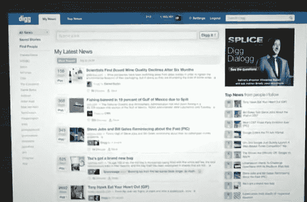
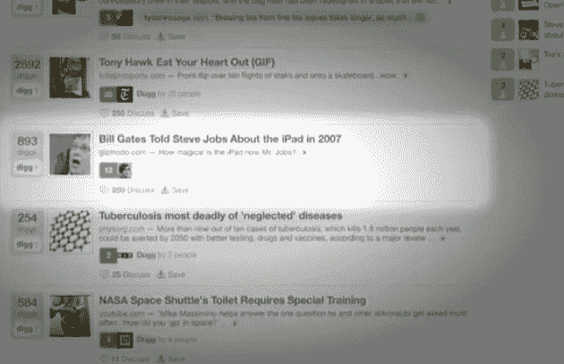

# Digg 第 4 版 TechCrunch 独家视频和截图

> 原文：<https://web.archive.org/web/https://techcrunch.com/2010/05/28/exclusive-video-and-screenshots-of-digg-version-4/>

# Digg 第四版独家视频和截图

【YouTube = http://www . YouTube . com/watch？v=Y9rc-Ou6814&hl=en_US&fs=1&]

[Digg = http://Digg . com/tech _ news/Exclusive _ Video _ And _ screens _ Of _ Digg _ Version _ 4]

上面的视频，我们相信将会展示给出版商以推广新的 Digg 版本，以前所未见的方式展示了 Digg 的新版本，版本 4，该公司已经为之工作了一年多——创始人[凯文·罗斯](https://web.archive.org/web/20221007104830/http://www.crunchbase.com/person/kevin-rose)第一次[在 2009 年 4 月谈到它](https://web.archive.org/web/20221007104830/https://beta.techcrunch.com/2009/04/20/interview-with-diggs-kevin-rose-the-state-of-the-union/)。

该服务的新版本旨在让目前迷恋 Twitter 和脸书上的病毒式内容传播的出版商重新开始关注 Digg。正如 Rose 在采访中所说，只有 Digg 上的头条——每天 100 个左右的故事——有很大的流量。因此，包括我们在内的出版商更加关注在 Twitter 和脸书上推广分享，这不是一个全有或全无的结果。

主要变化:

*   所有 Digg 用户都将经历一个“入职流程”,要求他们追随朋友、时尚引领者和出版商。
*   用户将被要求从脸书、推特等网站导入他们的社交图谱。还有一个为用户推荐的用户列表。
*   他们的主页将不再只显示总票数排名靠前的新闻。相反，它会显示你关注的人和出版商的链接，名为“我的新闻”。
*   Digg 上非常受欢迎的故事仍然会在顶级新闻频道上播放。
*   如果一个用户挖掘了一个故事，那么该用户的所有关注者也会在他们的提要中看到它，这有点像转发。罗斯说，这可能会产生“连锁反应”，并带来巨大的流量。
*   出版商现在可以通过 RSS 自动发布他们的内容到 Digg，不再需要有人第一次添加故事。每个故事将以一个挖掘开始。
*   手动添加故事的过程也简单得多——用户只需将 URL 粘贴到 Digg 中，就会自动生成图片、标题和摘要。

Digg 说，用户只会看到受欢迎的故事的链接，以及他们的朋友正在推广的故事，不会有你在 Twitter 和脸书上看到的状态更新和其他内容的混乱。这是一个纯粹的链接内容的地方，你所关注的人和实体正在推广这些内容。

