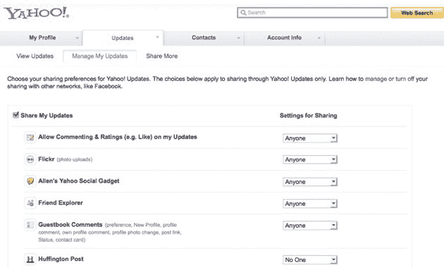

# 雅虎扩大雅虎更新，小心隐私

> 原文：<https://web.archive.org/web/https://techcrunch.com/2010/05/31/yahoo-expands-yahoo-updates-tiptoes-on-privacy/>

雅虎将很快改变他们处理状态更新和社交聚合的方式，让用户更容易关注他人。但是，谷歌(通过 Buzz 的推出)和脸书(通过最近的隐私变化)遭遇的公关惨败并没有影响雅虎——在变化生效之前，他们特别小心地解释变化将如何影响用户隐私。

简单来说，这是产品的扩展——目前，要在雅虎邮箱中看到其他人的状态更新，你必须有一个共同关注，这意味着两个人都同意成为“朋友”然后，您可以看到该用户的雅虎状态更新，以及他们添加到雅虎个人资料中的第三方服务的更新。在新的版本中，将不再有相互遵循的要求。因此，就像在 Twitter 上一样，用户可以关注他们选择的任何人。

对雅虎来说，这实际上并不是一个巨大的变化，因为用户已经可以在雅虎信使上以这种方式关注他人。但是雅虎项目管理高级主管科迪·西姆斯(T2)告诉我，根据雅虎目前收集的数据，他们认为用户采用率会大幅上升。

雅虎还会建议你根据一种算法自动跟踪一些用户，这种算法会观察你的行为，你朋友的朋友是谁等等。

但雅虎首席隐私官安妮·托特(Anne Toth)自 1998 年以来一直在雅虎工作，她表示，用户不会有隐私惊喜，他们可以选择打开、关闭共享，或进行更精细的设置。用户将不得不接受的一件事是，这些数据中的大部分按照定义都是公开的。隐私设置只是允许这些用户决定其他人是否可以关注你，并获得关于你创建的新内容的通知。

我不清楚用户是否会因为这些变化而突然反抗。今年早些时候，AOL 实现了一个类似的产品， [Lifestream](https://web.archive.org/web/20221006164629/https://beta.techcrunch.com/2010/03/11/aol-lifestream-google-buzz-social/) ，媒体没有一点关于隐私的报道。但雅虎正在对雅虎邮箱进行深度更新，这也是谷歌在 Buzz 上陷入麻烦的原因。

托特说，雅虎遗漏的一个功能是能够看到谁在跟踪某人，以及你在跟踪谁，这应该可以确保额外的隐私。

