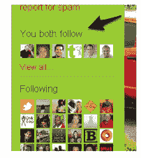

# Twitter 测试用户“你们都关注”功能 TechCrunch

> 原文：<https://web.archive.org/web/https://techcrunch.com/2010/06/02/twitter-testing-friends-in-common-feature/>

# Twitter 测试用户“你们都关注”功能

根据推特工程师[尼克·卡伦](https://web.archive.org/web/20221208035900/http://twitter.com/NK)刚刚发布的[推文](https://web.archive.org/web/20221208035900/http://twitter.com/nk/status/15289196455)，微博网络刚刚启用了一个新的“你们都关注”功能。这项功能只对 10%的用户进行了测试，它可以让你看到你和另一个用户都关注的普通人。这是该功能的截图[和](https://web.archive.org/web/20221208035900/http://twitpic.com/1terhf)。

“你们两个都关注”功能听起来很像。当你点击一个联系人时，它会在页面的右边栏显示你们共同关注的人，就在“关注”标签的上方。考虑到这个功能在显示你与其他 Twitter 用户之间的社交联系时是多么有用，这个功能没有被更快地打开确实令人惊讶。

“你们两个都跟着”在理论上类似于脸书的《共同特征的朋友》，这已经有一段时间了。毫无疑问，这一特性让 Twitter 更像一个互联的社交网络，如果微博网络能更进一步，这应该会很有趣。例如，Twitter 可以开始根据你朋友关注的人推荐人们关注。

更新:Twitter API 工程师 Marcel Molina 在一条 [Tweet](https://web.archive.org/web/20221208035900/http://twitter.com/noradio/status/15292463938) 中表示，他已经与 Kallen 组建了一个新团队来“构建快速原型”。我认为这意味着我们应该期待在不久的将来会有更多的功能更新。