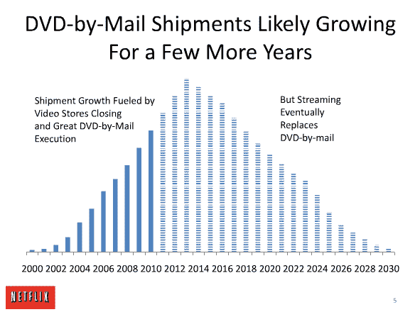

# 网飞 TechCrunch 揭露了网飞商业的未来

> 原文：<https://web.archive.org/web/http://techcrunch.com/2010/06/03/netflix-business/>

# 网飞揭露了网飞商业的未来

说到幻灯片演示，很少有人能做得像网飞和 T2 一样好。去年，他们[发布了一个关于他们文化的](https://web.archive.org/web/20230203042546/https://techcrunch.com/2009/08/05/other-companies-should-have-to-read-this-internal-netflix-presentation/)。如果你读了它，你可能会希望你后来为网飞工作。现在他们已经[发布了](https://web.archive.org/web/20230203042546/http://www.slideshare.net/reed2002/netflix-business-opportunity#40)一个关于他们业务的未来——这也很吸引人。

40 张幻灯片的演示非常棒，因为它让我们直接了解了网飞对其竞争对手的看法，以及他们为什么认为自己最终会成功。长话短说，他们正在将公司从邮件 DVD 服务转型为流媒体视频服务。任何在过去一年左右时间里关注该公司的人都会知道这一点，但阅读他们对这一转变的思考是非常有趣的。

例如，他们知道对新发行的 DVD 有需求，但他们将这个市场让给了竞争对手，这样他们就可以专注于建立最大的流媒体电影目录。他们知道，邮寄 DVD 还将继续增长几年(他们认为是 2014 年)，但之后，它将会像流媒体取而代之时一样迅速下降。

网飞不想成为所有视频内容的最终来源，他们只想专注于目录流能力，并作为其他视频服务(如按次付费)的补充服务而存在。关键是让这项服务无处不在(这就是为什么他们专注于签署设备协议)并且便宜(他们的目标是每个用户 10 美元左右)。一旦邮寄 DVD 开始消失，他们的大部分成本将与支付电影公司获得他们的备份目录电影有关。

那么，网飞未来最大的担忧是什么？Hulu 和盗版。一张幻灯片指出，Hulu 即将推出的订阅模式“*可能会对我们构成重大竞争威胁，*”。另一张幻灯片指出，盗版也可能是一个主要问题，因为它可能会变得对视频和音乐一样糟糕。[我认为网飞](https://web.archive.org/web/20230203042546/https://techcrunch.com/2010/01/07/netflix-hollywood-deal/)放弃新版本租赁无助于此，但很难反驳他们为自己开辟一个非常具体的、基于目录的流媒体利基的逻辑。

在下面找到完整的演示文稿:

[slide share id = 4329586 & doc = Netflix business opportunity-100527090800-PHP app 01 & w = 630]