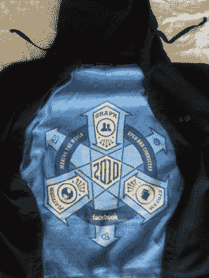
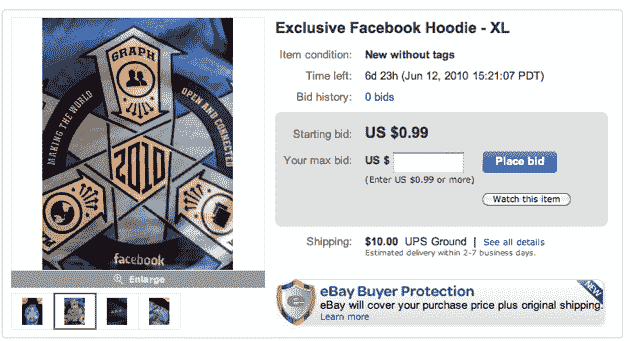

# 加入邪教！易贝 TechCrunch 上发现带有神秘徽章的脸书帽衫

> 原文：<https://web.archive.org/web/https://techcrunch.com/2010/06/05/join-the-cult-facebook-hoodie-with-mysterious-insignia-found-on-ebay/>

# 加入邪教！易贝发现带有神秘徽章的脸书帽衫

 本周早些时候，在 D8 会议上的[采访](https://web.archive.org/web/20230205080804/https://techcrunch.com/2010/06/02/mark-zuckerberg-talks-and-swerves-around-facebook-privacy/)中，脸书首席执行官马克·扎克伯格做了一件不可思议的事情:在发现这位热门人物对他来说有点太热了之后，他脱下了他的连帽衫。采访者卡拉·斯威舍(Kara Swisher)很快发现这件连帽衫的内部缝有一个神秘的徽章，并开玩笑说扎克伯格是一个邪教组织。然后互联网变得有点疯狂。

关于脸书类似光明会的地位的推文比比皆是。SFWeekly 的工作人员设法[重现了](https://web.archive.org/web/20230205080804/http://blogs.sfweekly.com/thesnitch/2010/06/bizarre_facebook_insignia_reve.php)这张图表，并对它可能意味着什么做了彻底的分析。下一个网站宣称这是令人毛骨悚然的。回到脸书总部，为了抵挡另一波负面新闻，牺牲了三只山羊。

现在，一名脸书员工显然厌倦了遮遮掩掩的生活——他们把自己的帽衫放在易贝上出售。它被描述为与马克·扎克伯格在会议上穿的一模一样。虽然还不清楚光是帽衫是否足以正式进入脸书的邪教(你可能需要通过一两次面试)，但它可能足以融入每周午夜的篝火晚会。

如果其他有事业心的邪教成员决定在不久的将来出售他们的帽衫，以利用公众日益增长的意识，不要感到惊讶。哦，这次销售收入的 15%将会捐给 EFF。

以下是描述:

> 这是限量版，员工专用，脸书帽衫。和马克·扎克伯格在 D8 会议上穿的一模一样。
> 
> 尺码:XL
> 
> 买家支付运费。将在赢得拍卖后 24 小时内发货。
> 
> 来自加州旧金山的船只。没有接送服务。

**更新**:哇。出价已超过 1000 美元。你们知道这只是一件帽衫吧？实际上并不存在邪教？

**更新 2** :现在易贝出现了第二件[脸书员工帽衫](https://web.archive.org/web/20230205080804/http://cgi.ebay.com/Facebook-hoodie-L-and-matching-sweat-pants-M-/270589959349)。这件还配有配套的运动裤。起价为 150 美元。

