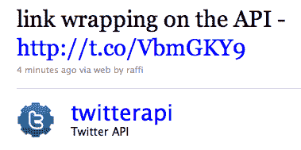

# Twitter 开始用 t.co 官方链接缩短器包装所有链接

> 原文：<https://web.archive.org/web/https://techcrunch.com/2010/06/08/twitter-to-begin-wrapping-all-links-with-official-t-co-link-shortener/>

# Twitter 开始用 t.co 官方链接缩短器包装所有链接

Twitter 链接即将发生巨大变化。在刚刚[发布在 Twitter 博客](https://web.archive.org/web/20230306174620/http://blog.twitter.com/2010/06/links-and-twitter-length-shouldnt.html)上的一篇帖子中，该公司宣布将很快使用新的官方链接缩短服务 t.co 来包装*所有在 Twitter 上分享的*链接。从今年夏天的某个时候开始，每当你通过 Twitter 网络客户端或第三方分享一个链接时，它都会被包装在一个 t.co/******.格式的链接中

那么这对 Twitter 生态系统意味着什么呢？Twitter 产品副总裁[詹森·高德曼](https://web.archive.org/web/20230306174620/http://www.crunchbase.com/person/jason-goldman)说这个功能有三个目的。首先，它将帮助 Twitter 打击垃圾邮件，因为该服务将能够准确监控每个链接的分布，并且当它认为某个链接可能是恶意的时，它可以警告用户。第二，它可以让用户更好地理解链接的走向(更多内容见下文)。第三，它将帮助 Twitter 进行分析，这与其推广的推文有关。高盛表示，Twitter 正在预先宣布这项功能，目前只有三个账户活跃，以给开发者社区一个即将到来的提示。

关于 t.co 令人困惑的部分是，许多用户不会真正意识到它。这是因为 Twitter 在每条推文中包含元数据，允许客户显示链接的原始 URL，即使链接首先通过 t.co。例如，如果我分享了一个 TechCrunch.com 的链接，我的推文中的链接仍然会显示为 https://techcrunch.com，尽管用户在到达他们最喜欢的科技博客之前会被悄悄地路由到 t.co。另一件要注意的事情是:虽然用户现在会看到扩展的链接出现在他们的推文中(可能会很长)，但每个链接只会算作 20 个字符，而不是最多 140 个字符。这是因为所有 t.co 链接的长度正好是 20 个字符。

高盛表示，“目标不是围绕 t.co 建立一个品牌”。相反，这是为了增加在 Twitter 上分享的链接的透明度。

这对 bit.ly 这样的链接缩短者来说不是好消息，但也不一定是他们的丧钟。高盛表示，bit.ly 的增值服务，如分析和定制缩短域名，仍将与 t.co 正常合作，用户显然仍可以将 bit.ly 用于更一般的链接缩短目的。问题是，大多数人通过 bit.ly 这样的服务分享链接，因为这是他们的 Twitter 客户端默认做的事情——他们不需要分析或自定义域。对于这些用户来说，现在没有明显的理由使用这些服务，因为 Twitter 将自己处理缩短的链接。

今天的消息并不令人惊讶——早在 3 月份，Twitter [就开始通过一种新的链接缩短服务路由](https://web.archive.org/web/20230306174620/https://techcrunch.com/2010/03/09/twitter-phishing/)直接消息，作为一种反钓鱼机制。没过多久，用户和开发者就质疑 Twitter 是否会很快广泛推出链接缩短服务，Twitter [证实](https://web.archive.org/web/20230306174620/https://techcrunch.com/2010/04/14/twitter-confirms-it-will-launch-its-own-link-shortener/)将于四月推出。