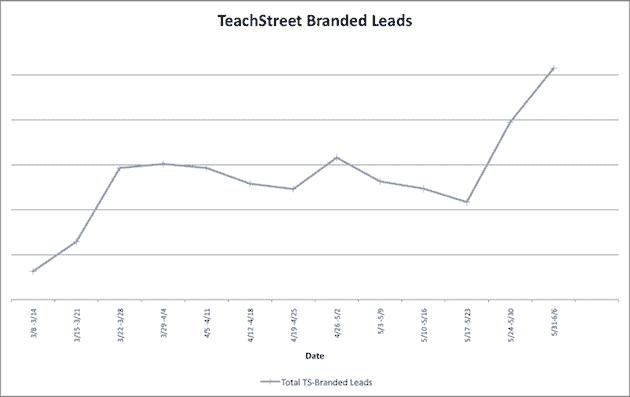
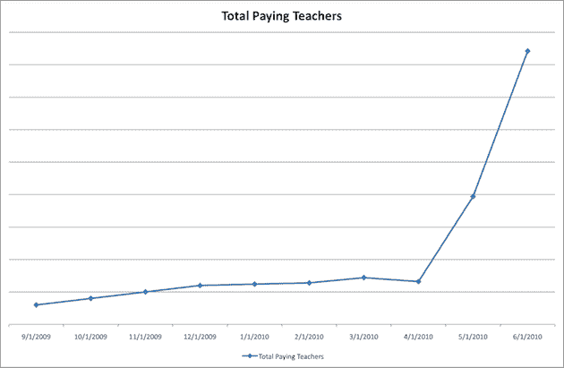

# 从免费服务过渡到付费服务的 5 个技巧

> 原文：<https://web.archive.org/web/https://techcrunch.com/2010/06/13/free-to-paid-tips/>

*编者按:本帖由*[*teach street*](https://web.archive.org/web/20230328093034/http://www.teachstreet.com/)*创始人兼首席执行官[戴夫·沙佩尔](https://web.archive.org/web/20230328093034/http://www.crunchbase.com/person/dave-schappell)撰写。在这篇文章中，他谈到了他的公司从免费服务向付费服务的转变，并分享了可能帮助其他创业公司实现这一飞跃的五个技巧。*

在过去两年多的时间里，我与一个团队一起经历了 web 服务从免费到付费的转变，因为 [TeachStreet](https://web.archive.org/web/20230328093034/http://www.teachstreet.com/) 已经从一个在西雅图寻找本地课程的地方发展成为一个[在线和本地课程的全球供应商](https://web.archive.org/web/20230328093034/http://www.teachstreet.com/learn)(我在这篇文章的底部包含了我们整个两年转变的高级时间表)。

围绕[免费增值](https://web.archive.org/web/20230328093034/http://www.avc.com/a_vc/2006/03/the_freemium_bu.html)之类的讨论数不胜数——我不会用这些话题的附加词汇来烦你。

我假设:

*   你同意最终你的收入需要超过你的支出
*   你能够为你的客户创造价值，并且他们中的一些人愿意为这个价值买单
*   收取费用不会毁掉你的生意(在我们的案例中，我们是一个[课程市场](https://web.archive.org/web/20230328093034/http://www.teachstreet.com/learn)；我们需要确保费用不会导致我们自 2008 年 4 月以来积累的课程清单消失)

最后，我将断言免费提供一个产品有许多原因(例如，在早期它可能是一个不完整的产品；免费是让客户尝试你的产品并衡量交付价值的好方法；免费可能有助于分发/传播；和许多更完全有效的理由)

最大的问题是，"*你如何把你的免费客户群转变成付费客户群，而又不会让他们都心烦意乱/失去他们？*

这里有 5 个技巧可以帮助你把顾客转变成付费服务:

**1)提前通知你的客户，给他们一个(真正的)机会来评论/提供反馈。**

请记住，许多客户不仅愿意付费，而且认为付费服务质量更高。当我们[预先宣布我们的价格变化时，我们得到了负面的回应](https://web.archive.org/web/20230328093034/http://blog.teachstreet.com/learn-new-things/news-from-our-founder-dave-schappell/)。但是，我们也收到了积极的公众回复，许多私人邮件告诉我们，他们对这一变化感到兴奋(因为这将减少他们班级的混乱/竞争；他们希望我们能长期存在。这意味着我们会有钱为更多的顾客做广告；等等。)

客户的反应也告诉我们，我们在向他们传达我们的价值方面做得很差。许多人说我们从未交付过客户，但当我们查看他们的教师仪表盘时，我们看到了大量的访问者和交付的销售线索。我们意识到我们忘记了设置并通过常规指标邮件传达该值！因此，在我们开始收费之前，我们优先考虑建立和传递这种沟通。

几位老师还问，为什么不能通过交钱以外的事情来‘赚房源’。我们认为这是一个很好的想法，并建立了一种方法来做到这一点(见下面的#3)。

最近的一个例子是 ZenDesk 的费用上涨最初处理得不好。最初，他们的声明导致了巨大的客户反弹；令人高兴的是，他们[修改了现有客户的定价方案](https://web.archive.org/web/20230328093034/https://techcrunch.com/2010/05/20/zendesk-apologizes-for-suddenly-hiking-its-prices-ceo-hopes-for-make-up-sex/)。作为 ZenDesk 的长期客户，我很高兴他们听取并做出了改变，但我敢打赌，他们本可以通过一些更开放的客户讨论来更好地处理这一问题。

我认为处理得很糟糕的一个例子是当[宁改变他们的费用](https://web.archive.org/web/20230328093034/https://techcrunch.com/2010/04/15/nings-bubble-bursts-no-more-free-networks-cuts-40-of-staff/)——他们似乎只是把许多客户扔在路边，没有输入，也没有谈判。

**2)公平定价(可能仍有很大折扣)**

当你展望未来 6-12 个月时，价格显然需要为你的损益表服务。但是，it **真的需要**为你的客户服务。如果其他选择更有吸引力，预计会看到顾客流失。

在我们的例子中，我们将新列表的价格定为 3 美元——这些列表持续 30 天，或者直到我们提供 10 个客户线索(以先到者为准)。lead-gen 行业的许多人对 0.30 美元/lead 的定价嗤之以鼻，但我们不得不看看 Craigslist 和 Twitter 等免费的替代产品。最终，我们知道我们不仅仅是一个上市工具——我们提供强大的 SEO 优势、评论/评级、支付、UGC 工具等等。而且，所有这些还不到一杯(西雅图)咖啡。如果我们不能让这种定价起作用，那么我们将不得不处理后果。似乎很公平。

迄今为止的结果非常有希望——自变革前以来，我们支付列表、订阅和特色费用的教师数量增长了 6-7 倍——为了继续获得他们的支持，我们知道我们需要向他们提供价值(即学生引导):

我们将来是否必须提高价格，或者调整销售线索的数量？当然，这是一种可能性。但是，我们预计明年不会这样做。我们将继续评估服务/优势，并尽最大努力对客户保持透明。

**3)为您的客户提供免费获取产品的途径**

金钱是许多补偿形式中的一种。在我们的业务中，高质量的内容(文章、问答等)同样有价值，甚至更有价值，因为它们帮助搜索引擎找到我们的网站，反过来，帮助人们发现优秀的课程、教师和学校。

我们最终创建了一个虚拟货币模型，老师每写一篇文章或回答一个问题就可以获得一个“点”。五点积分可以兑换一个免费的课程列表。一个老师可以很快找到五个问题来回答，从而在不到 10 分钟内获得一个免费列表。在我们推出虚拟货币的一周内，我们那一周所有的商品中有 9%是用积分支付的。这有助于我们(搜索引擎丰富的关键字内容)，也有助于老师，因为我们会围绕他们提供的任何文章和答案自动推销他们的课程列表。活跃的老师让他们的班级在搜索结果中显示得更高。我们认为这是真正的双赢，我们一点也不会错过这 3 美元！

许多企业可以利用这一点做得更好。我喜欢 Flickr 处理它的方式，因为我经常在基础版和专业版 Flickr 成员之间摇摆不定。我知道我会一直以职业球员的身份回归，但有时这并不必要。感谢 Flickr 让它变得如此简单。我希望网飞能在这方面做得更好，让我能够持续访问我的电影愿望清单和推荐，因为随着我的空闲时间的波动，我经常从付费客户转变为非付费客户。但是，当我不付钱的时候，他们就把我锁在电影列表之外——为什么？

**4)为长期客户提供祖父级定价，或给予他们独家优惠**

如果你有免费的服务，这一项是相当困难的，因为有需要支付的账单。但是，如果你是一家决定需要提价的服务公司，你应该认真考虑锁定现有客户的旧价格。或者，逐步提高价格。或者，给他们提供大量的学分(你明白了)。

在我们的案例中，我们创建了一个促销活动，提供 6 个月的专业会员优惠，每月 10 美元(相比之下，每月 29.99 美元)。在此次促销活动之前的几周，我们的专业会员订阅量相对持平；在开展促销活动两周后，我们的订户数量增加了 152%。我们很高兴看到这一优惠的赎回水平，并希望我们能在未来 6 个月继续赢得他们的信任/业务。如果我们不这样做，我们就不配拥有它。

其他一些例子:

*   SEOMoz 可能是互联网上最好的 SEO 建议/工具来源。它们过去是免费的，但现在逐渐引入了月/年会员资格。现在的费用是 799 美元/年(我觉得)，但是我 06 年加入的时候是 299 美元/年。酷的是，他们仍然遵守 299 美元/年的费用。以这样的价格，我永远不会离开——而且，我会继续向我的朋友们吹嘘它们！虽然我知道 799 美元很便宜，但我还是会犹豫，因为我知道我以前花了多少钱。干得好，西莫兹，感谢那些帮助你走到今天的人。
*   航空公司在这方面做得很糟糕——我们中有多少人被航空公司的飞行常客计划骗了？他们告诉我们 20，000 英里可以让我们免费飞行。然后他们限制座位。然后他们有 40k 和 60k 英里的优惠。然后他们完全关闭了程序。如果他们今后改变规则，我没问题，但改变我根据他们早先的提议获得的里程规则是错误的。

**5)如果可能的话，逐步过渡——只有在你提供价值的情况下，人们才应该付钱**

在我们的案例中，我们决定，如果我们在之前的 30 天内向教师提供了线索，他们只需为重新列出课程付费。因此，如果一位教师列出了一门[钢琴课](https://web.archive.org/web/20230328093034/http://www.teachstreet.com/c/68)或一门[摄影课](https://web.archive.org/web/20230328093034/http://www.teachstreet.com/c/165)，而我们在下个月没有接到他们的客户电话、信息或注册，我们就简单地免费重新列出这门课。这样，在我们实现价值之前，他们不需要考虑回报。并且，我们以类似的方式在现有列表中添加了祖父级内容。这有双重好处——对老师来说，他们的价值得到了保证(这是对早期支持者表示‘感谢’的另一种方式),对 TeachStreet 来说，它维持了选课，这对搜索引擎流量有好处。事实上，自费用调整之前，我们的整体列表已经显著增加。

其他业务将有自己独特的特点—您可以对现有客户慢慢实施费用增加(如上所述)，提供过渡定价，或将过去的活动转化为利益/层级，等等。但是，你明白了。

从免费服务转向付费服务而不吓跑客户是可以做到的。凭借 TeachStreet 上更高质量的数据，我们能够将教师的销售线索数量增加 25%,学生可以更快地收到活跃教师的回复，自推出付费服务以来，我们的运营收入翻了一番。

最后，请记住，从免费到付费的平稳过渡是一件好事。他们不仅仅是你的长期客户，他们以各种方式(反馈、耐心、内容等)帮助了你。)但是，这种转变做得不好的影响可能是灾难性的和/或长期的，会带来负面的公共关系、被破坏的关系以及令人不快的员工士气问题。

我希望上面的列表有所帮助——而且，我确信我错过了一些东西。请在评论中献计献策。

这是蒂奇街产品/定价历史的高级视图:

*   2008 年 4 月–在西雅图推出了包含大约 25000 个班级、课程、学校和教师的[班级、课程、教师、学校(TeachStreet)](https://web.archive.org/web/20230328093034/http://blog.teachstreet.com/press-news/teachstreet-launch-announcement/) 网站–教师可以添加无限个班级，学生可以联系教师。该产品功能有限，但它让我们展示了价值，使用我们的用户生成内容工具，并向客户学习(100%免费)
*   2008 年 8 月–2009 年 4 月–扩展到另外 7 个城市，并显著扩展了教师工具(通过 twilio 进行电话跟踪、教师指标仪表板等)(仍然 100%免费)
*   2009 年 7 月——引入学生对教师的支付(由 PayPal 提供支持),这样注册和支付就可以在网站上处理。请注意，我们花了 15 个月的时间才推出这项功能——你可能会说，如果没有这项功能，我们就不应该推出，但我们认为，我们需要首先展示其他附加值。学生支付少量预订费(以支付处理费用)，教师支付佣金(仍然 100%免费创建课程列表，但一些费用来自注册)
*   2009 年 9 月–推出面向教师的专业版功能，每月 29.99 美元。给他们额外的现场推广、额外的营销工具、免费的支付处理等等。(仍然 100%免费创建列表，但收入来自服务)
*   2009 年 9 月–2010 年 4 月–测试/优化/网络实验室化网站–实施额外的线索跟踪和线索衡量改进–我们知道，如果我们不能为教师/学校创造价值(更多新学生),我们将永远无法赢得他们的业务。(仍然 100%免费创建列表，但收入来自服务)
*   2010 年 4 月 7 日–我们[“预先宣布”对所有新类别列表收费](https://web.archive.org/web/20230328093034/http://blog.teachstreet.com/learn-new-things/news-from-our-founder-dave-schappell/)
*   2010 年 4 月 27 日–我们[“开启”了所有新列表的列表费](https://web.archive.org/web/20230328093034/http://blog.teachstreet.com/press-news/new-listings-fees-for-basic-members-and-more/) (100%的新列表已支付；所有列表都支持收入)
*   2010 年 5 月 12 日–每月 10 美元的“Go Pro”促销活动的最后一天(6 个月，每月 10 美元；相比正常的 29.99 美元/月的费率)(100%的新列表是付费的；所有列表都支持收入)
*   2010 年 6 月 6 日(目前)——流量一直在增长，收入大幅增加，我们 100%确定我们必须保持旋转。因为创业公司就是这么干的。