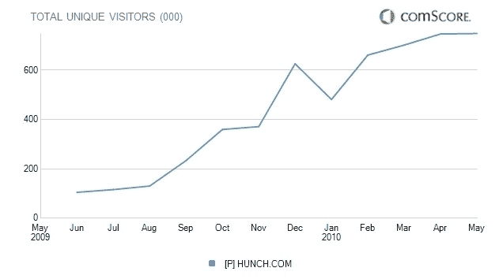

# 预感大变；Caterina Fake 预测“流量会直线下降”，但质量会上升

> 原文：<https://web.archive.org/web/http://techcrunch.com/2010/06/15/hunch-caterina-fake-video/>

# 预感大变；Caterina Fake 预测“流量会直线下降”，但质量会上升

决策网站 [Hunch](https://web.archive.org/web/20230330194902/http://hunch.com/) 今天正在进行一项重大变革，联合创始人 Caterina Fake 预测，这项变革至少会将流量减半，但会改善那些留下来的人的整体体验。该网站将不再对不登录的用户开放，尽管你可以用你的脸书或 Twitter 账户登录。Hunch 通过向新用户提出一系列问题来帮助他们做出决定，这样它就可以建立一个“品味档案”，并就任何给定的主题推荐最佳答案。当用户没有登录时，Hunch 并不知道他们过去提供了什么样的推荐，或者那个人可能有什么样的偏好。她告诉我，登录用户的搜索结果比未登录用户的搜索结果要好 20%到 40%。

我昨天在 Wired Business Conference 上找到了 Caterina，她告诉了我这个消息(见视频)。我在这里问她认为对网站整体流量会有什么影响。“我认为流量会直线下降，”她说，“但使用该产品的用户会显著提高搜索结果的质量。”

这是一个冒险的举动。大约一年前，在取消了必须回答 20 个问题才能从网站获益的要求后，Hunch [开始看到可观的增长](https://web.archive.org/web/20230330194902/https://techcrunch.com/2009/12/20/hunch-sprint/)。现在它又回到了那种模式，因为它能产生更好的数据。根据 comScore 的数据，该网站在过去一年中增长了 6 倍，美国独立访问者达到 75 万人。Fake 告诉我内部数字大约是 150 万访客。

这种直觉越能把回答问题变成真正的游戏，它就越不像是一件苦差事。例如，我很想知道我的朋友如何回答类似的问题，或者根据他们的回答，我的朋友属于哪种类型的性格。

