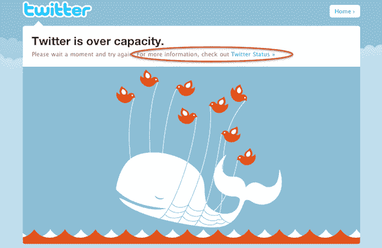

# Twitter 根据 TechCrunch 评论者的反馈调整了失败的鲸鱼

> 原文：<https://web.archive.org/web/https://techcrunch.com/2010/06/18/twitter-fail-whale-3/>

# Twitter 根据 TechCrunch 评论者的反馈调整了失败的鲸鱼

有时我们的评论者有点疯狂——但不管怎样，我们爱他们。其他公司也是如此。这就是证据。

Twitter 基于一位 TechCrunch 读者在一篇关于 Twitter 本周早些时候[宕机的帖子上发表的评论，调整了 Fail Whale 页面(你知道，当 Twitter 宕机时，你会一直看到这个页面)。好吧，这不是一个巨大的变化，但这是一个非常有用的变化。从现在开始，在 Twitter Fail Whale 页面上，你会在标题下面看到一个链接，链接到](https://web.archive.org/web/20230406171153/https://techcrunch.com/2010/06/14/twitter-down-yes-its-2010/) [Twitter 状态](https://web.archive.org/web/20230406171153/http://status.twitter.com/)博客:“Twitter 已经超负荷了。”

Twitter 写信给我们，让我们知道这一变化，并且这是基于一位 TechCrunch 读者[Stepshep](https://web.archive.org/web/20230406171153/http://stepshep.co.nr/)(Stephen Shepherd)的评论。那个人留下了一条[评论](https://web.archive.org/web/20230406171153/https://techcrunch.com/2010/06/14/twitter-down-yes-its-2010/#IDComment80209740)说:

> 人们可能会认为，状态博客的链接在 Fail Whale 页面上会更大。新用户不会阅读 RSS 上的小字/状态博客。顺便说一下，我用 Twitter 登录 intensedebate，现在不用了。

“这是一个好问题，也是一个很好的建议，我们的团队在本周做出了改变，”一位 Twitter 代表给我们写道。“我们在听着呢，”他们继续说道。

这是一个好主意，因为以前当 Twitter 关闭时，人们经常会去 TechCrunch 这样的网站寻找原因。说清楚一点，*我们希望你还是那样做*。但是对于那些不知道的人来说，有一个状态博客的链接是有好处的(状态博客和 Twitter 在不同的服务器上，所以在停机期间它会保持运行),以便从 Twitter 获得最新的情况。

所以，TechCrunch 的读者们，请留下有用的评论，这可能会有所不同。