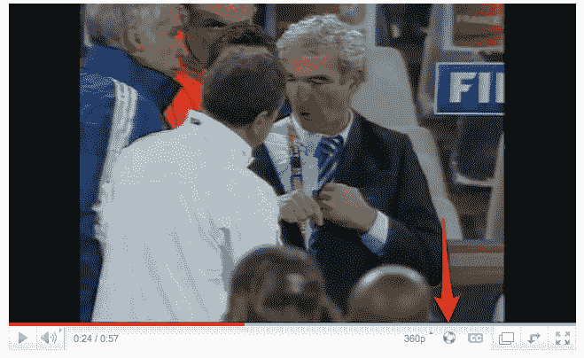

# BZZZZZZ: YouTube 得到了一个呜呜祖拉按钮(说真的)| TechCrunch

> 原文：<https://web.archive.org/web/https://techcrunch.com/2010/06/23/bzzzzzz-youtube-gets-a-vuvuzela-button-seriously/>

# BZZZZZZ: YouTube 上有一个呜呜祖拉按钮(说真的)

YouTube 总是有恶作剧的方式。在过去一个小时的某个时候，世界上最大的视频门户网站在一些视频上激活了一个新按钮，看起来像一个小小的足球。点击它会激活一个无休止的，令人难以置信的恼人的声音，听起来模糊地像一群昆虫。或者，对于任何观看世界杯的人来说，就像可怕的呜呜祖拉——一种在南非足球比赛中常用的乐器。当然，南非是今年世界杯的主办国，观看比赛的球迷已经连续几个小时受到呜呜祖拉无意识的嗡嗡声的影响。

这种噪音如此恼人，电视网已经采取措施过滤掉它，而[指南](https://web.archive.org/web/20230228011929/http://video.beta.techcrunch.com/video/3848650-how-to-really-turn-off-that-damn-vuvuzela-noise)已经弹出，向观众展示如何从他们的电视机和电脑上屏蔽这种噪音。尽管有抱怨，国际足联还是决定不禁止呜呜祖拉，因为它具有传统意义。有趣的事实:一份[报告](https://web.archive.org/web/20230228011929/http://www.sport24.co.za/Soccer/WorldCup/NationalNews/Vuvuzelas-unplugged-for-some-20100611)称，将塑料呜呜祖拉带到南非市场的那个人也在卖耳塞。聪明的家伙。

我没有在所有的视频中看到这个按钮，但是它肯定会出现在一些与足球无关的视频中。这里有一个[拥有它。](https://web.archive.org/web/20230228011929/http://www.youtube.com/watch?v=gYDV0iqPMck)

*感谢 [Ambuj Saxena](https://web.archive.org/web/20230228011929/http://www.twitter.com/ambujsaxena) 的提示。*