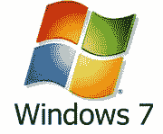

# Windows 7 每秒钟卖出 7 份拷贝，到目前为止总共卖出 1.5 亿份拷贝 TechCrunch

> 原文：<https://web.archive.org/web/https://techcrunch.com/2010/06/23/windows-7-150-million/>

# Windows 7 每秒卖出 7 份拷贝，到目前为止总共卖出了 1.5 亿份拷贝

Windows 操作系统升级周期正在全面展开。自从去年 10 月发布以来，微软已经卖出了 1 . 5 亿份 T2 视窗 7。每秒钟复制 7 份。

据微软称，Windows 7 是迄今为止“历史上销售最快的操作系统”。但是，如果你想知道的话，那些 [Windows 7 发布会](https://web.archive.org/web/20221007051958/https://beta.techcrunch.com/2009/10/09/unboxing-the-windows-7-launch-party-kit/)与此无关(尽管[它们很有趣](https://web.archive.org/web/20221007051958/https://beta.techcrunch.com/2009/10/22/how-to-throw-a-windows-7-torrenting-party-without-getting-arrested/))。大部分需求是由企业推动的，其中许多企业因为金融危机而退出了 Windows Vista，嗯，这很糟糕(不，这不是[盗版者的错](https://web.archive.org/web/20221007051958/http://www.crunchgear.com/2007/02/19/microsofts-ballmer-blames-poor-vista-sales-on-piracy/))。微软估计，75%的企业目前正在评估 Windows 7。你猜我们多久能卖出 3 亿本？

在微软的其他新闻中， [Windows Live 软件包](https://web.archive.org/web/20221007051958/https://beta.techcrunch.com/2010/04/21/windows-live-essentials-hotmail-messenger/)(包括 Hotmail、Messenger、影音制作和照片库)将于明天[进入公测](https://web.archive.org/web/20221007051958/https://beta.techcrunch.com/2010/06/23/windows-live-essentials-available-starting-tomorrow/)。