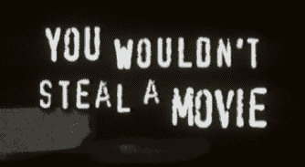

# 法官驳回维亚康姆对 YouTube 的诉讼(法庭文件)

> 原文：<https://web.archive.org/web/https://techcrunch.com/2010/06/23/youtube-declares-victory-in-viacom-case/>

# 法官驳回维亚康姆对 YouTube 的诉讼(法庭文件)

维亚康姆针对 YouTube 的长达 10 亿美元的版权侵权案现在基本结束了。法官令人难以置信地在简易判决中驳回了此案(他的最终命令见下文)，YouTube 宣布了胜利。维亚康姆首先在 2007 年提起诉讼。这些年来，大量的[有趣的花絮](https://web.archive.org/web/20230310224816/https://techcrunch.com/2010/03/18/viacom-may-be-misrepresenting-youtube-founders-call-to-steal-it/)从[未公开的文件](https://web.archive.org/web/20230310224816/https://techcrunch.com/2010/03/18/read-the-just-unsealed-documents-from-the-youtubeviacom-case-here/)中浮出水面。上诉几乎是肯定的，但是维亚康姆甚至不能出庭的事实树立了一个不好的先例。

来自 YouTube 的博客文章:

> 今天，法院批准了我们在维亚康姆与 YouTube 的诉讼中进行简易判决的动议。这意味着法院已经裁定 YouTube 受到《数字千年版权法(DMCA)》的保护，免受版权侵权的指控。该决定遵循了既定的司法共识，即 YouTube 等在线服务在与版权所有者合作帮助他们管理在线权利时受到保护。

法官批准了 YouTube 驳回此案的简易动议，这一事实向媒体公司发出了一个明确的信息:生在 DMCA，死在 DMCA。该法案中的“安全港”条款保护 YouTube 和其他网站，只要它们删除侵权内容，就不会因侵犯用户版权而被起诉。法官发现，尽管 YouTube 上有大量侵权视频，但该网站在接到通知后确实删除了这些视频。事实上，他指出了 2007 年的一个例子，当时维亚康姆向 YouTube 发出了一个撤下 10 万个视频的通知。到了第二天，他们下来了。

除非维亚康姆能找到一个更自由地解释 DMCA 的法官，否则这场官司不会有结果。只要谷歌拥有数十亿美元的现金，YouTube 就会一直存在。你不得不怀疑，到目前为止，维亚康姆在所有这些侵权视频上投放广告赚的钱是否比他们花在法律费用上的钱还多。

[scribd id = 33468644 key = key-wnrcsmnhto 8 e 9 uguhsr mode = list]