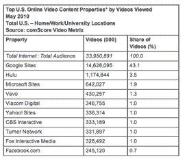
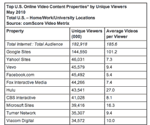

# comScore: YouTube 在 5 月份创下 146 亿视频观看量的历史新高 TechCrunch

> 原文：<https://web.archive.org/web/https://techcrunch.com/2010/06/24/comscore-youtube-reaches-all-time-high-of-14-6-billion-videos-viewed-in-may/>

# comScore: YouTube 在 5 月份达到 146 亿视频观看量的历史新高

美国 comScore video metrix 统计数据今天[出炉，](https://web.archive.org/web/20221209114215/http://www.comscore.com/Press_Events/Press_Releases/2010/6/comScore_Releases_May_2010_U.S._Online_Video_Rankings)五月份视频观看人数出现反弹。根据 web metrics 公司的数据，这个月有 1.83 亿美国互联网用户观看了在线视频，相比之下，4 月份有 1.78 亿人观看了 T4 的视频。ComScore 报告称，YouTube 在 5 月份观看了创纪录的 146 亿个视频，首次超过了每个观众观看 100 个视频的门槛。该报告还显示，1.441 亿观众在 YouTube.com 上观看了 146 亿个视频(相当于每位观众观看了 101.2 个视频)。

今年 5 月，美国互联网用户观看了近 340 亿个视频，其中谷歌网站以 146 亿个视频高居榜首，占所有在线观看视频的 43.1%。ComScore 表示，YouTube 占了该酒店观看视频的绝大部分。Hulu 以 12 亿视频位居第二，占所有在线视频观看量的 3.5%，比 4 月份略有增加。微软网站以 6.42 亿(1.9%)排名第三，其次是 Vevo，4.3 亿(1.3%)和 Viacom Digital，3.47 亿(1.0%)。

根据发布的消息，84.8%的美国互联网观众观看了在线视频。Hulu 观众平均观看了 27.0 个视频，每个观众总共观看了 2.7 个小时的视频。平均在线视频时长为 4.3 分钟。

从观看人数来看，5 月份有近 1.83 亿观众平均每人观看了 186 个视频。谷歌网站在本月吸引了 1.446 亿独立观众(每个观众 101.2 个视频)，其次是雅虎网站，观众为 4600 万(每个观众 7.3 个视频)，Vevo 为 4560 万(每个观众 9.4 个视频)。Vevo 本月再次增长，在 5 月份的排名中上升了一位，以 4560 万观众和平均每位观众 9.4 个视频的成绩位居第三。

关于 5 月份的视频广告，震颤媒体再次成为第一大视频广告网络，潜在观众达 1.028 亿，占视频观众总数的 56.2%。ScanScout Network 排名第二，潜在观众人数为 9930 万(渗透率为 54.3%)，其次是 YuMe Video Network，观众人数为 8750 万(47.8%)。