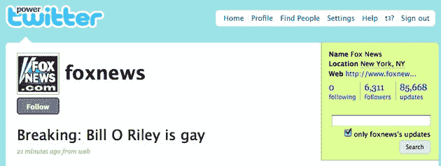

# 2009 年 TechCrunch 遭黑客攻击后，美国联邦贸易委员会禁止 Twitter“20 年内”在隐私问题上误导消费者

> 原文：<https://web.archive.org/web/https://techcrunch.com/2010/06/24/ftc-twitter-privacy-settlement/>

# 在 2009 年的黑客攻击后，联邦贸易委员会禁止推特“20 年内”在隐私问题上误导消费者

今天， [FTC 解决了](https://web.archive.org/web/20230214164811/http://ftc.gov/opa/2010/06/twitter.shtm)在 2009 年两起备受瞩目的黑客事件后，对 Twitter 松懈的安全措施和用户账户保护的长期调查。第一次[发生在 2009 年 1 月](https://web.archive.org/web/20230214164811/https://techcrunch.com/2009/01/05/twitter-gets-hacked-badly/)，危害了 35 个高调的账户，[包括](https://web.archive.org/web/20230214164811/https://techcrunch.com/2009/01/05/either-fox-news-had-their-twitter-account-hacked-or-bill-oreilly-is-gay-or-both/)巴拉克·欧巴马总统、比尔·奥雷利、布兰妮·斯皮尔斯、赫芬顿邮报和脸书的账户。据联邦贸易委员会称:

> 当时当选总统巴拉克·奥巴马的账户发出了一条推文，向他的 150，000 多名粉丝提供了赢得 500 美元免费汽油的机会。

另一次攻击发生在 2009 年 4 月，一名[黑客获得了](https://web.archive.org/web/20230214164811/https://techcrunch.com/2009/07/14/twitters-ev-confirms-hacker-targeted-personal-accounts-attack-was-highly-distressing/)一名 Twitter 员工的电子邮件账户，该账户存储了该员工的[管理密码](https://web.archive.org/web/20230214164811/https://techcrunch.com/2009/07/14/twitters-ev-confirms-hacker-targeted-personal-accounts-attack-was-highly-distressing/)。正在讨论的黑客是一个法国人，他被称为黑客克罗尔。(后来，这是给我们发送了[机密 Twitter 文件](https://web.archive.org/web/20230214164811/https://techcrunch.com/2009/07/16/twitters-internal-strategy-laid-bare-to-be-the-pulse-of-the-planet/)的同一名黑客，但那次事件不属于 FTC 调查的一部分)。

联邦贸易委员会对此事的担忧是黑客有能力攻破 Twitter 的密码系统并获得用户账户。据联邦贸易委员会称:

> 根据和解条款，Twitter 将被禁止在 20 年内误导消费者，告诉他们它在多大程度上维护和保护非公开消费者信息的安全、隐私和保密性，包括它为防止授权访问信息和尊重消费者的隐私选择而采取的措施。该公司还必须建立和维护一个全面的信息安全计划，该计划将在 10 年内每隔一年由第三方进行评估。

联邦贸易委员会提供了一份 Twitter 未能实施的安全措施清单，Twitter 称这些措施是在攻击后实施的。禁止 Twitter 在 20 年内“误导消费者”可能听起来很傻，但这基本上是秩序的生命，并赋予 FTC 对 Twitter 未来安全漏洞的罚款能力，每次事件高达 1.6 万美元。没有这一命令和解决方案，联邦贸易委员会就没有所谓的民事处罚权。

联邦贸易委员会的一名消息人士告诉我，该机构正在“密切关注社交媒体上的风险信息。”受损的社交网络越来越成为欺诈者接触和欺骗消费者的一种方式。Twitter 和其他社交网络现在都注意到了，他们必须尽一切努力保护用户的账户免受安全漏洞的侵害。