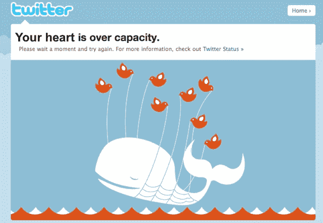

# Twitter 感觉像坠入爱河，至少从荷尔蒙的角度看是这样 TechCrunch

> 原文：<https://web.archive.org/web/https://techcrunch.com/2010/06/24/twitter-feels-like-falling-in-love-at-least-from-a-hormonal-perspective/>

# Twitter 感觉像是坠入爱河，至少从荷尔蒙的角度来看是这样

[病毒循环](https://web.archive.org/web/20221007010146/https://beta.techcrunch.com/2009/11/01/lets-kill-viral-its-time-for-a-new-word/)的作者亚当·佩恩伯格采访了保罗·j·扎克，又名爱博士。洛夫博士研究“神经经济学”，并发现社交媒体，特别是 Twitter 等快速流动的流媒体，让我们的大脑充满催产素，这种“拥抱激素”让我们产生共鸣，更重要的是，让我们感觉良好。

在一些测试案例中，最重要的涉及 Penenberg 关于“穿着泳裤的超重游客”的推文，拥抱荷尔蒙激增，压力下降。从某种意义上来说，Twitter 就像是吸了一口好烟，或者吃了一包薄薄荷糖。佩恩伯格在推特上写道，他们测量了他的荷尔蒙水平，结果令人惊讶:

> 在第一批和第二批血液之间的 10 分钟内，我的催产素水平飙升了 13.2%。这相当于新郎在扎克参加的婚礼上荷尔蒙激增。与此同时，压力荷尔蒙皮质醇和促肾上腺皮质激素分别下降了 10.8%和 14.9%。扎克解释说，这些结果是相互关联的，我在发微博时感受到的催产素的释放降低了我的压力荷尔蒙。

你可以在这里阅读整篇文章，但是对于那些需要快速解决社交媒体问题的人来说，他们也有一个视频采访来启发你。

有趣的问题是:如果公司能够在社交网络上与我们互动，它们实际上是在给我们下药吗？当我们坚定地不信任一个组织时会发生什么？他们的推文(“Retweet #在乎赢得一只免费的巧克力乌龟！”)诱发狂怒激素？潜力是可怕的。我最好发微博冷静一下。