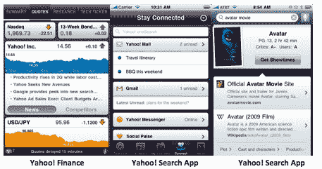
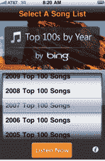
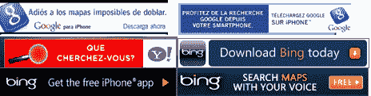

# 巨人的冲突:成为移动搜索领导者的战斗 TechCrunch

> 原文：<https://web.archive.org/web/https://techcrunch.com/2010/06/27/mobile-search-clash/?utm_source=feedburner&utm_medium=feed&utm_campaign=Feed:+Techcrunch+(TechCrunch>)

***编者按**:以下客座博文由移动广告交易 [Mobclix](https://web.archive.org/web/20221208105838/http://www.mobclix.com/) 的联合创始人 Krishna Subramanian 撰写。*

移动搜索仍然是移动网络上无人认领的大奖之一。从谷歌和雅虎到苹果，每个人都在追逐它，但微软的必应可能会通过手机应用程序积极推广必应，悄悄地成为城堡之王。我们来看看每个玩家的移动搜索策略。

## 苹果:在驾驶座上

在 4 月份的苹果主题演讲中，史蒂夫·乔布斯宣布了新的 iPhone 4.0、iAd 和其他一些他似乎并不太感兴趣的功能。在许多平庸的功能中，乔布斯先生碰巧挤进了一个声明，“在移动设备上，搜索还没有出现。人们不再用手机搜索了。”本月在 WWDC 的主题演讲中，乔布斯宣布 iPhone 4 用户将有机会从谷歌、雅虎和必应中选择他们的搜索引擎。在这三人中，必应得到了乔布斯的特别认可。

乔布斯先生是不是想让这个领域的其他玩家以为他不关心搜索，从而让他们措手不及？我敢肯定，他发送给谷歌的所有搜索流量都快把他逼疯了。与此同时，谷歌愉快地——而且相当漂亮地——优化了 iPhone 上的搜索结果页面，通过在 Safari 窗口中加入电话号码、地图等内容，使本地搜索变得极其方便。

还记得你在旅途中拨打 411，或者更近一点，给谷歌发短信询问当地商业或场馆信息的日子吗？现在还有人这么做吗？我敢肯定，人们喜欢花 1.75 美元找出当地比萨饼店的名字。当你拨打 411 并费力地通过自动语音菜单时，你可能已经调出了五个最近的比萨饼店的地址、电话号码和评论，并且只需点击一下就可以看到交互式地图。

苹果给移动搜索带来了流量，但为什么不从中赚钱呢？谷歌，雅虎！和微软都看到了在移动设备上控制搜索的价值——不仅仅是 iPhone。与 web 类似，这三个巨人希望成为每个消费者查询的起点。这三家公司都推出了风格略有不同的 iPhone 专用应用，试图首先赢得 iPhone 用户的心。

## 雅虎！不知道它想成为什么

雅虎！在应用商店里随处可见。它在 iTunes 应用商店中有两个 iPhone 应用程序。在参考类别中， [Yahoo！搜索应用](https://web.archive.org/web/20221208105838/http://itunes.apple.com/us/app/yahoo-search/id361071600?mt=8)以 658 条评论排在第 30 位。在很大程度上，它包含了许多与其他搜索应用相同的核心功能。

为了获得更多用户的关注，雅虎！在 Yahoo！上散布了许多不同类别的其他应用程序。金融和雅虎！购物和雅虎！娱乐应用和相当成功的雅虎！新闻应用(排名第 47，有近 5 万条评论)。这种建立兴趣的尝试只会稀释雅虎。这些如果结合在一起，可能会产生重大影响。

## 这是谷歌输掉的游戏

作为 iPhone 上移动 Safari 的默认搜索引擎，谷歌在推动 mindshare 应用程序方面一直拥有优势。它是第一个使用语音激活搜索的网站，自从使访问 Gmail 等谷歌核心产品变得更容易以来，它一直在稳步发展自己的功能。谷歌移动应用目前以超过 2000 条评论在 iPhone 应用参考分类中排名第一。

## 你好，宾！

当大门打开的时候，Bing 团队正在尽可能快地推出新功能，试图从 Google 那里汲取最有效的东西。有趣的是，结果(即使是在本地层面)与非常准确的谷歌搜索结果大相径庭。必应搜索应用在 WWDC 的主题演讲中得到了乔布斯先生的大力支持，因此人们已经有了很高的期望。它目前在参考文献中排名第二。

微软上周发布了一款更新的必应应用，增加了几个显著的新功能:视觉扫描(与易贝本月早些时候收购的红色激光 iPhone 应用非常相似)，以及通过脸书和推特状态更新来挖掘社交图。从娱乐的角度来看，必应可以创造一个与搜索相关的独特领域。它还[重新设计了它的移动浏览器搜索](https://web.archive.org/web/20221208105838/https://beta.techcrunch.com/2010/06/24/bing-web-search-iphone/)，使它更像一个应用程序的体验。

## 作为分销渠道的广告

最大的障碍是让这些应用程序安装在尽可能多的设备上，但由于应用程序商店中的所有应用程序，营销人员可以获得大量的广告库存。应用程序开发人员，如果你还没有爱上这些大男孩，你应该爱上他们。他们已经花了大量的钱(想想六位数以上),拼命想让尽可能多的用户看到你，这就意味着你口袋里有更多的钱。

所有的搜索巨头都使用应用内营销来推广他们自己的应用。雅虎！谷歌在避免创意饱和方面做得很好，它构建了大量的信息、颜色、语言和登陆页面，并利用了地理定位。

## 嘣！必应改变游戏

随着必应团队继续在广告上投入更多资金，他们最近改变了游戏规则，在应用排名中大幅击败了谷歌。怎么会？简单…

将自己与拥有消费者品牌影响力的成功应用联系起来，是一条通往巅峰的必经之路。“我们绝对是在 iPhone 上推广我们的应用程序，我不认为这是其他产品所不具备的。Bing 高级副总裁 Yusuf Mehdi 最近告诉 TechCrunch 联合编辑 Erick Schonfeld。“是的，一直有效。”

例如，Bing 以 1.99 美元的价格获得了允许用户按十年播放歌曲的年度前 100 名应用程序，Bing 将其更名为[年度前 100 名应用程序，使其免费，并插入广告以促使用户下载 Bing 搜索应用程序。](https://web.archive.org/web/20221208105838/http://itunes.apple.com/us/app/top-100s-by-year-by-bing/id366709777?mt=8)

必应 app 前 100 名瞬间飙升至 App Store 榜首，并连续数周保持前五。它仍然在音乐类别中名列前茅，徘徊在 Pandora 和 Shazam 等热门歌曲附近。而且，正如我提到的，Bing 搜索应用目前排名第二，并且是前 100 名免费 iPhone 应用中的一员。

*促使用户下载 Bing 应用的前 100 个应用中的广告:*

在成功利用赞助应用程序推动必应应用程序下载后，微软最近通过赞助 ESPN 世界杯琐事应用程序吸引了新的受众群体，该应用程序在体育类别中排名第六。

必应和 ESPN 并没有利用百强音乐应用的病毒性质，而是通过展示库存来增加世界杯琐事应用的流量。

那么，这给必应搜索应用带来了什么呢？在所有免费应用的前 100 名中怎么样，更重要的是，它甚至一度将谷歌的应用挤出了前 50 名。Bing 采用了一个简单的概念，通过在不同类别的顶级应用程序中始终保持品牌的首要地位，执行并证明了这一模式的价值。

移动搜索就在这里，不管你愿不愿意相信。以苹果最近以大约 2 亿到 2.5 亿美元的小额价格收购 Siri 为例。将它作为苹果公司的本地移动搜索产品的核心是非常容易的。更不用说估值与收购 Quattro Wireless 的价格差不多。

随着市场的增长，雅虎！、谷歌、必应和苹果将变得更加残酷。不要指望在谷歌移动广告上看到必应广告，或者在苹果上看到雅虎广告。。同样，在不久的将来，我们可能不会在应用商店里看到太多新的谷歌和必应应用。但是他们会尽可能地向前推进。毕竟，在乔布斯先生开始以不同的方式思考移动搜索之前，他们可能没有多少时间了。