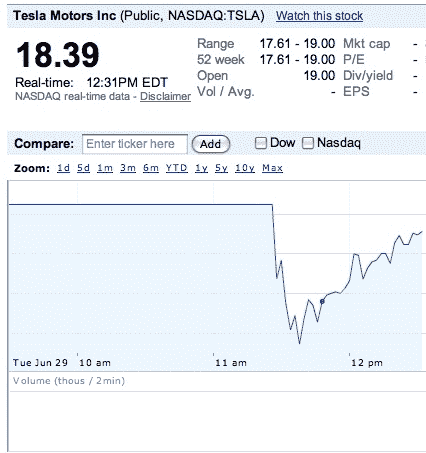

# 特斯拉 IPO 股票上涨、下跌和反弹。市场估价为 17 亿美元。TechCrunch

> 原文：<https://web.archive.org/web/https://techcrunch.com/2010/06/29/tesla-ipo-1-7-billion/>

# 特斯拉 IPO 股票上涨、下跌和反弹。市场估价为 17 亿美元。

随着道琼斯指数下跌超过 250 点，今天不是 IPO 的最佳时机。但在最初的恐慌之后，特斯拉的股价正在反弹。今天早上早些时候，特斯拉汽车敲响了纳斯达克开盘钟，以纪念其首次公开募股，股票代码为 [TSLA](https://web.archive.org/web/20230315180616/http://www.google.com/finance?q=tsla) ，股票开盘价为 19 美元，比昨天的[17 美元的定价](https://web.archive.org/web/20230315180616/https://techcrunch.com/2010/06/28/tesla-prices-ipo-at-17-per-share)上涨了 12%。但随后它们立即下跌，跌至 17.70 美元以下，然后再次反弹。目前，它们的交易价格超过 18 美元，这使得特斯拉的市值约为 17 亿美元

该公司能够将股票定价高于 14 至 16 美元的区间，并将从首次公开募股中获得 2.02 亿美元。特斯拉正在出售 1330 万股股票，其中 1188.06 万股通过公司出售，141.94 万股通过出售股东出售，[包括创始人埃隆·马斯克](https://web.archive.org/web/20230315180616/https://techcrunch.com/2010/06/28/tesla-ipo-musk-shares/)。这是 50 多年来汽车公司首次上市。(对于特斯拉的机会持怀疑态度，请阅读这篇深入的[路透社文章](https://web.archive.org/web/20230315180616/http://www.reuters.com/article/idUSTRE65R5EI20100628)，其中通用汽车的鲍勃·卢茨预测，“这些天才总是会得到应有的惩罚”)。

有人打赌今天的股票会在哪里结束吗？

**更新**:特斯拉的股票全天持续上涨，超过了开盘价，收于 23.89 美元，使该公司在第一个交易日结束时的市值达到 22 亿美元。