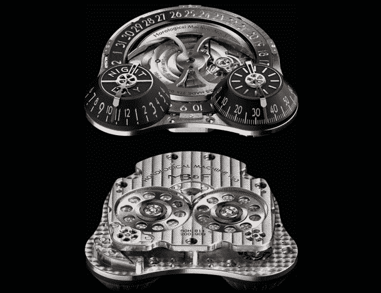

# 我与美好生活的擦肩而过:戴着价值 7.7 万美元的手表 TechCrunch

> 原文：<https://web.archive.org/web/http://techcrunch.com/2010/07/03/my-brush-with-the-good-life-wearing-a-77000-watch/>

在手表爱好者的文学作品中，我们经常会碰到售价高达六位数的手表，有些甚至高达七位数。我在购买手表上采取平民主义的立场，鼓励聪明的手表收藏家购买他们能负担得起的东西，或者更好的是，攒钱买一块可以永远佩戴的漂亮手表。在很大程度上，我也对任何可能超过 2 万美元的手表嗤之以鼻。

几周前，我去了拉斯维加斯的 JCK 展，这是一个为珠宝制造商举办的奇怪的贸易展，在那里我学到了一些有趣的东西。在那里，我得以一瞥珠宝世界的真正基础，并获得了一些见解。首先，大多数珠宝都是百分之百地涨价。那个 5000 美元的结婚戒指？这家商店花了 2500 美元或更少。那个 400 美元的金戒指？它的制作成本可能是 50 美元，然后以 150 美元的价格卖给了珠宝商。我学到的第二件事是，当谈论高度工程化的定制手表时，昂贵和可笑之间的区别可以很快被跨越，当戴着 77，000 美元的手表在地铁上时，你不仅会担心手表与金属杆摩擦，还会担心手腕上的大块钢铁和贵金属被刺伤的可能性。

有问题的手表是

[MB&F Horological Machine 3](https://web.archive.org/web/20230203070655/http://www.mbandf.com/horological-machines/hm3/index.php)

。这是一款手工制作的新颖钟表，在这些小圆顶上有独立的分针和时针，转子旁边有日期窗口。如果你把它翻过来，它看起来就像一只快乐的小青蛙。转子本身是 22K 玫瑰金，因此比我的车还值钱。

富人和超级富豪都拥有这种手表。一位知名客户为硅谷的一家大公司工作，而苏丹和寡头也是目标市场。一般来说，他们只生产一两只这样的手表，由于它们的稀缺性、工艺和材料，它们是稀有的。

首先，我们需要回答这样一个问题:是什么让这款腕表与众不同？制表世界是一个分层的地方。低端产品有斯沃琪和天美时之类的。10 美元到 1000 美元之间的价格通常表明一个较低端的品牌，使用大规模生产的机芯，由机器人组装。然后是 1000 美元到 8000 美元之间的死区，由欧米茄(Omega)、豪雅(Tag Heuer)等中档供应商占据。这些人卖手表就像电脑制造商卖个人电脑一样——你基本上总是买同样的东西，但你得到了一点附加值(或感知附加值)来抬高价格。这一系列的每一款腕表都采用完全相同的机芯，内置 ETA 或 Valjoux 机芯。

然后你会看到表面上从头到尾都是手工制作的手表。根据复杂程度和材料不同，价格从 10，000 美元到 40，000 美元不等。然后你有类似 MB&F HM3 的东西。这基本上是一个非常有限的运行定制件。专为非常富有的收藏家打造，把它想象成一件你戴在手腕上而不是挂在墙上的艺术品。从某种意义上说，它是浓缩的财富和投资，尽管从另一种意义上说，它是炫耀的定义。

我戴着它玩得很开心，当你把它戴在手腕上时，你就能理解一块价值 7.7 万美元的手表的诱惑了。首先，你可以告诉全世界“嘿，我戴着一块价值 77000 美元的手表”，但还有更多。例如，这是一个很好的话题引子(“你注意到我价值 77，000 美元的手表了吗？”)，一种认识女孩的有趣方式(“我戴着一块 77000 美元的手表。你叫什么名字？”)这是一个不用携带现金就能把毒资偷运出巴拿马的绝佳方法——你只需把现金换成一块手表，然后带着它越过边境！

这种血统和价格的手表是罕见和美妙的事情。这款手表的设计和制造方式在预算上是绝对不可能做到的，从水晶到表壳，它的一切都是一流的。如果我不是一个手表记者，我会买一个吗？大概不是这个具体型号(我喜欢更复杂的)。然而，引用费里斯的话来说，“就是这么选择的。如果你有办法，我强烈建议你挑一个。”

不用说，当我把这个东西运回去的时候，我感觉 77 个大家伙的重量从我的肩膀上滑了下来，但我确实花了短暂的时间，盘问我的联邦快递送货人，他可以多快、多安静地把这个东西装回他的卡车上，然后离开我的生活。