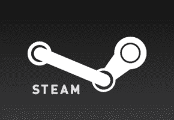
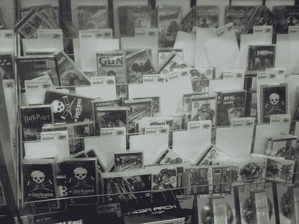
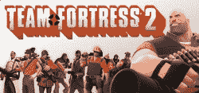
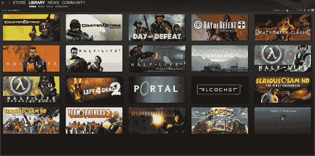
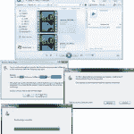

# Steam 如何阻止我盗版游戏，并享受甜蜜的 DRM kool-aid | TechCrunch

> 原文：<https://web.archive.org/web/https://techcrunch.com/2010/07/05/how-steam-stopped-me-from-pirating-games-and-enjoy-the-sweet-drm-kool-aid/>

 *注:有位读者给我们发了一篇关于 Steam 和 DRM 的有趣文章，但由于文章的性质要求匿名。我们当然有义务。*

直到几周前，我购买的最后一款没有盗版的 PC 游戏是 Team Fortress 2，它使用的是数字下载服务 s Team。我在零售店买的最后一款 PC 游戏是《半条命 2》。不过，和许多人一样，我在过去十年中仍然能够玩遍每一款热门 PC。比起拥有一个正版，盗版能带来如此多的好处，我实在无法证明花 50 美元买一个游戏是合理的。

我这么做的部分原因是因为盗版游戏非常简单。这就像用鼠标三次点击就能下载一个种子，在 Usernet 上就更不用说了。文件下载速度尽可能快，我的电缆调制解调器允许，我有完整的游戏与简单的破解说明几分钟后。为什么我要开车去商店，给他们 50 美元买同样的东西？

事实上，我可以回答。除了偷窃的道德问题，人们零售购买游戏的主要原因是多人模式。大多数盗版游戏不允许多人模式，因为游戏通常必须连接到官方服务器，在那里它的合法性可以很容易地通过某种认证服务来验证。因此，虽然我玩了现代战争 2 的单人模式两次，我还没有看到一分钟的多层模式。

我们这些下载游戏的人理解这种局限性。但在大多数情况下，这并不是什么大不了的事情，因为伟大的游戏正在以如此快的速度涌现出来。当我完成了我的第一次通过 MW2，战场坏公司 2 被释放。时机恰到好处。有时我们运气不错，像《边疆》和《摩登战争》(Modern war)这样的游戏有一个可以和破解版很好地匹配的在线多层模式，但这种情况已经不多见了。

所以在某种程度上，我盗版游戏的主要原因是我很懒，而且没有一种服务能迎合我。要么从亚马逊零售购买游戏需要我等待发货，要么我必须开车去百思买。一旦我拥有了这个游戏，我就不能丢失 CD 密钥，否则它将一文不值。最糟糕的借口是，它要求我在所有的电脑上都有一个 DVD-ROM 来安装这些游戏。那是愚蠢的。这个世界需要的是一种服务，在这种服务中，我只需购买一次游戏，就再也不用担心失去实体媒体或我再次玩游戏的权利。

蒸汽。这就是 Steam 的意义所在，多年来我完全忽略了它，尽管我的大多数电脑上都有它，这样我就可以玩团队堡垒 2 了。Steam 之于游戏，正如 iTunes 之于音乐。这两个平台都为数字版权管理和购买媒体提供了强有力的理由，但我认为 Steams 的理由更充分一些。

《半衰期》的开发者 Valve 早在 2003 年就发布了数字下载服务。几乎每个主要的游戏发行商都通过这个平台发行游戏。即使 DRM 是生态系统的核心部分，游戏玩家也可以通过这项服务轻松浏览、购买和享受 PC 游戏。

数字版权管理是互联网上的一个诅咒词。这并不是说大多数人想从那些日夜工作多年的开发人员和工程师那里拿走钱。不是，而是大多数 DRM 方案都很突兀，妨碍了真正享受游戏——或者音乐、电子书或电影。

看看育碧。为了对抗盗版，他们要求所有的游戏都要有持续的网络连接。这意味着如果你的网络中断了，或者你想在飞机上玩游戏，你就解决了。疯狂。正是这种计划迫使人们去盗版游戏。

Steam 的系统并不总是那么好。事实上，它的离线模式在早期并没有那么好。即使是现在，在线服务有时也会离线，剥夺一些游戏的所有登录和额外功能。但它的好处让它保持相关性，也是我开始通过它购买游戏的原因。

我已经确立了我很懒。Steam 明白这是大多数游戏玩家的标准。这就是为什么 Steam 让购买游戏变得如此简单。有畅销书名单，即将上市名单，演示名单，最重要的是，合法销售和免费周末。在 Steam 的夏季大减价期间，我花了 50 多美元在旧的随机游戏上，仅仅是因为它太简单和新颖了。(今天，7 月 5 日，是最后一天，顺便说一句)有很多不同的方法可以让我轻松地在 Steam 上购买一款对我的支票账户有害的游戏。一旦我点击购买按钮，Steam 会给我一个选项，让我立即开始安装过程，我知道，由于库模式，我将能够在未来的任何计算机上安装这个游戏。那很大。

然后是内置的好友列表，成就，在其他机器上的简单安装，以及更多证明 Steam DRM 合理性的功能。简单来说，使用 Steam 的优点比 DRM 的缺点多。就应该是这样。

 电影业真的应该向 Steam 寻求指导。这个生态系统也可以很容易地应用于购买电影。

一位红人制作了一张图片，展示了当前电影数字版权管理的痛苦。使用这些合法下载的电影需要的步骤太疯狂了。即使是有经验的书呆子也有困难。这些公司如何期望计算机新手“做正确的事情？”

DRM 方案讨厌你的自由。他们不希望你能够出国旅行或在任何你想要的系统上享受你的内容。不过，这并不能真正描述 Steam，因此至少有一家公司向整个行业展示了应该如何做。我知道它已经把这个前盗版者变成了一个真正的数字产品购买者。

* * *

*对我们的在线观众有什么贡献吗？也许是这篇文章的反面或者完全不同的随机的东西？在 Tips@CrunchGear.com 联系我们。*