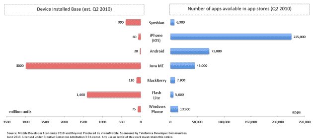
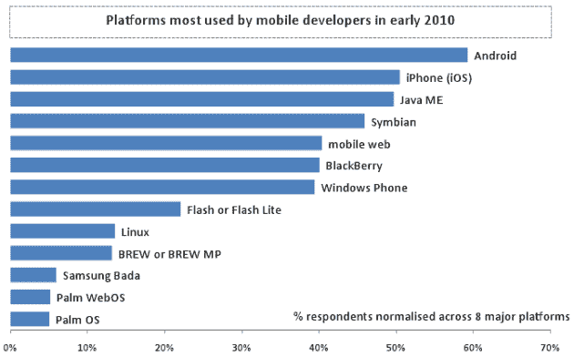
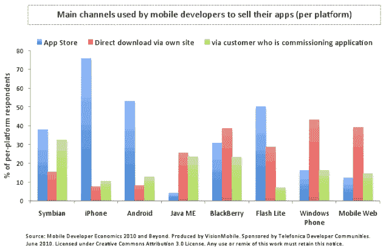
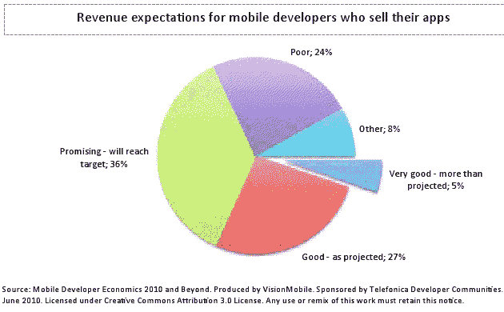
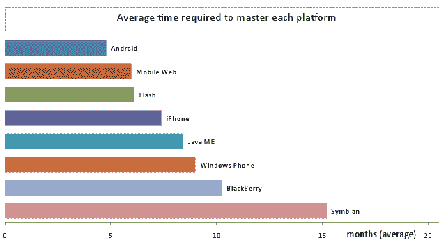
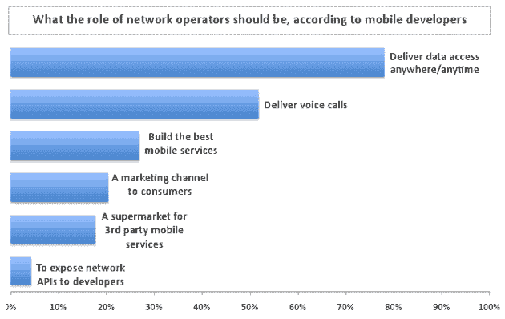

# 关于分散的移动开发者生态系统，你需要知道的一切

> 原文：<https://web.archive.org/web/https://techcrunch.com/2010/07/05/mobile-developer-economics-2010/>

考虑到移动应用行业的特点是巨大的[碎片化](https://web.archive.org/web/20221006023905/http://www.visionmobile.com/research.php#Atlas)，很高兴看到像样的研究帮助我们尝试并理解数字经济的这个特定部分正在发生什么，这个部分的规模和重要性在全球范围内持续增长。因此，我邀请任何对移动开发者生态系统感兴趣的人来看看 [VisionMobile 的](https://web.archive.org/web/20221006023905/http://visionmobile.com/)广泛的[研究报告](https://web.archive.org/web/20221006023905/http://www.visionmobile.com/blog/2010/07/mobile-developer-economics-2010-the-migration-of-developer-mindshare/)(由 [Telefónica 开发者社区](https://web.archive.org/web/20221006023905/http://www.o2litmus.co.uk/tools/o2-network-enablers/communities)赞助的[)，因为这是我迄今为止读过的最深刻的报告之一。](https://web.archive.org/web/20221006023905/http://www.o2litmus.co.uk/o2blog)

这份名为 [Developer Economics 2010](https://web.archive.org/web/20221006023905/http://www.visionmobile.com/research.php#devecon) 的免费研究报告深入研究了移动应用开发的各个方面，涵盖了来自世界各地的 400 多名开发人员，分为八大平台:iOS (iPhone)、Android、Symbian、BlackBerry、Java ME、Windows Phone、Flash/Flash Lite 和移动网络(WAP/XHTML/CSS/Javascript)。

该报告基于由三名研究人员、五名采访人员和八名移动应用程序开发人员组成的团队在 2010 年 1 月至 6 月期间进行的广泛研究，提供了对移动应用程序开发的所有接触点的见解，从平台选择到分发和货币化。

一些重要的发现:

### 市场渗透率和知名度

–**市场渗透**无疑是选择开发移动平台的最重要原因，超过 75%的受访者**选择了每个平台**。显然，比起平台的任何一个技术方面，开发者更关心潜在的市场和盈利潜力。

–根据其 400 名受访者的样本，VisionMobile 发现大多数开发人员**在多个平台上工作**:平均每个开发人员有 2.8 个平台。在 iPhone 和 Android 开发者中，**五分之一的人同时在 App Store 和 Android Market 发布应用**。

–在过去的两年里，随着移动开发者**远离“现有”平台**，即 Symbian、Java ME 和 Windows Phone，一场**思维份额迁移**已经发生(详见[此处](https://web.archive.org/web/20221006023905/http://www.visionmobile.com/blog/2010/07/mobile-developer-economics-2010-the-migration-of-developer-mindshare/))。通过 iPhone 和 Android 应用程序商店销售应用程序的 Symbian 受访者中有很大一部分(20-25 %)揭示了这些新平台正在发生的人才流失。

–根据 VisionMobile 的调查，绝大多数 Java ME 受访者对“一次编写，随处运行”的愿景失去了信心。此外，坊间的开发者评价表明，一半的 Windows Phone MVP 开发者(因其对平台的承诺而受到重视)都有 iPhone，他们在重新投资 Windows Phone 之前会三思而行。

–**Android 是最受移动开发者欢迎的平台**。调查结果表明，假设有同等数量的受访者在八个主要平台上都有经验，那么近 60%的移动开发者最近都在 Android 上进行开发。开发者关注度排名第二的是 iOS (iPhone)，超过了 2008 年处于领先地位的 Symbian 和 Java ME。

–平台特征揭示了每个平台的开发者思想份额和目标市场之间的脱节。例如，Symbian 操作系统被部署在大约 3.9 亿部手机中(Q2 2010)，并声称拥有超过 6000 个应用程序，而苹果的 **iPhone 在同一时期仅部署了 6000 万部手机，却拥有 30 倍多的应用程序**。

–显然，大多数开发人员对他们投入时间的平台有很强的亲和力**；在接受调查的所有八个主要移动平台中，受访者认为其平台的最佳方面是市场渗透率高，即使实际市场渗透率相对较低。**

(点击查看大图)

### **营销、销售和货币化**

–几年前成为主流的市场渠道在今天的移动应用上市蛋糕中只占一小部分。通过 OEM 或运营商交易预加载的运营商门户和 ondevice 是不到 5%的受访移动开发者的主要市场渠道。研究结果表明，除了定制应用开发的传统模式之外，开发人员要么求助于“本地”应用商店，要么通过自己的网站直接下载。

–**应用程序商店将平均上架时间缩短了三分之二**:从传统渠道的 68 天缩短到应用程序商店的 22 天。此外，应用程序商店**将平均支付时间减少了一半以上**；从传统渠道的 82 天，到应用商店的 36 天。平均而言，通过运营商渠道获得支付需要 55 天，如果通过手机制造商在设备上预装，则需要惊人的 168 天。

–在苹果和安卓平台之外，很少使用或获得应用商店**。只有 5%的 Java 和 10%多一点的 Windows Phone 受访者表示将应用商店作为主要的分销渠道。**

–移动开发者报告的主要挑战是**缺乏有效的营销渠道**来增加应用曝光率和发现率。此外，一半的受访者愿意为高级应用商店的位置付费。

–应用认证中最大的挑战是其成本；超过 30%对其应用进行认证的受访者表示认证流程的**高成本是头号挑战**。经济学不适用于低成本应用，而只适用于大规模生产。

–黄金似乎被夸大了:**只有 5%的受访者报告收入非常好**，超出了他们的预期。此外，近 60%的 iPhone 受访者没有达到他们的收入目标。

–对于采用应用商店和基于门户的渠道的开发者来说，广告资助模式只是次要收入来源，落后于**经过试验和测试的按下载付费模式**。同时，订阅模式主要适用于通过运营商或内容聚合门户发布应用程序的情况；他们在应用商店方面取得了有限的进展。

–**移动开发者将网络运营商视为比特管道**。近 80%的受访者认为网络运营商的角色应该是随时随地提供数据访问，而只有 53%的人认为他们的角色是提供语音通话。

### **技术方面**

–不同移动平台的学习曲线差异很大。平均而言，Symbian 平台需要 15 个月或更长时间来学习，而 Android 的平均报告时间不到 6 个月。而且 Symbian 比 iOS (iPhone)、Android 或 Java ME 编程难度大得多，耗时也长得多；基准测试显示，开发 9 个不同的典型应用程序，**Symbian 开发者需要编写的代码几乎是 Android 开发者的三倍，是 iPhone 开发者的两倍**。

–从技术角度来看，移动仿真器和调试器的最大难题是**速度慢和目标设备镜像差**。开发环境(ide)的最大难点是缺乏应用移植框架，以及仿真器集成不佳。

–在调试方面，我们的基准测试显示 **Android 的调试过程最快**，相比 iPhone、Symbian 和 Java ME。Symbian 中的调试时间是 Android 的两倍多。

–大多数移动开发人员仍然没有能力构建引人注目的 ui。每 100 名 Symbian、BlackBerry 和 Windows Phone 平台受访者中，约有 50 人对创建优秀用户界面的困难感到恼火。

–vision mobile 的研究表明，大多数开发人员—**超过 80%的受访者——在软件开发期间依靠社区或非官方论坛获得支持**,而只有 40%的受访者使用网站获得支持。

–访问未发布或“隐藏”的设备 API 是平台供应商的一个控制点，但这也是**开发人员似乎愿意支付的费用**–事实上，比任何其他类型的技术支持都要多。因此，平台供应商可以从分层 SDK 计划中受益，其中特权 SDK 可用于订阅计划的开发人员。

–迄今为止，运营商网络 API 程序未能吸引开发者**。只有 5%的受访者认为网络运营商的角色应该是公开网络 API。然而，超过一半的人会为计费 API 付费，其次是消息和位置 API。**

–平均而言，86%在工作中使用开源的受访者在 Eclipse 等开发工具中使用它。**与 Symbian 相比，Android 和 iPhone 开发人员领导开源社区的可能性是 Symbian 的三倍**，揭示了开发人员社区的对比谱系。60%的回答者报告开源的一个主要缺点是开源许可带来的**混乱。**

报告全文可在 DeveloperEconomics.com 免费获取。

