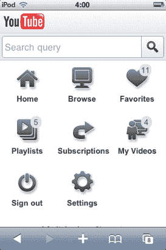

# YouTube Mobile 采用 HTML5，视频质量轻松击败原生应用| TechCrunch

> 原文：<https://web.archive.org/web/https://techcrunch.com/2010/07/07/youtube-iphone-mobile-html5/>

如果你有一部装有 HTML5 兼容浏览器的手机，你可能会想看看 YouTube 的新移动网站，它将在接下来的几个小时内在[m.youtube.com](https://web.archive.org/web/20230307214732/http://m.youtube.com/)推出。这是对旧的移动网络应用程序的重大升级，用户界面更加完美，加载速度更快。它还使用了大量 HTML5 功能，包括视频标签。但最重要的是，与本地应用程序(即 iPhone 的应用程序)相比，这款网络应用程序具有更高的视频质量，而且它很快也会提供更多内容。它还广泛可用，支持几乎所有符合 HTML5 的移动浏览器，包括 iPhone 和 Android 设备上的浏览器。

当然，YouTube 已经有了一个拥有庞大安装基础的移动应用程序——每台 iOS 设备，总共 1 亿台，都带有一个原生的 YouTube 应用程序。但今天在 YouTube 总部的一次演示中，产品经理安德烈·多罗尼切夫(Andrey Doronichev)明确表示，这款新的基于网络的应用程序几乎在所有方面都很出色，不难发现 YouTube 和苹果之间的一些紧张关系。这强调了一个更大的趋势，当谷歌尽可能的偏向网络应用而不是本地应用。

你看，YouTube 实际上并不控制 iPhone 自带的原生应用——那都是苹果的，尽管 YouTube 显然在被要求时与他们合作。很明显，苹果团队在跟上 YouTube 的最新改进方面做得不太好。在一个特别有说服力的演示中，Doronichev 拿出了两部 iPhones，让原生的 YouTube 应用程序与新的 m.YouTube.com 进行了对抗。这款网络应用提供了许多优势，包括搜索的自动完成和与最新版本的 YouTube 网页更一致的用户界面(iPhone 应用仍然使用 YouTube 的 5 星评级系统，该系统在 1 月份被[放弃](//web.archive.org/web/20230307214732/https://techcrunch.com/2010/01/21/new-youtube/%E2%80%9D)，取而代之的是二进制“Like”系统)。最重要的是，网络应用的视频质量远远领先于 iPhone 应用——Doronichev 解释说，这是因为 iPhone 应用仍然使用为 Edge 而不是 3G 开发的视频流格式。HTML5 应用程序上的视频看起来更好，启动也更快。

【YouTube = http://www . YouTube . com/watch？v=GGT8ZCTBoBA&hl=en_US&fs=1]

web 应用程序还有一些其他的不同之处。Doronichev 说，在快速迭代方面，它给了 YouTube 更多的灵活性，也为更广泛的移动广告打开了大门。这很重要——Doronichev 说，这意味着网络应用最终将比本地应用获得更多的内容，因为内容所有者将有更多的广告选择。

然而，网络应用仍然面临着一个大问题，那就是提高用户意识。YouTube 表示，去年，移动设备上的视频观看量增加了 160%，YouTube 现在每天有 1 亿次移动观看(这相当于 2006 年 T2 被谷歌收购 T3 时 YouTube 网站的观看量)。我的直觉是，这些视图中有很多来自本地应用，尤其是 iPhones 和 iPod Touch 上的应用。对这些用户来说，YouTube 体验是他们手机自带的原生应用，而不是移动浏览器网站。Doronichev 表示，随着该应用相对于原生应用的不断改进，用户可能会开始更多地使用该应用(特别是因为它在可用内容方面处于领先地位)，但我怀疑，将需要一场重大的教育和宣传活动来推动用户访问 YouTube 的方式发生重大转变。

**更新:**嗯，这个有意思。如果你在 iPhone 上浏览 YouTube 移动网站，它会提示你将它“安装”到你的 iPhone 上(它会添加一个到你 iPhone 主屏幕的链接)。看起来谷歌没有浪费任何时间让人们改变。另一件需要注意的事情是:一旦你“安装”了网络应用，iPhone 主屏幕上显示的标志实际上是 YouTube 标志，而原生 iPhone 应用是一台过时电视的图像。我怀疑用户会更喜欢前者。

一个警告:Doronichev 说，iPhone 4 上的 web 应用程序仍有一些错误，将在未来几周内清理干净。