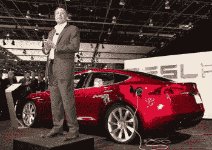

# 埃隆·马斯克:“为什么欧文·托马斯是硅谷的杰森·布莱尔”

> 原文：<https://web.archive.org/web/https://techcrunch.com/2010/07/11/elon-musk-why-owen-thomas-is-silicon-valleys-jayson-blair/>

 * [特斯拉汽车](https://web.archive.org/web/20221006183311/http://www.teslamotors.com/)创始人兼首席执行官[埃隆·马斯克](https://web.archive.org/web/20221006183311/http://www.crunchbase.com/person/elon-musk)在面对媒体时不会退缩。当《纽约时报》写了一篇充满错误的文章时，马斯克[猛烈抨击作者](https://web.archive.org/web/20221006183311/https://beta.techcrunch.com/2009/04/10/teslas-elon-musk-grows-a-pair-good-for-him/)，说“他为什么要挑一家电动汽车公司的毛病？他为什么要挑一个试图做好事的小人物，而底特律已经发生了数百亿美元的惊人浪费？”他补充道“他是一个巨大的混球…和一个白痴。”就在这个时候，一名记者在戳特斯拉。进入马斯克的私人生活，他会毫不留情。*

Valleywag 的欧文·托马斯(Owen Thomas)现在为 VentureBeat 撰稿，出于某种原因，他迷上了马斯克的个人生活，并继续写这个男人的婚姻灾难。他在多个场合称马斯克是个骗子，似乎很高兴了解马斯克离婚的肮脏细节。马斯克在《赫芬顿邮报》上发表了他的观点。托马斯[又打了他](https://web.archive.org/web/20221006183311/http://venturebeat.com/2010/07/09/tesla-motors-elon-musk-truth/)。

马斯克现在再次回应，如下。这种交流让我感到困扰的是，硅谷媒体，尤其是 VentureBeat，如此关注一个企业家的个人生活。我们的读者不想知道离婚这件事。这里不是好莱坞，这些人不会试图让媒体大量报道他们的私生活。如果是的话，他们会雇佣代理人和公关人员，充分利用这一点。相反，他们专注于想象和建设未来。我们的社区容不得这种攻击。VentureBeat 应该道歉并继续前进，让特斯拉继续扰乱汽车行业。

以下是马斯克的回应:

### 为什么欧文·托马斯是硅谷的杰森·布莱尔

欧文·托马斯(Owen Thomas)的最新文章《特斯拉 CEO 无法处理真相》，继续他对特斯拉和我个人的破坏性和欺诈性讨伐。特斯拉受到了大量正面和负面的压力，但令人惊讶的是，有多少真正负面的压力可以直接追溯到一个人。

尽管在特斯拉和 SpaceX 都取得了无数成功，但托马斯从未写过一篇关于这两家公司的正面文章。他写的几十个故事中的每一个——没有一个例外——都是令人讨厌的热门作品。即使所有这些故事在事实上是正确的，他们肯定不是，他仍然从根本上误导了公众对我的公司的看法，甚至没有提供象征性的正面文章。因疏忽而说谎仍然是说谎。

在下面托马斯在他的文章中使用的类似标题下，我解决了他最新文章中的不准确之处，在那里他再次坚定地撒谎。不可能阻止欧文继续写这种错误的垃圾，但是，因为我没有时间或倾向于反驳他所有的坏报道，我想知道他写的东西没有一点是客观的。欧文·托马斯今后写的任何文章都应该牢记这一点。

### 特斯拉 IPO 申请

托马斯表示，“特斯拉更新了 IPO 申报文件，基本上承认了我们(即欧文托马斯)提出的所有担忧，这些担忧是投资者应该考虑的潜在风险因素”。

我们更新了我们的 IPO 文件，只是为了声明托马斯写的东西没有事实依据。由于特斯拉正处于 IPO 静默期，我们无法用新闻稿直接回应。相反，我们不得不更新 IPO 文件，以向投资者保证，托马斯所说的特斯拉依赖我提供资金，或者与我离婚有关的能源部贷款违约风险都是错误的。

即使没有 IPO 收益，特斯拉也有足够的资金从它的许多风险投资者、戴姆勒和能源部那里完成 Model S，而无需我的财务帮助。IPO 的原因是为额外的新开发项目提供现金，并为包括我在内的长期股东提供一小部分流动性(我出售了 5%的股份)。如果这是一个真正的问题，早在欧文·托马斯(Owen Thomas)提出之前，银行家和律师们就已经把它写进了 IPO 招股说明书。

这是他通过写一篇误导性的文章，凭空给特斯拉制造了一个现实问题的众多情况之一。

### 我的个人消费

在他题为“马斯克的个人支出”的章节中，托马斯做了一些创造性的数学计算，声称我的“弥天大谎”之一是我建议我每月支出 3 万美元，不包括法律费用。这完全是瞎编的。我从未在我的文章中提到过这一点，也无法从我的其他陈述中计算出来。

托马斯故意将我在过去两年被迫花在离婚律师身上的平均费用和我去年的家庭开支合并在一起，忽略了一个事实，即很大一部分法律费用发生在今年审判前。

### 特斯拉汽车公司的创立

在这里，托马斯讲述了一件趣闻，事关特斯拉与公司创始人之一马丁·艾伯哈德之间的一个严重问题。埃伯哈德对特斯拉(和我)提起了充满不准确之处的诉讼。

特斯拉准备提起反诉，但在我们提起之前，埃伯哈德和我通过几个小时的调解解决了我们的分歧。我很高兴我们和解了。这个结果显然让埃伯哈德和我都很满意，否则事情就不会解决。然而，托马斯引用埃伯哈德的律师，好像这是一个片面的胜利。他完全可以引用我的律师的话，他也会做出同样的声明。

托马斯忘记提到的是，埃伯哈德在调解开始前几周就被迫撤回了诉讼。如果埃伯哈德的立场是坚定的，他就不会在调解开始之前单方面撤回他的要求。

### 客户存款的安全性

Thomas 说，我告诉客户，我个人会支持他们的车辆存款，我还说他们的存款有风险。他又在故意混淆事实，让我听起来好像自相矛盾。

欧文·托马斯又一次误导了读者:这些陈述实际上是指处于不同成熟阶段的不同工具，但他断章取义，假装它们指的是同一件事。当我说我将亲自支持客户存款时，我在几个场合以及在一篇汽车与司机的文章中直接对客户这样做了，这是明确而清楚地关于跑车。

我知道，如果需要的话，我的资源加上特斯拉的资源，将足以偿还他们个人的债务。此外，特斯拉在早期没有向客户充分说明跑车的存款存在风险。客户在没有明确同意的情况下将这些资金置于风险之中是不对的。

另一方面，在 Model S 发布会上，我对《纽约时报》的克莱尔·凯恩·米勒(Claire Cain Miller)发表的声明明确提到了 Model S 的预订。我知道，在最坏的情况下，我和特斯拉的资源也无法覆盖 Model S 的存款。然而，与 Roadster 不同的是，我们非常明确地表示，Model S 的预订资金处于风险之中，这些资金将用于该车的前期开发。

在这一部分，托马斯还说我宣布特斯拉的一轮融资已经在 2008 年 11 月结束，而实际上是在 2009 年 3 月结束的。不管是有意还是无意，他搞混了融资文件签署的时间(代表确定的承诺)，实际上是 2008 年 12 月，最后一笔现金汇入的时间是 2009 年 3 月。这在有大量参与者的复杂金融回合中很常见。

### 我的企业家史

在这一部分中，托马斯对我最初的两家公司 Zip2 和 PayPal 进行了诽谤，谈论了两家公司发生的管理变革，但没有承认任何一家公司的积极之处。事实是，上市后，Zip2(我 23 岁时创建)以超过 3 亿美元的价格卖给了康柏，PayPal 以超过 15 亿美元的价格卖给了易贝。任何人阅读托马斯对他们历史的扭曲描述而不了解更多，都会认为两者都是失败的。

值得注意的是，在过去 15 年里，我参与创建的五家公司(Zip2、PayPal、SpaceX、特斯拉和 SolarCity)中，每家公司的每一轮都是上涨的，即使是在最糟糕的市场条件下。换句话说，不管你是 A 轮、B 轮、C 轮、D 轮等投资者，你总是赚钱的。对于一家上市公司，股价当然会有显著的短期波动，但那些相信长期持有策略的投资者应该会从这一记录中得到安慰。

托马斯还错误地表示，我与贝宝管理团队的其他人疏远了，对他们来说，我的历史完全不同。事实上，取代我成为 PayPal 首席执行官的彼得·泰尔后来成为 SpaceX 最大的投资者之一。麦克斯·拉夫琴(贝宝首席技术官)、彼得·泰尔、大卫·萨克斯(贝宝首席运营官公司)和我在贝宝合作后不久就一起制作了一部电影。我和 PayPal 管理团队的其他几名成员还参与了六个其他项目。

### 特斯拉的投资者

托马斯引用了《纽约时报·米勒》的另一篇文章，内容是关于我写给客户的一封电子邮件，并声称我说过特斯拉将在四到五个月内开始获得能源部的资金。

我实际上说的是，能源部告诉我，预计在四到五个月内会有资金拨付。这是绝对正确的。最终，由于 ATVM 贷款项目是全新的，能源部比他们自己预期的多花了六个月的时间。

无论如何，托马斯奇怪地设法从特斯拉的巨大胜利中创造出一个虚假的负面故事。我们与福特和日产一起，被选为先进技术车辆制造项目的首批获奖者。这个项目的一个要求是，你必须证明你是一个可行的持续经营的企业，并且对于所寻求的资金，你有一个令人信服的技术和商业模式。

这与通用汽车和克莱斯勒的汽车救助计划完全不同，尽管许多媒体混淆了这两个计划。事实上，通用汽车和克莱斯勒被排除在 ATVM 计划之外的原因是，它们正在经历破产，因此显然不符合拥有一个可行的持续业务的要求。

托马斯谎称特斯拉去年没有盈利，尽管我说过会盈利。事实上，特斯拉在 2009 年是盈利的，尽管只是在 7 月份。考虑到 Model S 费用的增加，这是我们能做的最好的了，但尽管如此，这仍然是一个重要的象征性胜利。如果特斯拉所做的只是专注于成为一家小型跑车公司并销售动力系统技术，它今天仍会盈利，因为这两项业务都产生了很高的利润率。

然而，我从一开始的目标就是制造任何人都能买得起的电动汽车(Model S 是这个过程的第二步，而不是最终目标)，这需要大幅扩大产量。我们正努力从每年 500 辆跑车增加到 20，000 辆 S 型车。换句话说，仅仅几年时间，产量就要达到现在的 4000%。在这种增长和资本支出水平下，根本没有办法保持盈利。

关于《汽车与司机》引用我的话说通用电气将成为投资者，那是我的一个错误，C&D 一发表我就更正了。C&D 的采访发生在几个月前，当时通用电气通过电子邮件确认他们将进行投资。然后，通用电气出现了某种内部危机，在第十三个小时退出了(他们要求我们延长截止日期，以便让他们参与)，这对他们来说是不幸的。他们的投资会有惊人的收益。

托马斯明显忽略了特斯拉的实际投资者。除了 Valor Equity、DFJ、Technology Partners 等优秀的风险投资人，还有戴姆勒和丰田。戴姆勒在与我们就电动智能汽车合作一年并进行极其详细的技术和财务尽职调查后，向特斯拉投资了 5000 万美元。去年年底，当我们与 ADWEA 和 Fjord Capital 进行另一轮投资时，他们再次投资。当我们进行首次公开募股时，他们没有卖出一股股票，尽管他们的投资回报率约为三倍。

### 丰田交易

托马斯表示，尽管丰田和特斯拉宣布他们将共同开发一款汽车，但在新闻发布会后提交给 SEC 的文件显示，我们没有书面协议，也不能保证我们能完成这项工作。因此，他断定我(大概还有丰田章男)在新闻发布会上误导了公众！

托马斯实际上知道得更多，但是，对于那些不熟悉 IPO 招股说明书(又名 S-1)要求的人来说，你总是必须陈述最坏的情况。这样做是为了责任保护，但绝对不是实际上**预期**会发生的事情。

任何认为丰田总裁丰田章男会在加州州长面前发表关于与特斯拉合作电动汽车项目的重要公开演讲，而不会坚持到底的人，都是十足的傻瓜。正如丰田上周在日本宣布的那样，我们现在已经签署了协议，并将在本月交付第一批原型车。车辆和计划的细节将在今年晚些时候的另一次活动中公布。

尽管丰田最近遇到了麻烦，但他们仍然是世界上最大的汽车公司，也是混合动力电动汽车的领导者。对他们来说，投资特斯拉(而且是以 IPO 价格)并希望与我们合作生产汽车是一种巨大的荣誉和强有力的认可。

以 4200 万美元收购 NUMMI 工厂，该工厂有能力每年生产 50 万辆汽车，占全球汽车产量的近 1%，而我们的特斯拉工厂是双方关系中另一个有价值的元素。我应该提一下，NUMMI 一半归丰田所有，一半归通用汽车公司所有，所以我们也欠他们一份感激之情。

我喜欢这家工厂的主要原因是，它加快了我们生产大众汽车的能力。Model S 平台将最多消耗 5 万到 10 万 NUMMI 容量。该工厂的其余部分将被分割开来，直到我们能够将我们的大批量平价电动汽车推向市场，这一直是我对特斯拉的梦想。