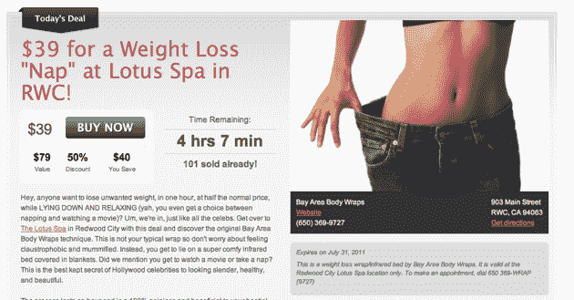

# 交易多，竞争对手多:类似 Groupon 的初创公司入门

> 原文：<https://web.archive.org/web/http://techcrunch.com/2010/07/11/groupon-competitors-guide/>

最近，团购网站和其他将折扣交易作为其业务核心的公司已经成为一种炙手可热的趋势，Groupon 正以疯狂的速度在世界各地的城市扩张，无数的竞争者和克隆者试图抓住一些聚光灯。或许这些网站吸引人的原因是团购模式很容易理解。

对于那些没有尝试过的人来说，像 Groupon 这样的公司会找到愿意提供大折扣的当地餐馆、水疗中心或其他商家，前提是它们的名字会传播给许多新客户。Groupon 通过在网上提供优惠券来宣传这项业务，并从优惠券上的花费中抽取一部分。然而，该模型有许多变体，这些差异可能会令人困惑，因此我们将在下面介绍其中的一些(注意，国外有许多类似的公司——这些是美国的一些知名公司，尽管下面的一些公司也是国际公司)。

**[Groupon](https://web.archive.org/web/20230203033156/http://www.groupon.com/)**

 **Groupon 是在线“团购”行业的市场领导者，根据 Crunchbase 的数据，迄今为止，Groupon 已经筹集了高达 1.728 亿美元的资金。Groupon 在全球 140 个城市提供服务，比其他任何团购公司都要多。对于每个城市，每天，Groupon 都会为一个利基市场项目(如水疗中心、餐厅或彩弹郊游)提供折扣，如果有足够多的人注册交易，他们就可以获得折扣。优惠券通过电子邮件发送给买家。相反，如果没有达到配额，交易就取消了，没有人会为他们承诺购买的东西付费。当然，如果交易不成功，Groupon 通过折扣“宣传”的公司，以及注册购买的人会有点失望。

因为每笔交易的成功都依赖于有足够多的人注册，所以 Groupon 为他们的用户创造了一些激励措施来传播他们提供的折扣。Groupon 鼓励其客户通过电子邮件、脸书和 Twitter 分享有关交易的消息，并承诺如果他们的一个用户向一个朋友发送了一个 Groupon 链接，而该朋友在 72 小时内购买了一个 Groupon(优惠券)，发送链接的人将在其账户中获得价值 10 美元的 Groupon 积分。此外，如果用户向朋友发送推荐，而朋友在 72 小时内订阅，当朋友在 Groupon 上购买第一笔交易时，发送推荐的人将在其帐户中获得价值 10 美元的 Groupon 点数。

 ** [生活社交](https://web.archive.org/web/20230203033156/http://www.livingsocial.com/) ** 

 **LivingSocial 是 Groupon 的主要竞争对手，他们在美国 26 个城市提供服务，并获得了大约 4400 万美元的资金。LivingSocial 的模式与 Groupon 有些不同，因为没有交易生效所需的最低人数限制。但和 Groupon 一样，折扣只能在交易的运行期结束后激活和使用。LivingSocial 在工作日的 24 小时内提供每笔交易，从早上 5 点到下午 5 点。

此外，LivingSocial 使用不同的激励措施来鼓励更多的人注册他们的交易。如果一个 LivingSocial 用户通过 LivingSocial 提供的链接分享一笔交易，然后有三个人通过该链接加入这笔交易，那么分享该链接的人就可以免费获得他们的交易。

 ** [金边市](https://web.archive.org/web/20230203033156/http://newyork.gilt.com/) ** 

 **Gilt City 是最近作为 Gilt 的子单位创建的，目前只在纽约市可用。与许多竞争对手不同，Gilt City 的每笔交易都持续 7 天，每周更新一次，而不是每天一次。此外，Gilt City 每次打折时的库存似乎都是有限的，可能会售罄，就像 Gilt 上的其他销售一样，而不是试图尽可能多地出售他们的交易。

与 LivingSocial 一样，Gilt 并不要求交易的最低注册人数。

 **BuyWithMe 的设置与 Groupon 基本相同，每天都有新的交易展示，每笔交易的时限都设定为一周左右。尽管他们每天都会在主页上推出一笔新交易，但他们在每个城市都有大量交易(交易数量因城市而异)。BuyWithMe 在美国 5 个城市开展业务，目前已经获得了 2150 万美元的资金。

**[Tippr](https://web.archive.org/web/20230203033156/http://tippr.com/)**

 **Tippr 是另一个团购网站，在美国 25 个主要城市提供交易。Tippr 归 Kashless 所有，该公司自成立以来已经筹集了 500 万美元。

与 Groupon、LivingSocial 和 BuyWithMe 不同，Tippr 自豪地在他们的主网站上展示每天三笔交易，每天至少有一笔新交易。作为让更多人加入交易的激励措施，随着越来越多的人注册交易，Tippr 为每个注册的人提供的折扣越来越大，尽管折扣的增加是有限的。Tippr 的一个有点不寻常的方面是它的十项专利，它们静静地展示在网站的底部(尽管不清楚这些是否真的会帮助他们击败竞争对手)。

**[【JITC】](https://web.archive.org/web/20230203033156/http://www.juiceinthecity.com/)**

 **都市果汁是一个迎合妈妈们的小众团购网站。JITC 的这一方面是它与本次综述中其他公司的不同之处，因为网站上提供的每一笔交易都是为了吸引有年幼子女的女性。到目前为止，JITC 每天只在旧金山湾区和西雅图-塔科马地区做一单交易，还没有收到任何外部资金。

他们承诺令人难以置信的、省钱的交易，就像其他的一样，但是 JITC 不要求每笔交易都有一定数量的人注册。每张优惠券在购买后都会通过电子邮件发送给买家，尽管在购买当天无法使用。

[【WGTG】](https://web.archive.org/web/20230203033156/http://wegivetoget.com/)

我们只在芝加哥提供 Give to Get，并且每天提供一张新的优惠券(他们称之为 GO-GO)。WGTG 的特别之处在于，当你在 WGTG 上创建一个帐户时，你也自动注册了慈善网站；[www.actofgood.org](https://web.archive.org/web/20230203033156/http://www.actofgood.org/)。因此，无论何时你购买 GO-GO，只要它在 www.actofgood.org 上市，优惠券上花费的 10%的钱将捐赠给你选择的慈善机构。把省钱的行动和给钱的行动联系起来，这似乎是一个不同寻常的想法，但正如人们所说的，“异性相吸”。

与 Juice in the City 和 LivingSocial 类似，WGTG 不要求最低人数注册才能使交易有效，优惠券在购买后通过电子邮件发送给买家。
************