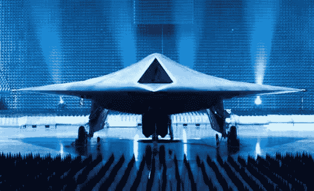

# 塔拉尼斯:价值 2.14 亿美元的无人驾驶隐形战斗机，证明它是英国的更好

> 原文：<https://web.archive.org/web/https://techcrunch.com/2010/07/12/taranis-the-214-million-unmanned-stealth-fighter-that-proves-its-better-if-its-british/>

# 塔拉尼斯:价值 2.14 亿美元的无人驾驶隐形战斗机，证明它最好是英国的

不，这架飞机肯定没有太阳动力[号](https://web.archive.org/web/20230315051240/http://www.crunchgear.com/2010/07/08/solar-impulse-flight-a-great-success-flies-for-26-straight-hours-powered-only-by-the-sun/)号[那么绿色](https://web.archive.org/web/20230315051240/http://www.crunchgear.com/tag/green/)，但这并不意味着它不漂亮。它被很谦虚地称为[塔拉尼斯](https://web.archive.org/web/20230315051240/http://www.dailymail.co.uk/sciencetech/article-1294037/Taranis-The-143million-unmanned-stealth-jet-hit-targets-continent.html)。它的造价约为 2.14 亿美元，几乎是隐形飞行的巅峰之作。

塔拉尼斯是英国国防公司 BAE 系统公司的杰作，一劳永逸地证明了一句老话:最好是英国货。从 2006 年就开始研发了。(该飞机目前在英国国防部的眼中。)

是什么让飞机如此特别？首先，它是无人驾驶的。在空中巡逻时，飞行员不必冒生命危险。如果飞行系统像宣传的那样工作，这将是第一架这样的飞机。

虽然这种飞机可以携带武器载荷，但它的主要目的是在世界各大洲之间进行远距离监视。所以如果你认为你能逃脱法律的制裁，那么，统治大不列颠吧。诸如此类。

有一件事我不知道，但我希望我知道:它有多快。据说它能以“喷气式飞机的速度”飞行，但实际数字会更令人印象深刻。

很明显，它看起来很棒。