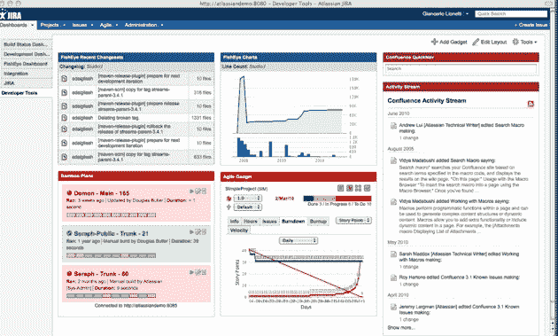

# 产品管理软件公司 Atlassian 从 Accel TechCrunch 获得了 6000 万美元的首轮巨额资金

> 原文：<https://web.archive.org/web/https://techcrunch.com/2010/07/14/atlassian-accel-60-million/>

# 产品管理软件公司 Atlassian 从 Accel 获得了 6000 万美元的首轮巨额资金

一家公司的第一轮风险投资达到 6000 万美元，而且是在它带着价值 1 万美元的信用卡债务成立八年之后，这种情况并不常见。但是 2002 年在悉尼成立的亚特兰大 T2 公司今天从 Accel Partners 获得了第一笔风险投资。该公司在截至 2010 年 6 月 30 日的财年中实现了 5900 万美元的收入，并且“从第一年就开始盈利”，联合创始人兼首席执行官迈克·坎农-布鲁克斯说。

这笔钱将用于为创始人和员工提供一些流动性，扩大其产品组合，并可能收购其他初创公司。为了获得少数股权的回报，Accel 希望 Atlassian 有朝一日能够成功上市。但是 Accel 的合伙人 Richard Wong 并不着急。他认为，一旦公司收入突破 1 亿美元，就有可能进行首次公开募股。如果收入继续以每年 30%的速度增长，那也只是几年后的事了。

Atlassian 生产的产品开发软件(用于制作软件)被全球 20，000 家客户使用，包括脸书、Zynga、思科和 Adobe。“在我们的信念中，”Wong 说，“这些人是产品开发软件的标准——20，000 个客户不会错的。”其产品包括吉拉 bug 追踪器、Confluence wiki 和协作套件，以及一系列软件项目开发工具。

Wong 将 Atlassian 比作 Salesforce，只是没有销售人员。Atlassian 有 225 名员工，但几乎没有销售人员。该公司在组织内迅速传播。“就像 Salesforec.com 关于简化协作一样，这也是关于简化产品开发流程。”Atlassian 既在公司自己的服务器上提供防火墙后的产品，也提供软件服务，其定价比 IBM 的 Rational 软件低一个数量级。

Atlassian 的产品为企业软件带来了熟悉的界面。“它在思想上更现代一点，”坎农-布鲁克斯说，“是企业软件和消费者世界之间的桥梁。”该界面引入了工程师和产品经理从脸书等应用程序中熟悉的活动流和头像等元素。

